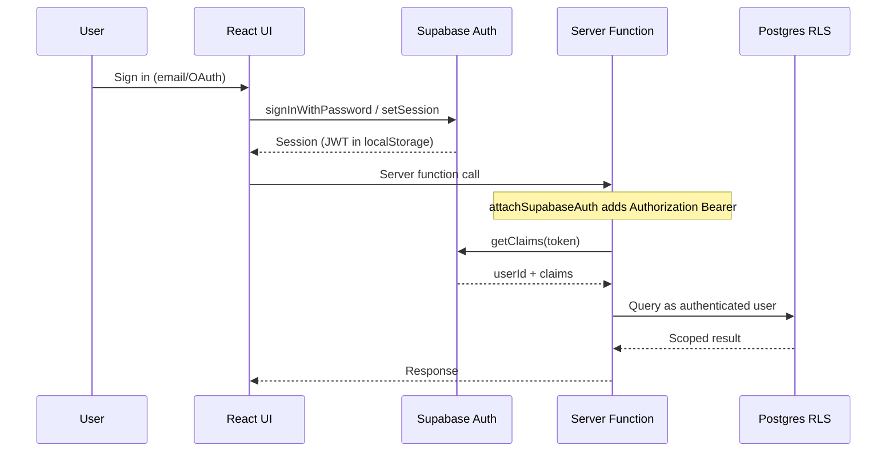

# Authentication & Authorization

Tamarind uses Supabase Auth for identity and JWT sessions. Authorization combines Postgres row-level security (RLS), server-side role checks, and plan-based feature gating.

## Authentication Flow

## Sign-In Methods

| Method | Route / File |
|--------|--------------|
| Email/password | [`src/routes/login.tsx`](../../src/routes/login.tsx) |
| Google, Apple, Microsoft, Lovable OAuth | [`src/integrations/lovable/index.ts`](../../src/integrations/lovable/index.ts) → `supabase.auth.setSession` |
| Password reset | [`src/routes/forgot-password.tsx`](../../src/routes/forgot-password.tsx), [`src/routes/reset-password.tsx`](../../src/routes/reset-password.tsx) |

## Session Management

| Component | File | Role |
|-----------|------|------|
| `AuthProvider` | [`src/lib/auth-context.tsx`](../../src/lib/auth-context.tsx) | React context exposing session and user state |
| `AuthSync` | [`src/routes/__root.tsx`](../../src/routes/__root.tsx) | On auth state change, invalidates router and React Query cache |
| Route guard | [`src/routes/_authenticated.tsx`](../../src/routes/_authenticated.tsx) | Redirects to `/login` if no Supabase user |

Sessions persist in browser localStorage via the Supabase client ([`src/integrations/supabase/client.ts`](../../src/integrations/supabase/client.ts)).

## Server-Side Token Plumbing

Every server function call passes through two middleware layers registered in [`src/start.ts`](../../src/start.ts):

1. **`attachSupabaseAuth`** ([`src/integrations/supabase/auth-attacher.ts`](../../src/integrations/supabase/auth-attacher.ts)) — Client-side: reads session token and attaches `Authorization: Bearer <token>` to the RPC request.

2. **`requireSupabaseAuth`** ([`src/integrations/supabase/auth-middleware.ts`](../../src/integrations/supabase/auth-middleware.ts)) — Server-side: validates JWT via `getClaims`, creates a user-scoped Supabase client, injects `{ supabase, userId, claims }` into handler context.

Authenticated server functions declare `.middleware([requireSupabaseAuth])` to enforce this.

## Entry Routing

[`src/routes/index.tsx`](../../src/routes/index.tsx) handles the root redirect:

- Unauthenticated + zero workspaces → `/bootstrap`
- Unauthenticated → `/login`
- Authenticated → first workspace `/w/$workspaceId`

## Workspaces & Roles

Each user belongs to one or more workspaces via `workspace_users`. Roles are defined in the `user_roles` catalog:

| Role | Description |
|------|-------------|
| `admin` | Full workspace control, manage members and invites |
| `member` | Create and edit pages, participate in conversations |
| `viewer` | Read-only access to visible content |

Roles are assigned at invite time or during bootstrap. Conversation-level roles (`conversation_role` enum) exist separately in `conversation_participants`.

## Invite Flow

1. Admin creates invite via workspace settings → [`src/lib/invites.functions.ts`](../../src/lib/invites.functions.ts)
2. Invite stored in `workspace_invites` with token and 24h expiry
3. Recipient visits `/accept-invite?token=...` → [`src/routes/accept-invite.tsx`](../../src/routes/accept-invite.tsx)
4. New users sign up; existing users with matching email auto-accept
5. `acceptInvite` / `acceptInviteWithSignup` creates `workspace_users` row

Bootstrap (first workspace) bypasses invites: [`src/routes/bootstrap.tsx`](../../src/routes/bootstrap.tsx) creates admin account + workspace when `workspaceCountIsZero()`.

## Authorization Layers

Defense in depth across three layers:

### 1. Postgres RLS

Policies on all tables use helper functions:

- `is_workspace_member(workspace_id)`
- `has_workspace_role(workspace_id, role)`
- `current_workspace_user_id(workspace_id)`
- `is_conversation_participant(conversation_id)`
- `is_page_collaborator(page_id)`

See [Database](database.md) for the full policy set.

### 2. Server Function Checks

Additional assertions in business logic:

- `assertWorkspaceAdmin` — invite management
- `assertParticipant` — conversation message access
- Page visibility checks in `pages.functions.ts`

### 3. Plan-Based Feature Gating

[`src/lib/features.ts`](../../src/lib/features.ts) defines which plan tiers grant each capability:

| Feature key | free | pro | enterprise |
|-------------|------|-----|------------|
| `pages.create` | ✓ | ✓ | ✓ |
| `pages.unlimited` | | ✓ | ✓ |
| `pages.externalShare` | | ✓ | ✓ |
| `conversations.create` | ✓ | ✓ | ✓ |
| `conversations.group` | ✓ | ✓ | ✓ |
| `search.fulltext` | ✓ | ✓ | ✓ |
| `search.semantic` | | ✓ | ✓ |
| `invites.create` | ✓ | ✓ | ✓ |
| `invites.unlimited` | | | ✓ |
| `workspace.manage` | ✓ | ✓ | ✓ |
| `ai.suggestions` | | ✓ | ✓ |

`requireFeature(workspaceId, featureKey)` in [`src/lib/workspaces.functions.ts`](../../src/lib/workspaces.functions.ts) throws `FeatureGateError` (HTTP 402) when the workspace plan does not grant the feature.

> **Note:** Only `invites.create` is actively gated in server code today. Other feature keys are infrastructure for future UI enforcement. Client-side gating via `hasFeature()` is UX-only; server checks are authoritative.

## Service Role Usage

[`src/integrations/supabase/client.server.ts`](../../src/integrations/supabase/client.server.ts) provides a service-role client that bypasses RLS. Used only in trusted server-side code:

- Workspace bootstrap
- Message insert (triggers semantics pipeline)
- Page collaborator tracking
- Semantic pipeline (normalization, embedding)

## Related Docs

- [Database](database.md) — RLS policies and helper functions
- [Workspaces & Permissions](../interface/workspaces_permissions.md) — UI-level permission model
- [User Onboarding](../interface/user_onboarding.md) — Bootstrap and invite flows
