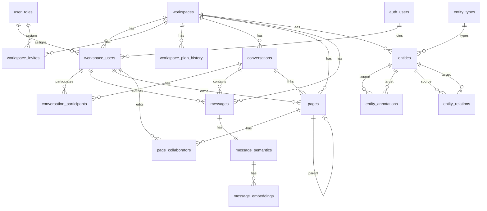

# Database Schema

The database is PostgreSQL hosted on Supabase. Schema is defined in SQL migrations under [`supabase/migrations/`](../../supabase/migrations/). TypeScript types are generated in [`src/integrations/supabase/types.ts`](../../src/integrations/supabase/types.ts).

**Extensions:** `pgcrypto`, `vector` (pgvector), `pg_cron`, `pg_net`

## Entity Relationship Diagram

## Enums

| Enum | Values |
|------|--------|
| `plan_tier` | `free`, `pro`, `enterprise` |
| `workspace_role` | `admin`, `member`, `viewer` |
| `conversation_role` | `admin`, `member`, `viewer` |
| `conversation_type` | `direct`, `group`, `channel` |
| `page_visibility` | `private`, `conversation`, `workspace`, `external` |
| `page_type` | `standard`, `template`, `generated`, `imported` |
| `page_origin` | `user`, `conversation`, `import`, `ai` |
| `annotation_type` | `mention_user`, `mention_entity`, `ticket_ref`, `inline_page_match`, `semantic_hint` |
| `relation_type` | `quoted_from`, `derived_from_message`, `cited_in`, `child_of`, `attached_to`, `linked_by_user` |
| `embedding_status` | `NEW`, `QUEUED`, `PROCESSING`, `EMBEDDED`, `FAILED`, `SKIPPED` |

## Tables

### Workspace & Membership

| Table | Purpose | Key relationships |
|-------|---------|-------------------|
| `workspaces` | Tenant root; holds `plan` tier | — |
| `workspace_plan_history` | Audit trail of plan changes | → `workspaces`, → `auth.users` |
| `user_roles` | Role catalog (`admin`, `member`, `viewer`) with JSON permissions | — |
| `workspace_users` | Links `auth.users` to workspace with role | → `workspaces`, → `auth.users`, → `user_roles`; UNIQUE(workspace_id, user_id) |
| `workspace_invites` | Token-based email invites (24h TTL) | → `workspaces`, → `user_roles` |

### Conversations & Messages

| Table | Purpose | Key relationships |
|-------|---------|-------------------|
| `conversations` | Chat threads (direct, group, channel) | → `workspaces`, → `workspace_users` (created_by) |
| `conversation_participants` | Membership in a conversation | → `conversations`, → `workspace_users`; PK(conversation_id, workspace_user_id) |
| `messages` | Chat messages with TipTap/HTML raw text | → `workspaces`, → `conversations`, → `workspace_users` (author), → `entities` (optional) |

### Pages

| Table | Purpose | Key relationships |
|-------|---------|-------------------|
| `pages` | Rich-text documents (TipTap JSON) | → `workspaces`, → `workspace_users` (owner, created_by), → `conversations`, → `pages` (parent), → `entities` (optional) |
| `page_collaborators` | Tracks who edited a page | → `pages`, → `workspace_users`; PK(page_id, workspace_user_id) |

`pages.plain_text` is a generated column via `tiptap_to_plaintext(doc)` for full-text search.

### Semantic Layer (Schema-Ready)

| Table | Purpose | Key relationships |
|-------|---------|-------------------|
| `entity_types` | Catalog: `page`, `message`, `user` | — |
| `entities` | Unified knowledge objects with optional `embedding vector(1536)` | → `workspaces`, → `entity_types`; UNIQUE(workspace_id, entity_type_id, source_id) |
| `entity_annotations` | Links between entities (mentions, refs) | → `entities` (source/target), → `workspaces` |
| `entity_relations` | Directed relations between entities | → `entities` (source/target); UNIQUE per relation type |

> **Note:** These tables exist with pgvector and full-text indexes, but **no application code reads or writes them yet**. They are schema-ready for a future knowledge graph layer.

### Embedding Pipeline

| Table | Purpose | Key relationships |
|-------|---------|-------------------|
| `message_semantics` | Normalized text, quality score, embedding queue state | → `messages` (1:1, CASCADE); UNIQUE(message_id), UNIQUE(checksum) |
| `message_embeddings` | Vector embeddings for semantic search | → `message_semantics` (CASCADE); `embedding_vector vector(1536)` |

## Key Indexes

| Index | Table | Type |
|-------|-------|------|
| `idx_messages_conversation` | messages | `(conversation_id, created_at)` |
| `idx_messages_fts` | messages | GIN full-text on `raw_text` |
| `idx_pages_plaintext_fts` | pages | GIN full-text on `plain_text` |
| `idx_entities_embedding` | entities | IVFFlat cosine on `embedding` |
| `idx_message_embeddings_vector` | message_embeddings | HNSW cosine on `embedding_vector` |
| `idx_message_semantics_queue` | message_semantics | Partial: `(next_retry_at, created_at) WHERE status = 'QUEUED'` |

## Database Functions

| Function | Purpose |
|----------|---------|
| `is_workspace_member(workspace_id)` | RLS: current user is a workspace member |
| `has_workspace_role(workspace_id, role)` | RLS: role check |
| `current_workspace_user_id(workspace_id)` | RLS: resolve workspace_users.id for auth user |
| `is_conversation_participant(conversation_id)` | RLS: conversation access |
| `is_page_collaborator(page_id)` | RLS: page collaborator check |
| `tiptap_to_plaintext(doc jsonb)` | Generated column helper for pages.plain_text |
| `set_last_modified_at()` | Trigger: auto-update last_modified_at |
| `claim_embedding_batch(batch_size, stale_after)` | Pipeline: atomic batch claim (service_role only) |

## Row-Level Security

RLS is enabled on all public tables. Most policies use the helper functions above to scope access by workspace membership and role.

Write patterns:
- **Authenticated users** — reads and writes scoped by RLS policies
- **Service role** — used server-side for bootstrap, message side-effects, and the embedding pipeline (no authenticated write policies on embedding tables)

## Realtime Publication

`messages` and `pages` are published to `supabase_realtime` for live client subscriptions.

## Migration Timeline

| Date | Change |
|------|--------|
| 2026-05-27 | Initial schema: all core tables, enums, RLS, indexes |
| 2026-05-28 | Confirm all auth users |
| 2026-06-03 | Add `conversation_type`, `image_url` to conversations |
| 2026-06-04 | Add `page_collaborators` |
| 2026-07-15 | Update page visibility RLS for collaborators |
| 2026-07-16 | Add `is_page_collaborator()` helper |
| 2026-07-18 | Allow users to update own workspace_users profile |
| 2026-07-22 | Add `message_semantics` + `embedding_status` enum |
| 2026-07-24 | Add `message_embeddings`, retry columns, queue indexes |
| 2026-07-29 | Drop `token_count`, add `claim_embedding_batch` RPC |
| 2026-07-30 | Enable `pg_cron`, `pg_net` |

## Related Docs

- [Overview](overview.md) — How the app accesses the database
- [Auth](auth.md) — RLS and permission model
- [Semantic Pipeline](../semantic/pipeline.md) — message_semantics and message_embeddings usage
