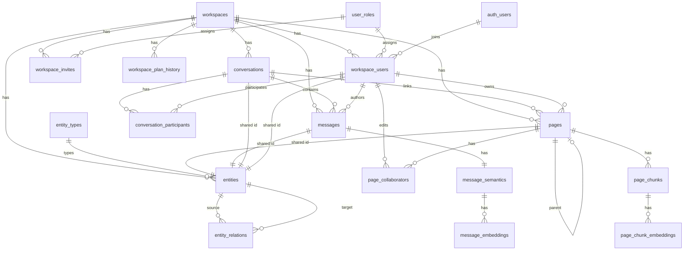

# Database Schema

The database is PostgreSQL hosted on Supabase. Schema is defined in SQL migrations under [`supabase/migrations/`](../../supabase/migrations/). TypeScript types are generated in [`src/integrations/supabase/types.ts`](../../src/integrations/supabase/types.ts).

**Extensions:** `pgcrypto`, `vector` (pgvector), `pg_cron`, `pg_net`

## Entity Relationship Diagram

## Enums

| Enum | Values |
|------|--------|
| `plan_tier` | `free`, `pro`, `enterprise` |
| `workspace_role` | `admin`, `member`, `viewer` |
| `conversation_role` | `admin`, `member`, `viewer` |
| `conversation_type` | `direct`, `group`, `channel` |
| `page_visibility` | `private`, `conversation`, `workspace`, `external` |
| `page_type` | `standard`, `template`, `generated`, `imported` |
| `page_origin` | `user`, `conversation`, `import`, `ai` |

| `relation_type` | `quoted_from`, `derived_from_message`, `cited_in`, `child_of`, `attached_to`, `linked_by_user` |
| `embedding_status` | `QUEUED`, `PROCESSING`, `EMBEDDED`, `FAILED`, `SKIPPED` (column default `QUEUED`) |
| `page_embedding_status` | `QUEUED`, `PROCESSING`, `RETRY_WAIT`, `EMBEDDED`, `FAILED` |
| `page_semantic_job_status` | `QUEUED`, `PROCESSING`, `RETRY_WAIT`, `COMPLETED`, `FAILED` |
| `canonical_topic_job_status` | `QUEUED`, `PROCESSING`, `RETRY_WAIT`, `COMPLETED`, `QUARANTINED` |
| `canonical_topic_job_type` | `ADD`, `REMOVE` |

## Tables

### Workspace & Membership

| Table | Purpose | Key relationships |
|-------|---------|-------------------|
| `workspaces` | Tenant root; holds `plan` tier | — |
| `workspace_plan_history` | Audit trail of plan changes | → `workspaces`, → `auth.users` |
| `user_roles` | Role catalog (`admin`, `member`, `viewer`) with JSON permissions | — |
| `workspace_users` | Links `auth.users` to workspace with role | → `workspaces`, → `auth.users`, → `user_roles`; UNIQUE(workspace_id, user_id) |
| `workspace_invites` | Token-based email invites (24h TTL) | → `workspaces`, → `user_roles` |
| `workspace_bootstrap_invites` | Platform-owner-issued tokens that let a recipient create a new workspace + admin account. Columns: `token` (unique), `admin_email` (optional lock; NULL = recipient supplies their own), `welcome_message`, `created_by`, `expires_at`, `used_at`, `created_workspace_id`. RLS enabled with **no policies** — all access goes through server functions using the service-role client, gated by the `PLATFORM_OWNER_EMAILS` env allowlist | → `auth.users` (created_by), → `workspaces` (created_workspace_id, ON DELETE SET NULL) |

### Conversations & Messages

| Table | Purpose | Key relationships |
|-------|---------|-------------------|
| `conversations` | Chat threads (direct, group, channel) | → `workspaces`, → `workspace_users` (created_by) |
| `conversation_participants` | Membership in a conversation | → `conversations`, → `workspace_users`; PK(conversation_id, workspace_user_id) |
| `messages` | Chat messages with TipTap/HTML raw text; `purged_at` marks trash state | → `workspaces`, → `conversations`, → `workspace_users` (author), → `entities` (optional) |

### Pages

| Table | Purpose | Key relationships |
|-------|---------|-------------------|
| `pages` | Rich-text documents (TipTap JSON); `purged_at` marks trash state | → `workspaces`, → `workspace_users` (owner, created_by), → `conversations`, → `pages` (parent), → `entities` (optional) |
| `page_collaborators` | Tracks who edited a page | → `pages`, → `workspace_users`; PK(page_id, workspace_user_id) |
| `page_chunks` | Chunked page text for semantic indexing (`position`, `content`, `checksum`, `token_count`) | → `pages` (CASCADE); UNIQUE(page_id, position) |
| `page_topics` | Last successful page analysis: `topic_name`, `topic_description`, `page_snapshot`, `page_snapshot_hash`, `llm_model` | → `pages` (PK = page_id, CASCADE) |
| `page_topic_jobs` | Analysis work queue per page (`page_snapshot_hash`, `status`, `attempts`, `next_retry_at`, `started_at`, `completed_at`, `last_error`) | → `pages` (CASCADE) |

`pages.plain_text` is a generated column via `tiptap_to_plaintext(doc)` for full-text search.

`page_chunks.checksum` is a hex SHA-256 supplied by the app and is **not** globally unique — the same text can appear on many pages. `position` is ordering only, never identity: reconciliation matches on checksum and keeps chunk ids when content is unchanged; unmatched rows are deleted (cascading embeddings).

**Page semantics invariant.** A `page_topics` row describes exactly its `page_snapshot`; a missing row means the page was never analyzed. `page_topic_jobs` has no snapshot text — only the `page_snapshot_hash` version it must analyze. A partial unique index on `page_id WHERE status IN ('QUEUED','PROCESSING','RETRY_WAIT')` allows at most one in-flight job per page; terminal (`COMPLETED` / `FAILED`) rows accumulate as debug history and carry no uniqueness.

### Entity Registry (Schema-Ready)

| Table | Purpose | Key relationships |
|-------|---------|-------------------|
| `entity_types` | Catalog: `page`, `message`, `conversation`, `user`, `page_chunk` | — |
| `entities` | Identity registry for workspace assets (`metadata jsonb`) | → `workspaces`, → `entity_types`; PK `id` **equals the source asset PK** |
| `entity_relations` | Directed relations between entities | → `entities` (source/target); UNIQUE per relation type |

**Shared-id invariant.** `entities.id` is not auto-generated: it is the same UUID as the source row (`pages.id`, `messages.id`, `conversations.id`, `workspace_users.id`), and the type comes from `entity_type_id`. There is no `source_id`, `title`, or `embedding` column.

**Lifecycle.** `trg_sync_entity_from_page` / `_message` / `_conversation` / `_workspace_user` / `_page_chunk` (AFTER INSERT OR DELETE on each source table) create and remove the matching registry row via the `entity_type_id_for(key)` helper. Deleting a source row removes its entity, cascading `entity_relations`. There are no UPDATE triggers — id and workspace are immutable in practice.

**Page chunks as entities.** `page_chunks` carries no workspace column, so `sync_entity_from_page_chunk()` resolves `workspace_id` and `created_by_workspace_user_id` from the parent page. Chunk identity is checksum-bound: re-chunking deletes the old chunk row (and its entity, embeddings, and any future suggestion rows) and inserts a new UUID, so a `?k=` passage deeplink to text that no longer exists goes stale by design. `position` remains ordering, never identity, and no ProseMirror offsets are stored.

> **Note:** No application code reads or writes these tables yet; they are groundwork for the knowledge graph layer. `pages.entity_id` / `messages.entity_id` remain nullable legacy columns.

### Embedding Pipeline

| Table | Purpose | Key relationships |
|-------|---------|-------------------|
| `message_semantics` | Normalized text, quality score, embedding queue state | → `messages` (1:1, CASCADE); UNIQUE(message_id), UNIQUE(checksum) |
| `message_embeddings` | Vector embeddings for semantic search | → `message_semantics` (CASCADE); `embedding_vector vector(1536)` |
| `page_chunk_embeddings` | Vector + queue state per page chunk | → `page_chunks` (CASCADE); UNIQUE(chunk_id, embedding_model); `embedding vector(1536)` |
| `page_topic_embeddings` | Vector + queue state per page topic (1:1 with `page_topics`) | → `page_topics(page_id)` (CASCADE); UNIQUE(page_id), UNIQUE(page_id, embedding_model); `embedding vector(1536)` |

**Page embedding queue.** `page_chunk_embeddings` carries its own state machine (`page_embedding_status`: `QUEUED` → `PROCESSING` → `EMBEDDED` / `RETRY_WAIT` / `FAILED`) plus `attempts`, `next_retry_at`, `last_error`, `embedded_at`. `embedding` is NULL until a successful embed; a CHECK enforces that an `EMBEDDED` row has a vector. Re-embedding updates the existing `(chunk_id, embedding_model)` row instead of inserting.

**Page topic embedding queue.** `page_topic_embeddings` reuses `page_embedding_status` with the same columns. Its only enqueue path is the `trg_page_topics_enqueue_embedding` trigger on `page_topics` (AFTER INSERT OR UPDATE OF `topic_name`, `topic_description`, skipped when neither actually changed): it upserts a `QUEUED` row whose `checksum` is the SHA-256 of `topic_name || ': ' || topic_description`. A `PROCESSING` row is forced back to `QUEUED` with the new checksum, so the in-flight guarded persist no-ops. The previous vector is kept on requeue. It is not yet wired into `search_pages_semantic`.

**Naming split.** Page rows use `embedding` / `embedding_model`; the older `message_embeddings` uses `embedding_vector` / `model`. The two enums are deliberately separate so page states (`RETRY_WAIT`) never leak into message/CTI predicates.

**Access.** `page_chunks`, `page_chunk_embeddings`, `page_topics`, `page_topic_jobs`, and `page_topic_embeddings` grant `SELECT` to `authenticated` and `ALL` to `service_role`. RLS allows SELECT only, gated by `public.can_read_page(page_id)` so the existing page visibility policy (private / conversation / collaborator / workspace / external) applies without duplication. All writes go through the service-role pipeline.

### Conversation Suggestions

| Table | Purpose | Key relationships |
|-------|---------|-------------------|
| `conversation_suggestions` | Per-participant suggestion of a related entity (`entity_similarity_score`, `llm_confidence`, `reason`, `notification_text`, `status`, `feedback_type`, `feedback_at`, `expires_at`) | → `workspaces`, → `conversations`, → `entities` (CASCADE), → `conversation_topics`, composite FK (conversation_id, workspace_user_id) → `conversation_participants` |
| `conversation_suggestion_jobs` | Work queue per (conversation, participant): `status`, `attempts`, `next_retry_at`, `started_at`, `completed_at`, `last_error` | → `conversations`, → `workspaces`, → `workspace_users`; UNIQUE(conversation_id, workspace_user_id) |

**Status model.** `conversation_suggestion_status` is `PENDING` → `SHOWN` / `EXPIRED` only. A partial unique index on `(conversation_id, workspace_user_id) WHERE status = 'PENDING'` allows at most one live suggestion per participant per conversation; terminal rows accumulate as history.

**Entity typing is not denormalized.** The suggestion row stores only `entity_id`; the kind comes from `entities.entity_type_id` → `entity_types`. `ON DELETE CASCADE` means a re-chunked passage drops its suggestion rather than dangling.

**Service-role ACL helpers.** Workers run as `service_role`, where `auth.uid()` is NULL, so the explicit-user variants `is_workspace_member_as`, `is_conversation_participant_as`, `is_page_collaborator_as`, and `can_read_page_as` exist alongside the session-based helpers. `search_pages_semantic_for_user` and `search_messages_semantic_for_user` are `SECURITY DEFINER` wrappers that over-fetch and post-filter with those helpers. All of them, plus the four queue RPCs (`list_conversation_suggestion_jobs_due(p_idle, p_cooldown, p_limit)`, `enqueue_conversation_suggestion_job`, `claim_conversation_suggestion_job`, `apply_conversation_suggestion_result`), are `service_role`-only.

**Configurable cooldown.** `list_conversation_suggestion_jobs_due` takes both the debounce (`p_idle`) and the negative-feedback cooldown (`p_cooldown`) as intervals from the caller — there is no hardcoded 14-day window. The worker supplies them from its TypeScript config (exploration default cooldown 120h) and re-checks the last negative `feedback_at` after claiming, since the due-list is only a pre-filter.

### Canonical Topics

| Table | Purpose | Key relationships |
|-------|---------|-------------------|
| `canonical_topic_source_types` | Registry of source topic kinds: `source_type` (`page_topic`, `conversation_topic`), `table_name`, `owning_entity_column`, `owning_table_name` | — |
| `canonical_topics` | Workspace-wide canonical topic nodes (`name`, `description`, `embedding vector(1536)`, `embedding_model`, `evidence_count`, `generated_at`, `regenerated_at`, `generation_model`, `last_evidence_at`) | → `workspaces` (CASCADE) |
| `canonical_topic_evidences` | Links a canonical topic to one source topic row (`source_type`, `source_id`, `owning_entity_id`, `similarity`) | → `canonical_topics` (CASCADE), → `canonical_topic_source_types` (source_type); UNIQUE(`canonical_topic_id`, `source_type`, `source_id`) |
| `canonical_topic_jobs` | Work queue for canonicalization (`workspace_id`, `source_type`, `source_id`, `job_type`, `status`, `attempts`, `next_retry_at`, `started_at`, `completed_at`, `last_error`, `result`) | → `workspaces` (CASCADE), → `canonical_topic_source_types` (source_type) |

**Source-type registry.** `canonical_topic_source_types` is the source of truth for resolving a source row to its owning entity and workspace. It is read by the validation trigger on `canonical_topic_evidences` and by the enqueue triggers on `page_topics` / `conversation_topics`. Only `service_role` can read it.

**Workspace-wide identity.** A `canonical_topics` row represents one idea inside a workspace. It is created or reinforced by `apply_canonical_topic_add_and_commit`. Evidence links from `page_topics` and `conversation_topics` accumulate on `canonical_topic_evidences`; when the last evidence for a topic is removed, the topic is deleted.

**Job lifecycle.** Source changes enqueue `ADD` or `REMOVE` jobs on `canonical_topic_jobs`. `claim_canonical_topic_job` picks the oldest claimable job, but skips any source that already has a `PROCESSING` row. A partial unique index `uniq_canonical_topic_jobs_source_inflight` on `(source_type, source_id) WHERE status = 'PROCESSING'` enforces the same exclusivity at the DB level. `apply_canonical_topic_add_and_commit` takes a per-workspace advisory lock, re-runs a nearest-match check under the lock, and downgrades a `create` decision to `reinforce` if a matching topic appeared meanwhile. `apply_canonical_topic_remove_and_commit` deletes matching evidences, decrements each affected topic, and deletes topics whose `evidence_count` reaches zero.

**Access.** `canonical_topics` and `canonical_topic_evidences` grant `SELECT` to `authenticated` and `ALL` to `service_role`; RLS allows reads only for workspace members. `canonical_topic_source_types` and `canonical_topic_jobs` are `service_role`-only with a `USING (false)` policy.

### Pinned Entities

| Table | Purpose | Key relationships |
|-------|---------|-------------------|
| `pinned_entities` | Per-workspace-user pins of a conversation or page (`created_at` only) | → `workspaces` (CASCADE), → `workspace_users` (CASCADE), → `entities` (CASCADE); UNIQUE(workspace_user_id, entity_id) |

Replaces the earlier unused `pinned_assets` table and its `pinned_asset_type` enum, both dropped.

**Entity typing is not denormalized.** The pin row stores only `entity_id`; the kind comes from `entities.entity_type_id` → `entity_types`. Only `conversation` and `page` are pinnable — messages, workspace users, and page chunks are rejected by the insert trigger.

**Insert guard.** `trg_pinned_entities_validate` (BEFORE INSERT, `SECURITY DEFINER`) is the real ACL, since server functions run as `service_role` and bypass RLS. It requires `entities.workspace_id = pin.workspace_id`, workspace membership via `is_workspace_member_as`, and then `is_conversation_participant_as` / `can_read_page_as` for the respective kind.

**Access.** Grants are `SELECT, INSERT, DELETE` to `authenticated` and `ALL` to `service_role`; there is no UPDATE path. RLS scopes every statement to `workspace_user_id = current_workspace_user_id(workspace_id)` plus workspace membership, and the INSERT `WITH CHECK` additionally requires the session helpers `is_conversation_participant` / `can_read_page` (the `_as` variants stay `service_role`-only).

**Revocation.** CASCADE from `entities` removes pins when the conversation/page is deleted, and CASCADE from `workspace_users` removes them when the member leaves the workspace. Four further triggers drop pins that access changes would strand: `trg_unpin_on_conversation_participant_delete` (AFTER DELETE on `conversation_participants` — unpins that conversation and any page the user can no longer read), `trg_unpin_on_page_collaborator_delete`, `trg_unpin_on_page_access_change` (AFTER UPDATE OF `visibility`, `owner_workspace_user_id`, `conversation_id` on `pages`), and `trg_pages_unpin_on_purge` (AFTER UPDATE OF `purged_at` when it goes NULL → non-null — trashing a page unpins it for every user; recovering does **not** restore pins).

Index: `idx_pinned_entities_workspace_user` on `(workspace_id, workspace_user_id, created_at DESC)`.

### Entity Deletion (Trash & Purge)

| Table | Purpose | Key relationships |
|-------|---------|-------------------|
| `purgeable_entity_types` | Registry of which entity kinds are trashable/purgeable: `entity_type_key` (PK, matches `entity_types.key`), `table_name`, `purge_order` | — (seeded with `message` = 10, `page` = 20) |

**Soft delete.** `pages.purged_at` and `messages.purged_at` (both `timestamptz NULL`) mark trash state: non-null means "deleted, due for purge at that instant"; recover sets it back to NULL. Partial indexes `idx_pages_purged_at` / `idx_messages_purged_at` on `(purged_at) WHERE purged_at IS NOT NULL` keep trash lookups cheap.

`purged_at` semantics differ per kind:

| Value | Page | Message |
|-------|------|---------|
| `NULL` | Live | Live |
| Future | In trash, recoverable | `[Message deleted]` placeholder + author Undo; `raw_text` and evidences still present |
| Past | Due for row **DELETE** | Placeholder, no Undo; after the worker tick: `raw_text = ''`, no semantics/jobs/evidences |

**Type-agnostic purge.** `purge_due_entities(p_entity_ids uuid[] DEFAULT NULL)` (`SECURITY DEFINER`, `service_role`-only) walks `purgeable_entity_types` in `purge_order`, selects rows with `purged_at IS NOT NULL AND purged_at <= now()` (optionally intersected with `p_entity_ids`), and applies one of two strategies keyed on `entity_type_key`. It returns `TABLE(entity_type text, id uuid)` for everything processed.

- **Delete strategy (default, e.g. `page`).** Hard-deletes the row; existing `ON DELETE CASCADE` chains handle semantics, chunks, embeddings, topics, suggestions, and the `entities` registry row (via the sync triggers). Adding a new hard-deletable kind means adding a `purged_at` column plus one registry row — no change to the RPC.
- **Scrub strategy (`message`).** Keeps the row as a permanent tombstone so the `[Message deleted]` placeholder survives: deletes `conversation_topic_evidences`, `conversation_topic_jobs`, and `message_semantics` (embeddings cascade) for the due ids, then sets `messages.raw_text = ''`. `id`, `conversation_id`, `author_workspace_user_id`, `created_at` and `purged_at` are left intact, and because the message row is never deleted the `entities` registry row survives too. Topic recounting (`evidence_count`, `historical_weight`, candidate demotion, `conversations.current_topic_id`) is reconciled by the purge worker after the RPC returns.

**Search and CTI exclusions.** `search_messages_keyword` and `search_messages_semantic` (and therefore `search_messages_semantic_for_user`) filter `m.purged_at IS NULL`, so a deleted message disappears from search immediately — during the grace window as well as after the scrub. `cti_is_next_processable` ignores earlier messages with `purged_at IS NOT NULL` (they are never blockers) and `claim_conversation_topic_job` skips jobs whose message is purged, so a deleted message cannot freeze a conversation's topic queue during its grace hour.

**Deliberately unchanged.** `list_pages_due_for_chunking` / `list_pages_due_for_topics` still include trashed pages, and RLS is untouched — a trashed page stays readable under existing visibility so recover flows need no special policy, and message authors already hold `UPDATE` on their own rows (hard `DELETE` remains service_role-only). `purgeable_entity_types` has RLS enabled with a `USING (false)` SELECT policy; only `service_role` can read it.

## Key Indexes

| Index | Table | Type | Used by |
|-------|-------|------|---------|
| `idx_messages_conversation` | messages | `(conversation_id, created_at)` | Conversation message listing |
| `idx_messages_conversation_unread` | messages | `(conversation_id, created_at) INCLUDE (author_workspace_user_id) WHERE purged_at IS NULL` | Unread-message summary per conversation |
| `idx_messages_fts` | messages | GIN full-text on `raw_text` | *(legacy — not used by current search RPCs)* |
| `idx_pages_plaintext_fts` | pages | GIN full-text on `plain_text` | *(legacy — not used by current search RPCs)* |
| `idx_pages_title_trgm` | pages | GIN trigram on `title` | Keyword search |
| `idx_pages_content_trgm` | pages | GIN trigram on `plain_text` | Keyword search |
| `idx_conversations_title_trgm` | conversations | GIN trigram on `title` | Keyword search |
| `idx_messages_normalized_trgm` | message_semantics | GIN trigram on `normalized_text` | Keyword search |
| `idx_workspace_users_display_name_trgm` | workspace_users | GIN trigram on `display_name` | Keyword search (people) |
| `idx_entities_workspace_type` | entities | `(workspace_id, entity_type_id)` | Registry lookups by workspace/type |
| `idx_message_embeddings_vector` | message_embeddings | HNSW cosine on `embedding_vector` | Semantic search |
| `idx_message_semantics_queue` | message_semantics | Partial: `(next_retry_at, created_at) WHERE status = 'QUEUED'` | Embedding worker |
| `idx_pages_purged_at` | pages | Partial: `(purged_at) WHERE purged_at IS NOT NULL` | Trash listing / purge sweep |
| `idx_messages_purged_at` | messages | Partial: `(purged_at) WHERE purged_at IS NOT NULL` | Trash listing / purge sweep |
| `idx_pages_last_modified_at` | pages | `(last_modified_at)` | Page chunking due-list |
| `idx_page_chunks_page_checksum` | page_chunks | `(page_id, checksum)` (non-unique) | Chunk reconciliation |
| `idx_page_chunk_embeddings_queue` | page_chunk_embeddings | `(embedding_status, next_retry_at, created_at)` | Queue inspection |
| `idx_page_chunk_embeddings_claimable` | page_chunk_embeddings | Partial: `(next_retry_at, created_at) WHERE status IN ('QUEUED','RETRY_WAIT')` | Page embedding worker |
| `idx_page_chunk_embeddings_vector` | page_chunk_embeddings | Partial HNSW cosine on `embedding` WHERE status = `'EMBEDDED'` | Page semantic search |
| `uniq_page_topic_jobs_inflight` | page_topic_jobs | Partial UNIQUE: `(page_id) WHERE status IN ('QUEUED','PROCESSING','RETRY_WAIT')` | One in-flight analysis job per page |
| `idx_page_topic_jobs_claimable` | page_topic_jobs | Partial: `(next_retry_at, created_at) WHERE status IN ('QUEUED','RETRY_WAIT')` | Page semantic worker |
| `idx_page_topic_jobs_queue` | page_topic_jobs | `(status, next_retry_at, created_at)` | Queue inspection |
| `idx_page_topic_embeddings_claimable` | page_topic_embeddings | Partial: `(next_retry_at, created_at) WHERE status IN ('QUEUED','RETRY_WAIT')` | Page topic embedding worker |
| `idx_page_topic_embeddings_queue` | page_topic_embeddings | `(embedding_status, next_retry_at, created_at)` | Queue inspection |
| `idx_page_topic_embeddings_vector` | page_topic_embeddings | Partial HNSW cosine on `embedding` WHERE status = `'EMBEDDED'` | *(reserved — not wired into search)* |
| `idx_canonical_topics_workspace_id` | canonical_topics | `(workspace_id)` | Workspace topic listing |
| `idx_canonical_topics_embedding` | canonical_topics | HNSW cosine on `embedding` | `match_canonical_topics` nearest-match |
| `idx_canonical_topic_evidences_source` | canonical_topic_evidences | `(source_type, source_id)` | Reverse lookup from a source topic |
| `idx_canonical_topic_evidences_topic` | canonical_topic_evidences | `(canonical_topic_id)` | Evidence listing for a canonical topic |
| `idx_canonical_topic_jobs_claimable` | canonical_topic_jobs | Partial: `(status, next_retry_at, created_at, id) WHERE status IN ('QUEUED','RETRY_WAIT')` | Worker claim |
| `uniq_canonical_topic_jobs_source_inflight` | canonical_topic_jobs | Partial UNIQUE: `(source_type, source_id) WHERE status = 'PROCESSING'` | One in-flight job per source |

## Database Functions

| Function | Purpose |
|----------|---------|
| `is_workspace_member(workspace_id)` | RLS: current user is a workspace member |
| `has_workspace_role(workspace_id, role)` | RLS: role check |
| `current_workspace_user_id(workspace_id)` | RLS: resolve workspace_users.id for auth user |
| `is_conversation_participant(conversation_id)` | RLS: conversation access |
| `is_page_collaborator(page_id)` | RLS: page collaborator check |
| `tiptap_to_plaintext(doc jsonb)` | Generated column helper for pages.plain_text |
| `set_last_modified_at()` | Trigger: auto-update last_modified_at |
| `claim_embedding_batch(batch_size, stale_after)` | Pipeline: atomic batch claim (service_role only) |
| `claim_page_chunk_embedding_batch(batch_size, stale_after)` | Pipeline: atomic page-embedding batch claim, `SKIP LOCKED`, recovers stale `PROCESSING` via `updated_at` (service_role only — workers must bump `updated_at` as a heartbeat) |
| `list_pages_due_for_chunking(p_idle, p_limit)` | Pipeline: pages idle past debounce that need first chunk, re-chunk, or empty-page cleanup (service_role only) |
| `list_pages_due_for_topics(p_idle, p_limit)` | Pipeline: idle pages whose live `plain_text` SHA-256 differs from `page_topics.page_snapshot_hash` (or never analyzed / emptied). Returns `page_id, title, plain_text, page_snapshot, page_snapshot_hash`; `p_limit` capped at 100. Token threshold stays in the app (service_role only) |
| `claim_page_topic_job(p_stale_after)` | Pipeline: claim one analysis job, `SKIP LOCKED`, recovers stale `PROCESSING` via `started_at`, bumps `attempts` (service_role only) |
| `enqueue_page_topic_job(p_page_id, p_hash)` | Pipeline: upsert the in-flight job — overwrites hash and resets `QUEUED`/`RETRY_WAIT` rows, no-ops while `PROCESSING`. Returns `enqueued` / `requeued` / `processing` (service_role only) |
| `apply_page_topic_result(p_job_id, p_topic_name, p_topic_description, p_page_snapshot, p_page_snapshot_hash, p_llm_model)` | Pipeline: atomic commit — re-checks the live page hash, upserts `page_topics` and completes the job. Returns `committed` / `drifted` / `not_processing` / `not_found` (service_role only) |
| `claim_page_topic_embedding_batch(batch_size, stale_after)` | Pipeline: atomic page-topic-embedding batch claim, `SKIP LOCKED`, recovers stale `PROCESSING` via `updated_at` (service_role only — workers must bump `updated_at` as a heartbeat) |
| `enqueue_page_topic_embedding()` | Trigger on `page_topics`: upserts the `QUEUED` topic-embedding row with the new checksum (service_role only) |
| `set_page_chunks_updated_at()` / `set_page_chunk_embeddings_updated_at()` / `set_page_topics_updated_at()` / `set_page_topic_jobs_updated_at()` / `set_page_topic_embeddings_updated_at()` | Triggers: auto-update `updated_at` |
| `search_pages_keyword(...)` | Keyword search over page titles and content |
| `search_conversations_keyword(...)` | Keyword search over conversation titles |
| `search_messages_keyword(...)` | Keyword search over normalized message text |
| `search_people_keyword(...)` | Keyword search over participant display names |
| `search_messages_semantic(...)` | Semantic search over message embedding vectors |
| `search_pages_semantic(...)` | Semantic search over embedded page chunks (one best chunk per page); returns `chunk_id` of the winning chunk for passage deeplinks |
| `get_unread_conversation_summary_for_user(p_workspace_id, p_workspace_user_id)` | Unread counts per conversation for a workspace user; counts messages by others after `conversation_participants.last_read_at`, excluding purged messages (called by service-role server functions with an explicit `p_workspace_user_id`) |
| `purge_due_entities(p_entity_ids)` | Trash: process due trashed rows across every kind listed in `purgeable_entity_types` — hard-delete for pages, scrub-in-place for messages (service_role only) |
| `unpin_on_page_purge()` | Trigger on `pages`: drops all pins for a page when it is moved to trash |
| `escape_ilike_pattern(text)` | Escape helper for ILIKE patterns in keyword RPCs |
| `match_canonical_topics(p_workspace_id, p_embedding, p_limit)` | Semantic nearest-match over `canonical_topics` in a workspace; returns `id, name, description, similarity` (service_role only) |
| `enqueue_canonical_topic_job(p_workspace_id, p_job_type, p_source_type, p_source_id)` | Enqueue a single `ADD`/`REMOVE` canonical-topic job (service_role only) |
| `claim_canonical_topic_job(p_stale_after)` | Claim one canonical-topic job, `SKIP LOCKED`, recovers stale `PROCESSING`, excludes sources already in-flight (service_role only) |
| `apply_canonical_topic_add_and_commit(p_job_id, p_result)` | Atomic commit of an `ADD` job: per-workspace advisory lock, nearest-match downgrade, evidence insert, counter increment, mark `COMPLETED`. Returns `committed` / `not_processing` / `not_found` (service_role only) |
| `apply_canonical_topic_remove_and_commit(p_job_id)` | Atomic commit of a `REMOVE` job: delete evidences, decrement topics, delete zero-count topics, mark `COMPLETED`. Returns `committed` / `not_processing` / `not_found` (service_role only) |
| `validate_canonical_topic_evidence()` | Trigger on `canonical_topic_evidences`: resolves source row through the registry, enforces workspace match, fills `owning_entity_id` (service_role only) |
| `enqueue_page_topic_canonical_job()` | Trigger on `page_topics`: enqueues `ADD`/`REMOVE` canonical-topic jobs on insert/update/delete (service_role only) |
| `enqueue_conversation_topic_canonical_job()` | Trigger on `conversation_topics`: enqueues `ADD`/`REMOVE` canonical-topic jobs on candidate promotion/demotion/delete (service_role only) |

## Row-Level Security

RLS is enabled on all public tables. Most policies use the helper functions above to scope access by workspace membership and role.

Write patterns:
- **Authenticated users** — reads and writes scoped by RLS policies
- **Service role** — used server-side for bootstrap, message side-effects, and the embedding pipeline (no authenticated write policies on embedding tables)

## Realtime Publication

`messages` and `pages` are published to `supabase_realtime` for live client subscriptions.

## Migration Timeline

| Date | Change |
|------|--------|
| 2026-05-27 | Initial schema: all core tables, enums, RLS, indexes |
| 2026-05-28 | Confirm all auth users |
| 2026-06-03 | Add `conversation_type`, `image_url` to conversations |
| 2026-06-04 | Add `page_collaborators` |
| 2026-07-15 | Update page visibility RLS for collaborators |
| 2026-07-16 | Add `is_page_collaborator()` helper |
| 2026-07-18 | Allow users to update own workspace_users profile |
| 2026-07-22 | Add `message_semantics` + `embedding_status` enum |
| 2026-07-24 | Add `message_embeddings`, retry columns, queue indexes |
| 2026-07-29 | Drop `token_count`, add `claim_embedding_batch` RPC |
| 2026-07-30 | Enable `pg_cron`, `pg_net` |
| 2026-08-17 | Add `page_chunks`, `page_chunk_embeddings`, `page_embedding_status` enum, `claim_page_chunk_embedding_batch` RPC |
| 2026-08-17 | Add `list_pages_due_for_chunking` RPC and `idx_pages_last_modified_at` |
| 2026-08-18 | Add `page_topics`, `page_topic_jobs`, `page_semantic_job_status` enum, and the page-semantics RPCs |
| 2026-08-19 | Add `search_pages_semantic` RPC |
| 2026-08-19 | Rename `page_embeddings` → `page_chunk_embeddings`, `page_semantics` → `page_topics`, `page_semantic_jobs` → `page_topic_jobs` (with indexes, constraints, triggers, RPCs); add `page_topic_embeddings` + enqueue trigger, `claim_page_topic_embedding_batch` RPC, and backfill |
| 2026-08-20 | Entities registry revamp: drop `entity_annotations` + `annotation_type`, drop `entities.source_id` / `title` / `embedding`, shared-id invariant, `conversation` entity type, `idx_entities_workspace_type`, backfill, and lifecycle sync triggers |
| 2026-08-21 | Page-chunk deeplink groundwork: `page_chunk` entity type, backfill, `trg_sync_entity_from_page_chunk`, and `search_pages_semantic` now returns `chunk_id` |
| 2026-08-21 | Drop unused `pinned_assets` + `pinned_asset_type`; add `pinned_entities` with insert-guard and access-revocation triggers |
| 2026-08-23 | Entity deletion groundwork: `pages.purged_at`, `messages.purged_at`, partial indexes, `purgeable_entity_types` registry, `trg_pages_unpin_on_purge`, and `purge_due_entities` RPC |
| 2026-08-22 | Drop unreachable `NEW` from `embedding_status`; default `message_semantics.embedding_status` to `QUEUED`; recreate status indexes and `cti_is_next_processable` |
| 2026-08-23 | Message delete with Undo: `purge_due_entities` scrubs messages instead of deleting them, message search RPCs filter `purged_at IS NULL`, and CTI claim/ordering ignore purged messages |
| 2026-09-03 | Unread-messages groundwork: partial index `idx_messages_conversation_unread` and `get_unread_conversation_summary_for_user` RPC |
| 2026-09-04 | Platform bootstrap groundwork: `workspace_bootstrap_invites` table (service-role only, RLS enabled with no policies) |
| 2026-09-11 | Canonical Topics groundwork: `canonical_topic_source_types`, `canonical_topics`, `canonical_topic_evidences`, `canonical_topic_jobs`, matching/queue/claim/apply RPCs, source enqueue triggers, and source-level in-flight exclusivity |

## Related Docs

- [Overview](overview.md) — How the app accesses the database
- [Auth](auth.md) — RLS and permission model
- [Semantic Pipeline](../semantic/pipeline.md) — message_semantics and message_embeddings usage
- [Search & Retrieval](../search/readme.md) — Keyword and semantic search RPCs
