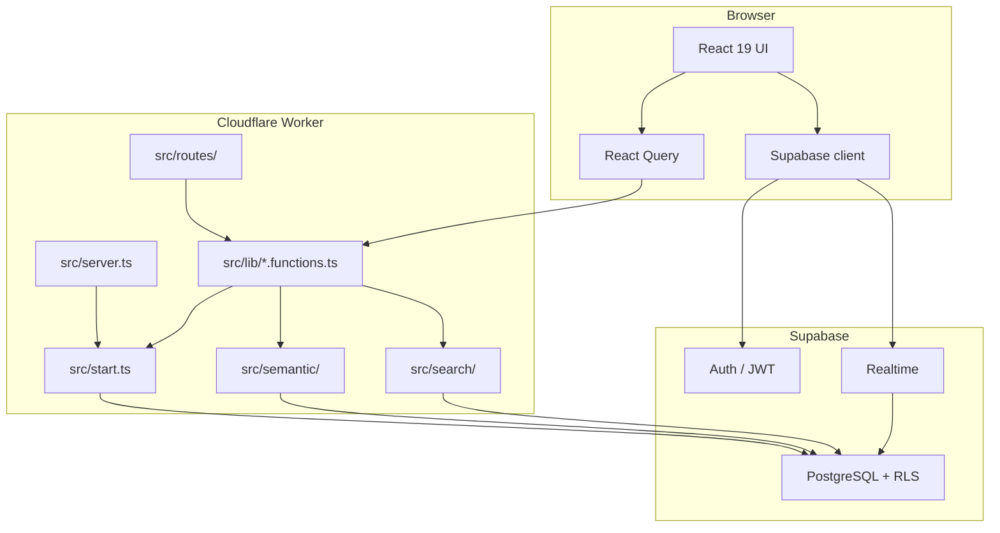
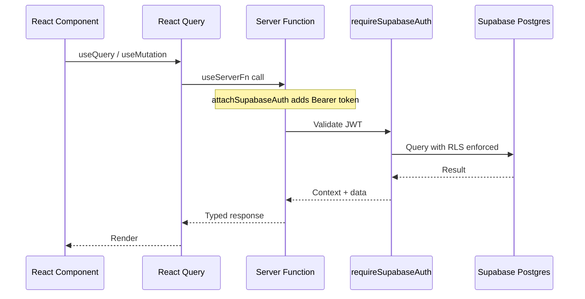

# Architecture Overview

Tamarind is a full-stack TypeScript application deployed on Cloudflare Workers. It uses TanStack Start for SSR, file-based routing, and typed server functions. Supabase provides authentication, PostgreSQL with row-level security, and realtime pub/sub.

## System Layers

## Entry Points

| File | Role |
|------|------|
| [`src/server.ts`](../../src/server.ts) | Cloudflare Worker default export; wraps TanStack Start with SSR error handling |
| [`src/start.ts`](../../src/start.ts) | TanStack Start instance: global error middleware, `attachSupabaseAuth` on all server functions |
| [`src/router.tsx`](../../src/router.tsx) | Router factory with React Query context |
| [`src/routes/__root.tsx`](../../src/routes/__root.tsx) | HTML shell, `AuthProvider`, global toasts, auth state sync |
| [`src/routeTree.gen.ts`](../../src/routeTree.gen.ts) | Auto-generated route tree (do not edit) |

## Routing

Routes are file-based under [`src/routes/`](../../src/routes/). TanStack Router compiles them into `routeTree.gen.ts`.

### Public routes

| Path | Purpose |
|------|---------|
| `/` | Redirect hub: login, bootstrap, or first workspace |
| `/login` | Email/password and OAuth sign-in |
| `/bootstrap` | First-workspace setup when database is empty |
| `/accept-invite` | Token-based invite acceptance |
| `/forgot-password`, `/reset-password` | Password reset flow |

### Authenticated routes

Protected by [`src/routes/_authenticated.tsx`](../../src/routes/_authenticated.tsx), which redirects unauthenticated users to `/login`.

| Path | Purpose |
|------|---------|
| `/w/$workspaceId` | Main workspace shell (sidebar, conversations, pages) |
| `/w/$workspaceId/c/$conversationId` | Legacy redirect to `?c=` search param |
| `/w/$workspaceId/p/$pageId` | Legacy redirect to `?p=` search param |
| `/w/$workspaceId/settings` | Workspace settings (invites) |

The workspace shell uses search params `?c=` and `?p=` to open conversations and pages in a split-pane layout.

### API routes

| Path | Purpose |
|------|---------|
| `POST /api/pages/save` | Beacon-based page autosave on tab close |
| `POST /api/generate-embeddings` | OpenAI embedding proxy |
| `POST /api/run-embedding-worker` | Dev-only manual embedding worker trigger |
| `POST /api/public/internal/run-embedding-worker` | Production cron target (secret-gated) |

See [API Routes](../api/readme.md) for details.

## Server Functions

Business logic lives in [`src/lib/*.functions.ts`](../../src/lib/) using TanStack Start `createServerFn`. These are typed RPC endpoints called from React via `useServerFn` and React Query.

| Module | Responsibilities |
|--------|------------------|
| `workspaces.functions.ts` | Workspace listing, bootstrap, feature gating |
| `conversations.functions.ts` | Conversations, messages, participants, page-from-messages |
| `pages.functions.ts` | Page CRUD, sharing, visibility, backlinks, duplication |
| `search.functions.ts` | Hybrid workspace search (`executeSearch`) |
| `invites.functions.ts` | Invite lifecycle |
| `profile.functions.ts` | Display name, workspace profile |

All authenticated server functions use `requireSupabaseAuth` middleware, which validates the JWT and injects a user-scoped Supabase client.

## Request Lifecycle

## Supabase Client Tiers

Three client patterns are used depending on context:

| Client | File | Scope | Usage |
|--------|------|-------|-------|
| Browser | [`client.ts`](../../src/integrations/supabase/client.ts) | User session (localStorage) | Auth UI, Realtime subscriptions |
| Authenticated server | [`auth-middleware.ts`](../../src/integrations/supabase/auth-middleware.ts) | Per-request, RLS enforced | Server functions via `requireSupabaseAuth` |
| Admin | [`client.server.ts`](../../src/integrations/supabase/client.server.ts) | Service role, bypasses RLS | Bootstrap, message insert side-effects, semantic pipeline |

Admin operations that bypass RLS are limited to trusted server-side code. User-facing reads and writes go through the authenticated client.

## Background Processing

Two background mechanisms exist:

1. **Inline semantics** — `waitUntil()` in Cloudflare Workers runs normalization/scoring after message insert. See [Cron & Background Jobs](../cron/readme.md).
2. **Embedding worker** — External cron (pg_cron + pg_net) calls a secret-protected HTTP endpoint to batch-process queued embeddings.

## Related Docs

- [Database](database.md) — Schema and relationships
- [Auth](auth.md) — Authentication and authorization
- [Realtime](realtime.md) — Live updates
- [Semantic Pipeline](../semantic/readme.md) — Message processing
- [Search & Retrieval](../search/readme.md) — Hybrid workspace search
- [Deployment](../deployment.md) — Environment and hosting
