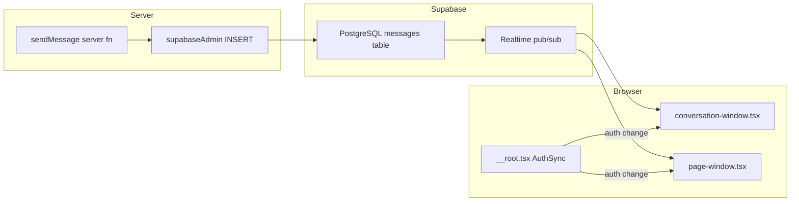

# Realtime

Tamarind uses Supabase Realtime for live updates. There are no custom WebSocket servers, SSE endpoints, or third-party pub/sub services.

## Overview



## Message Subscriptions

**File:** [`src/components/conversation/conversation-window.tsx`](../../src/components/conversation/conversation-window.tsx)

When a conversation is open, the component subscribes to Postgres changes on the `messages` table:

```typescript
supabase
  .channel(`messages:${conversationId}`)
  .on("postgres_changes", {
    event: "*",
    schema: "public",
    table: "messages",
    filter: `conversation_id=eq.${conversationId}`,
  }, handler)
  .subscribe()
```

`sendMessage` INSERTs and `trashMessages` / `recoverMessage` UPDATEs appear without a full refetch. Initial history comes from React Query + `listMessages` (newest 200); live events **overlay by id** (a later UPDATE replaces the cached row instead of being ignored because the id was already loaded). DELETE is handled defensively; message rows are no longer removed.

When the conversation is showing a `listMessagesAround` slice (deep link outside the latest 200), realtime **INSERT**s for messages not already in that slice are ignored so new traffic does not appear as a hole at the bottom of the old window. **UPDATE**s still overlay ids already on screen. Sending a message or **Jump to latest** clears `?m=`, refetches `listMessages`, and resumes live INSERT overlay.

### Message send flow

```
User sends message
  → sendMessage (server fn)
  → supabaseAdmin INSERT into messages
  → Realtime postgres_changes event
  → conversation-window merges into liveMessages state
  → enqueueMessageSemanticsProcessing (background, not realtime)
```

## Page Presence

**File:** [`src/components/page/page-window.tsx`](../../src/components/page/page-window.tsx)

When a page is open, the component joins a Supabase Presence channel:

```typescript
supabase.channel(`page:${pageId}`)
  .on("presence", { event: "sync" }, handler)
  .subscribe(async (status) => {
    if (status === "SUBSCRIBED") {
      await channel.track({ user_id, display_name, ... })
    }
  })
```

This shows which workspace members are currently viewing the same page. Presence state is ephemeral and not persisted to the database.

## Auth State Invalidation

**File:** [`src/routes/__root.tsx`](../../src/routes/__root.tsx)

`AuthSync` listens for Supabase auth state changes (`SIGNED_IN`, `SIGNED_OUT`, `TOKEN_REFRESHED`):

- Invalidates the TanStack Router cache (re-runs route loaders)
- Invalidates all React Query caches

This ensures Realtime subscriptions and server function data reflect the current user after login, logout, or token refresh.

## Realtime Publication

Only two tables are published to Supabase Realtime (configured in migrations):

| Table | Client usage |
|-------|--------------|
| `messages` | INSERT + UPDATE overlay in conversation window |
| `pages` | Available for future content sync (presence used today) |

## What Is Not Realtime

- **Page content edits** — saved via server functions and beacon API; no live co-editing sync
- **Conversation list / page list** — refreshed via React Query, not Realtime
- **Semantic pipeline status** — background processing; no client notification
- **Workspace membership changes** — require navigation refresh or query invalidation

## Related Docs

- [Overview](overview.md) — Supabase client tiers
- [Conversations](../interface/conversations.md) — Chat UI
- [Pages](../interface/pages.md) — Page editor
