# Cron & Background Jobs

Tamarind uses two background processing mechanisms: inline Cloudflare `waitUntil` for message semantics, and external cron schedulers for embedding, CTI, page-chunking, and page-embedding workers.

## Overview

```mermaid
flowchart TB
  subgraph inline [Inline: waitUntil]
    Send["sendMessage"]
    Enqueue["enqueueMessageSemanticsProcessing"]
    Norm["normalize → score → persist"]
  end

  subgraph cronEmbed [Scheduled: embedding]
    PGCronEmbed["pg_cron (every minute)"]
    PGNetEmbed["pg_net HTTP POST"]
    WorkerEmbed["runEmbeddingWorker"]
    Embed["OpenAI → message_embeddings"]
  end

  subgraph cronCti [Scheduled: CTI]
    PGCronCti["pg_cron (every minute)"]
    PGNetCti["pg_net HTTP POST"]
    WorkerCti["runCtiWorker"]
    Cti["apply_cti_plan_and_commit"]
  end

  subgraph cronPages [Scheduled: page chunking]
    PGCronPages["pg_cron (every minute)"]
    PGNetPages["pg_net HTTP POST"]
    WorkerPages["runPageChunkingWorker"]
    Chunks["page_chunks + QUEUED embeddings"]
  end

  Send --> Enqueue --> Norm
  PGCronEmbed --> PGNetEmbed --> WorkerEmbed --> Embed
  PGCronCti --> PGNetCti --> WorkerCti --> Cti
  PGCronPages --> PGNetPages --> WorkerPages --> Chunks
```



## Inline Semantics Processing

**Trigger:** Message insert in `sendMessage` or page announcement

**Mechanism:** Cloudflare Workers `waitUntil()` in [`enqueueMessageSemanticsProcessing`](../../src/semantic/enqueueMessageSemanticsProcessing.ts)

```typescript
import { waitUntil } from "cloudflare:workers";

export function enqueueMessageSemanticsProcessing(params) {
  const task = processAndPersistMessageSemantics(...).catch(handleError);
  waitUntil(task);
}
```

**What it does:**
1. Normalizes message text
2. Scores quality with heuristic model
3. Persists to `message_semantics` with status QUEUED or SKIPPED

**Characteristics:**
- Runs after the HTTP response is sent (non-blocking)
- No separate queue service — task runs in the same Worker invocation
- Failures are logged but do not affect the user's message send

**Trigger points:**

| Event | File |
|-------|------|
| User sends chat message | `conversations.functions.ts` → `sendMessage` |
| Page share announcement | `pages.server.ts` |
| Page-from-messages announcement | `conversations.functions.ts` → `createPageFromMessages` |

## Embedding Worker (Cron)

**Trigger:** External scheduler calling HTTP endpoint

**Mechanism:** pg_cron + pg_net in Supabase Postgres

### Setup

Migration [`20260730075844_*.sql`](../../supabase/migrations/20260730075844_751b8476-8d44-4d58-ad03-be209441e6c9.sql) enables extensions:

```sql
CREATE EXTENSION IF NOT EXISTS pg_cron;
CREATE EXTENSION IF NOT EXISTS pg_net;
```

A pg_cron job calls the worker endpoint every minute via pg_net HTTP POST with the `x-embedding-worker-secret` header.

### Worker execution

[`runEmbeddingWorker`](../../src/semantic/messages/message-embedding/runEmbeddingWorker.ts):

1. Claims up to 10 batches of 64 messages per tick
2. Calls OpenAI `text-embedding-3-small`
3. Persists vectors to `message_embeddings`
4. Calls `finalize_embedded_message` (sets EMBEDDED + enqueues CTI job)
5. Handles retry/failure on embedding errors

### Queue management

Queue state lives in `message_semantics.embedding_status`:

| Status | Meaning |
|--------|---------|
| `QUEUED` | Waiting for worker |
| `PROCESSING` | Claimed by worker |
| `EMBEDDED` | Vector stored |
| `FAILED` | Permanent failure or max retries |
| `SKIPPED` | Score below threshold |

Batch claiming uses the `claim_embedding_batch` Postgres RPC (service_role only), which atomically locks rows and handles stale PROCESSING recovery.

### Retry logic

Transient errors (429, 5xx) trigger exponential backoff requeue (max 10 retries). Permanent errors (400, 401, 403) mark FAILED immediately.

## CTI Worker (Cron)

**Trigger:** External scheduler calling HTTP endpoint (separate from embedding)

**Mechanism:** pg_cron + pg_net in Supabase Postgres

A pg_cron job calls the CTI worker endpoint every minute via pg_net HTTP POST with the `x-cti-worker-secret` header.

### Worker execution

[`runCtiWorker`](../../src/semantic/conversation-topics/worker/runCtiWorker.ts):

1. Claims **one** next-in-order job per iteration via `claim_conversation_topic_job`
2. Runs `conversationTopicEngine.planTransition()` (similarity routing, optional LLM/embeddings)
3. Applies the plan and completes the job via `apply_cti_plan_and_commit` (conversation lock + topic mutations + COMPLETED)
4. Classifies errors via `classifyCtiError` — permanent → `QUARANTINED`; transient → `RETRY_WAIT` with backoff
5. After 5 transient backoffs: 24h conversation halt, then renewed retry cycle

### Queue management

Queue state lives in `conversation_topic_jobs.status`:

| Status | Meaning |
|--------|---------|
| `QUEUED` | Waiting for worker |
| `PROCESSING` | Claimed by worker |
| `COMPLETED` | Topic transition committed |
| `RETRY_WAIT` | Transient failure; backoff or 24h conversation halt |
| `QUARANTINED` | Permanent failure; message excluded; later jobs continue |

Jobs are created only after `message_semantics.embedding_status = EMBEDDED` (via `finalize_embedded_message` RPC). Messages are processed in conversation order (`messages.created_at`, then `messages.id`).

### Error handling

- **Permanent** (validation, malformed data, unsupported content): `QUARANTINED` immediately. The conversation continues with the next message.
- **Transient** (timeouts, 5xx, rate limits, network): `RETRY_WAIT` with exponential backoff (10s base, 5 attempts). Other conversations keep processing.
- **After 5 transient backoffs**: 24h halt for that conversation only (`RETRY_WAIT`, `attempt_count` reset). Then the same job retries with a fresh 5-attempt cycle.
- **Global infra outage**: tick circuit-break stops processing further jobs in the same cron invocation (does not affect other conversations on the next tick).

### Operational recovery

24h halt — wait or force retry:

```sql
UPDATE conversation_topic_jobs
SET next_retry_at = now(), status = 'RETRY_WAIT'
WHERE id = '<job-id>';
```

Quarantined messages are not replayed automatically (optional later backfill).

## Page Chunking Worker (Cron)

**Trigger:** External scheduler calling HTTP endpoint (separate from embedding/CTI)

**Mechanism:** pg_cron + pg_net in Supabase Postgres

A pg_cron job calls the page-chunking worker every minute via pg_net HTTP POST with the `x-page-chunking-worker-secret` header.

### Worker execution

[`runPageChunkingWorker`](../../src/semantic/pages/page-chunks/worker/runPageChunkingWorker.ts):

1. Lists due pages via `list_pages_due_for_chunking` (idle ≥ `PAGE_CHUNKING_DEBOUNCE_MS`, default 5 minutes)
2. Walks TipTap JSON into structural chunks (header glue, ~300 token target, 350 hard cap)
3. Reconciles `page_chunks` by SHA-256 checksum (keeps row ids when content is unchanged)
4. Inserts `page_embeddings` rows as `QUEUED` for new/changed chunks only

This worker does **not** call OpenAI. Vector generation belongs to the page embedding worker below.

Content saves already bump `pages.last_modified_at`; that timestamp is the debounce signal. Empty never-chunked pages are skipped. Historical pages drain gradually, longest-idle first, `PAGE_CHUNKING_BATCH_SIZE` (20) per tick.

## Page Embedding Worker (Cron)

**Trigger:** External scheduler calling HTTP endpoint (separate secret from the other workers)

**Mechanism:** pg_cron + pg_net in Supabase Postgres

A pg_cron job calls the page embedding worker every minute via pg_net HTTP POST with the `x-page-embedding-worker-secret` header (`PAGE_EMBEDDING_WORKER_SECRET`).

### Worker execution

[`runPageEmbeddingWorker`](../../src/semantic/pages/page-embeddings/worker/runPageEmbeddingWorker.ts):

1. Claims up to 20 rows via `claim_page_embedding_batch` (`QUEUED` + `RETRY_WAIT`, stale `PROCESSING` recovery after 10 minutes)
2. Loads the matching `page_chunks` text and compares the live checksum against the claimed row
3. Bumps `updated_at` as a heartbeat before the OpenAI call, so overlapping ticks cannot double-embed
4. Embeds the batch with `text-embedding-3-small`
5. Persists guarded: `UPDATE ... WHERE id = ? AND embedding_status = 'PROCESSING' AND checksum = ?`

### Invariants

- **Heartbeat is an app contract**, not a column. Any UPDATE fires `trg_page_embeddings_updated_at`; the worker must touch rows before long calls.
- **Retries follow the CTI pattern.** Transient errors → `RETRY_WAIT` with exponential backoff; after `MAX_TRANSIENT_BACKOFFS` (5) the row gets a 24h `next_retry_at` with `attempts` reset. `FAILED` is only for permanent errors and is never claimed.
- **Drift is a skip, not a failure.** Missing chunk → no-op (CASCADE already removed the row); checksum mismatch → requeued as `QUEUED` with the live checksum and logged.

## Dev Manual Triggers

For local testing without pg_cron:

```
POST /api/run-embedding-worker
POST /api/run-cti-worker
POST /api/run-page-chunking-worker
POST /api/run-page-embedding-worker
```

Available only in development mode (404 in production). See [API Routes](../api/readme.md).

## What Is Not Used

- **Cloudflare Cron Triggers** — removed from `server.ts`; scheduling is external
- **Bull/Redis queues** — queue state is in Postgres
- **Supabase Edge Functions** — all processing runs in the Cloudflare Worker

## Related Docs

- [Semantic Pipeline](../semantic/pipeline.md) — Full processing flow
- [Embedding](../semantic/msg_embedding.md) — Worker details
- [API Routes](../api/readme.md) — HTTP endpoints
- [Deployment](../deployment.md) — Environment setup
