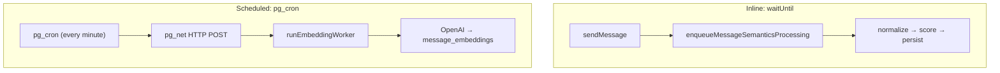

# Cron & Background Jobs

Tamarind uses two background processing mechanisms: inline Cloudflare `waitUntil` for message semantics, and an external cron scheduler for batch embedding.

## Overview



## Inline Semantics Processing

**Trigger:** Message insert in `sendMessage` or page announcement

**Mechanism:** Cloudflare Workers `waitUntil()` in [`enqueueMessageSemanticsProcessing`](../../src/semantic/enqueueMessageSemanticsProcessing.ts)

```typescript
import { waitUntil } from "cloudflare:workers";

export function enqueueMessageSemanticsProcessing(params) {
  const task = processAndPersistMessageSemantics(...).catch(handleError);
  waitUntil(task);
}
```

**What it does:**
1. Normalizes message text
2. Scores quality with heuristic model
3. Persists to `message_semantics` with status QUEUED or SKIPPED

**Characteristics:**
- Runs after the HTTP response is sent (non-blocking)
- No separate queue service — task runs in the same Worker invocation
- Failures are logged but do not affect the user's message send

**Trigger points:**

| Event | File |
|-------|------|
| User sends chat message | `conversations.functions.ts` → `sendMessage` |
| Page share announcement | `pages.server.ts` |
| Page-from-messages announcement | `conversations.functions.ts` → `createPageFromMessages` |

## Embedding Worker (Cron)

**Trigger:** External scheduler calling HTTP endpoint

**Mechanism:** pg_cron + pg_net in Supabase Postgres

### Setup

Migration [`20260730075844_*.sql`](../../supabase/migrations/20260730075844_751b8476-8d44-4d58-ad03-be209441e6c9.sql) enables extensions:

```sql
CREATE EXTENSION IF NOT EXISTS pg_cron;
CREATE EXTENSION IF NOT EXISTS pg_net;
```

A pg_cron job calls the worker endpoint every minute via pg_net HTTP POST with the `x-embedding-worker-secret` header.

### Worker execution

[`runEmbeddingWorker`](../../src/semantic/embedding/runEmbeddingWorker.ts):

1. Claims up to 10 batches of 64 messages per tick
2. Calls OpenAI `text-embedding-3-small`
3. Persists vectors to `message_embeddings`
4. Updates status to EMBEDDED or handles retry/failure

### Queue management

Queue state lives in `message_semantics.embedding_status`:

| Status | Meaning |
|--------|---------|
| `QUEUED` | Waiting for worker |
| `PROCESSING` | Claimed by worker |
| `EMBEDDED` | Vector stored |
| `FAILED` | Permanent failure or max retries |
| `SKIPPED` | Score below threshold |

Batch claiming uses the `claim_embedding_batch` Postgres RPC (service_role only), which atomically locks rows and handles stale PROCESSING recovery.

### Retry logic

Transient errors (429, 5xx) trigger exponential backoff requeue (max 10 retries). Permanent errors (400, 401, 403) mark FAILED immediately.

## Dev Manual Trigger

For local testing without pg_cron:

```
POST /api/run-embedding-worker
```

Available only in development mode (404 in production). See [API Routes](../api/readme.md).

## What Is Not Used

- **Cloudflare Cron Triggers** — removed from `server.ts`; scheduling is external
- **Bull/Redis queues** — queue state is in Postgres
- **Supabase Edge Functions** — all processing runs in the Cloudflare Worker

## Related Docs

- [Semantic Pipeline](../semantic/pipeline.md) — Full processing flow
- [Embedding](../semantic/msg_embedding.md) — Worker details
- [API Routes](../api/readme.md) — HTTP endpoints
- [Deployment](../deployment.md) — Environment setup
