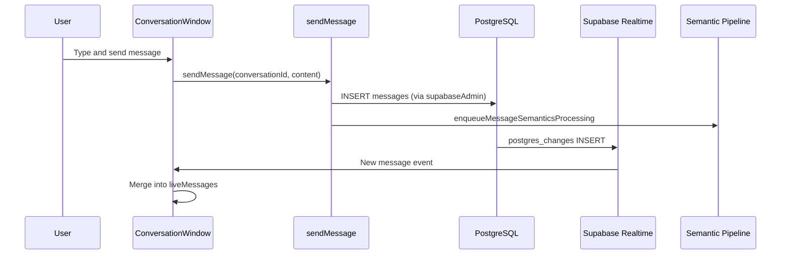

# Conversations

Conversations are the primary communication channel in Tamarind. They support direct messages, group chats, and channels, with rich-text messaging, @mentions, and the ability to create pages from message selections.

## Conversation Types

| Type | Description |
|------|-------------|
| `direct` | One-on-one between two workspace members |
| `group` | Multi-participant chat with editable title |
| `channel` | Schema-supported; same as group in current UI |

## UI Components

| Component | File | Purpose |
|-----------|------|---------|
| `ConversationWindow` | [`conversation-window.tsx`](../../src/components/conversation/conversation-window.tsx) | Main chat interface |
| `NewConversationDialog` | [`new-conversation-dialog.tsx`](../../src/components/new-conversation-dialog.tsx) | Pick members, find-or-create conversation |
| `ConversationSettingsDialog` | [`conversation-settings-dialog.tsx`](../../src/components/conversation/conversation-settings-dialog.tsx) | Title, participants, linked pages |
| `AddParticipantsDialog` | [`add-participants-dialog.tsx`](../../src/components/conversation/add-participants-dialog.tsx) | Add members to group |
| `EditableTitle` | [`editable-title.tsx`](../../src/components/conversation/editable-title.tsx) | Inline title editing |

## Conversation Window Features

The main chat UI ([`conversation-window.tsx`](../../src/components/conversation/conversation-window.tsx)) provides:

- **Message list** with day separators and author avatars
- **TipTap composer** for rich-text message input
- **@mentions** — `@user` for workspace members, `@@page` for pages
- **Realtime updates** — new messages appear via Supabase Realtime INSERT subscription
- **Create page from messages** — select messages and distill into a page
- **Conversation settings** — rename, manage participants, view linked pages

## Message Flow

Initial message history is loaded via React Query + `listMessages`. Realtime handles only subsequent INSERTs.

## Server Functions

All in [`src/lib/conversations.functions.ts`](../../src/lib/conversations.functions.ts):

| Function | Method | Purpose |
|----------|--------|---------|
| `listWorkspaceMembers` | GET | Members for @mention autocomplete |
| `listMyConversations` | GET | User's conversations in workspace |
| `findOrCreateConversation` | POST | Find existing direct or create new |
| `getConversation` | GET | Conversation details + participants |
| `listMessages` | GET | Message history for a conversation |
| `sendMessage` | POST | Insert message, trigger semantics pipeline |
| `addParticipants` | POST | Add members to group conversation |
| `listConversationPages` | GET | Pages linked to conversation |
| `createConversationPage` | POST | Create page scoped to conversation |
| `listMentionablePages` | GET | Pages available for @@mention |
| `renameConversation` | POST | Update group conversation title |
| `createPageFromMessages` | POST | Create page from selected messages |

## Mentions

TipTap mention extensions in [`src/components/editor/custom-mentions.ts`](../../src/components/editor/custom-mentions.ts):

| Trigger | Target | Autocomplete source |
|---------|--------|-------------------|
| `@` | Workspace members | `listWorkspaceMembers` |
| `@@` | Pages | `listMentionablePages` |

Mention list UI: [`src/components/editor/mention-list.tsx`](../../src/components/editor/mention-list.tsx)

## Create Page from Messages

Users can select one or more messages and create a page that captures that knowledge. `createPageFromMessages`:

1. Creates a new page with quoted message content
2. Links the page to the conversation
3. Posts an announcement message in the conversation

This triggers the semantic pipeline for the announcement message.

## Participants

- Direct conversations: exactly 2 participants, auto-created
- Group conversations: admin can add participants via `addParticipants`
- Roles per participant: `admin`, `member`, `viewer` (conversation_role enum)

## Related Docs

- [User Interface](user_interface.md) — Where conversations appear in the shell
- [Pages](pages.md) — Creating pages from messages
- [Realtime](../architecture/realtime.md) — Message subscription details
- [Semantic Pipeline](../semantic/pipeline.md) — Message processing after send
