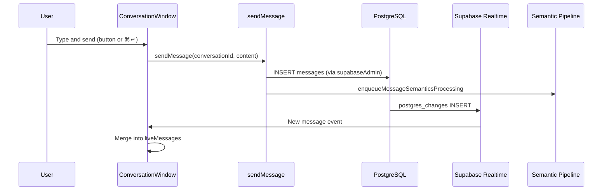

# Conversations

Conversations are the primary communication channel in Tamarind. They support direct messages, group chats, and channels, with rich-text messaging, @mentions, and the ability to create pages from message selections.

## Conversation Types

| Type | Description |
|------|-------------|
| `direct` | One-on-one between two workspace members |
| `group` | Multi-participant chat with editable title |
| `channel` | Schema-supported; same as group in current UI |

## UI Components

| Component | File | Purpose |
|-----------|------|---------|
| `ConversationWindow` | [`conversation-window.tsx`](../../src/components/conversation/conversation-window.tsx) | Main chat interface |
| `NewConversationDialog` | [`new-conversation-dialog.tsx`](../../src/components/new-conversation-dialog.tsx) | Pick members, find-or-create conversation |
| `ConversationSettingsDialog` | [`conversation-settings-dialog.tsx`](../../src/components/conversation/conversation-settings-dialog.tsx) | Title, participants, linked pages (`DialogContent` size `detail`, 630px) |
| `AddParticipantsDialog` | [`add-participants-dialog.tsx`](../../src/components/conversation/add-participants-dialog.tsx) | Add members to group |
| `EditableTitle` | [`editable-title.tsx`](../../src/components/conversation/editable-title.tsx) | Inline title editing |

## Conversation Window Features

The main chat UI ([`conversation-window.tsx`](../../src/components/conversation/conversation-window.tsx)) provides:

- **Message list** — consecutive messages from the same author on the same day are grouped into elevated "meseta" containers (raised surface with subtle shadow); own-message mesetas use a darker accent tint. Avatars and names appear on the first message of each run. Quoted message blocks (`.msg-quote`) remain visually nested inside message bodies, distinct from the meseta plate. Sticky day separators show **Today** for the current day, otherwise the full date (`Wed, 08 Aug 2026`)
- **Selection** — click live messages to select; a floating bar exposes quote, copy, create page, and related actions. **Esc** clears the selection. **Delete** appears only when every selected message is authored by you and none is already deleted. One selected message deletes immediately; two or more open a confirm dialog (`Confirm deletion` / `Are you sure you want to remove these messages?`)
- **Hover quick-actions** (nothing selected) — Quote & reply, Create page (same handlers as the selection bar). Deleted messages are not selectable and do not show hover actions
- **Deleted messages** — stay in the original slot as `[Message deleted]`. The author sees **Undo** for one hour (`purged_at > now()`). After the grace period the placeholder remains; Undo is hidden. Quotes of a deleted message show the same placeholder at display time (stored HTML is not rewritten); clicking the quote still scrolls to `data-message-id`
- **TipTap composer** — see below
- **@mentions** — `@` for workspace members and group/channel conversations, `@@page` for pages
- **Realtime updates** — INSERT and UPDATE via Supabase Realtime; live rows overlay `listMessages` by id so other participants see the placeholder immediately
- **Conversation settings** — rename, manage participants, view linked pages

## Composer

The composer is a collapsible vertical panel in the conversation column.

| State | Behavior |
|-------|----------|
| Minimized (default on first open) | Same height as the nav profile/logout row (`--footer-row`, 3rem). The composer `ResizablePanel` must use a literal `"3rem"` for `collapsedSize`/`defaultSize` — `react-resizable-panels` does not parse CSS variables. Nav CSS can keep `h-[var(--footer-row)]`. Only the placeholder **Start writing a message…**. No buttons, no hover formatting, not resizable |
| Expanded | ~20% of the column (resizable 16–45%). Formatting toolbar, secondary **New page**, **Send** with ⌘↵ hint |

- Click or focus expands. Blur with empty content collapses. Blur with text stays expanded.
- **Enter** inserts a line break. **Send** is the button or **⌘↵** / Ctrl+Enter. Mention popovers still consume Enter while open.
- Long text wraps (`min-w-0` + ProseMirror `overflow-wrap`).

### Session drafts

[`src/lib/composer-drafts.ts`](../../src/lib/composer-drafts.ts) stores HTML in `sessionStorage` (`tamarind:composer-drafts`), keyed by conversation id.

- Debounced write on TipTap `onUpdate`; removed on successful send or empty editor
- Restored on mount (including after switching conversations or opening/closing a page beside the thread, which remounts `ConversationWindow`); a restored draft expands the composer
- Cleared on logout (`clearComposerDrafts` in the workspace shell)

No database persistence.

## Message Flow

Initial history loads via React Query + `listMessages` (including deleted rows, with `purgedAt`). Realtime INSERT/UPDATE events overlay that list by message id.

## Server Functions

All in [`src/lib/conversations.functions.ts`](../../src/lib/conversations.functions.ts):

| Function | Method | Purpose |
|----------|--------|---------|
| `listWorkspaceMembers` | GET | Members for @mention autocomplete |
| `listMyConversations` | GET | User's conversations in workspace (`lastModifiedAt` included) |
| `findOrCreateConversation` | POST | Find existing direct or create new |
| `getConversation` | GET | Conversation details + participants |
| `listMessages` | GET | Message history for a conversation (`purgedAt`; deleted rows kept) |
| `sendMessage` | POST | Insert message, trigger semantics pipeline |
| `trashMessages` | POST | Author: schedule purge (`purged_at = now() + 1 hour`). Skips ids that are already purged |
| `recoverMessage` | POST | Author: clear `purged_at` while the undo window is still open |
| `addParticipants` | POST | Add members to group conversation |
| `listConversationPages` | GET | Pages linked to conversation |
| `createConversationPage` | POST | Create page scoped to conversation |
| `listMentionablePages` | GET | Pages available for @@mention |
| `renameConversation` | POST | Update group conversation title |
| `createPageFromMessages` | POST | Create page from selected messages |

Recent-activity empty state uses [`listRecentActivity`](../../src/lib/activity.functions.ts) (authorship-based, not `last_modified_at`).

## Mentions

TipTap mention extensions in [`src/components/editor/custom-mentions.ts`](../../src/components/editor/custom-mentions.ts):

| Trigger | Target | Autocomplete source |
|---------|--------|-------------------|
| `@` | Workspace members and group/channel conversations | `listWorkspaceMembers` + `listMyConversations` (direct DMs deduped against members) |
| `@@` | Pages | `listMentionablePages` |

Mention list UI: [`src/components/editor/mention-list.tsx`](../../src/components/editor/mention-list.tsx)

## Create Page from Messages

Users can select one or more messages (or use hover **Create page**) and create a page that captures that knowledge. `createPageFromMessages`:

1. Creates a new page with quoted message content
2. Links the page to the conversation
3. Posts an announcement message in the conversation

This triggers the semantic pipeline for the announcement message.

The New Page dialog has **title** and **visibility** only (no template picker).

## Add messages to page

Users can select one or more messages (any author) and append them onto an existing page they can edit. Selection toolbar **Add to page** opens a page picker (`AddMessagesToPageDialog`) that lists live workspace pages (`listMyPages`), with an instant title filter and single-select rows.

`appendMessagesToPage`:

1. Verifies the caller is a conversation participant and can edit the chosen page (not trashed; same workspace)
2. Appends a heading using the create-from-messages title taxonomy (`Messages from {conversation} on {YYYY-MM-DD HH:mm}` UTC), a horizontal rule, then chronological author-batched message content (quotes become blockquotes)
3. Leaves the page title unchanged and does **not** post a conversation announcement

On success the app navigates to the page and clears the message selection.

## Participants

- Direct conversations: exactly 2 participants, auto-created
- Group conversations: admin can add participants via `addParticipants`
- Roles per participant: `admin`, `member`, `viewer` (conversation_role enum)

## Related Docs

- [User Interface](user_interface.md) — Shell, hotkeys, split-view close
- [Pages](pages.md) — Creating pages from messages
- [Realtime](../architecture/realtime.md) — Message subscription details
- [Semantic Pipeline](../semantic/pipeline.md) — Message processing after send
