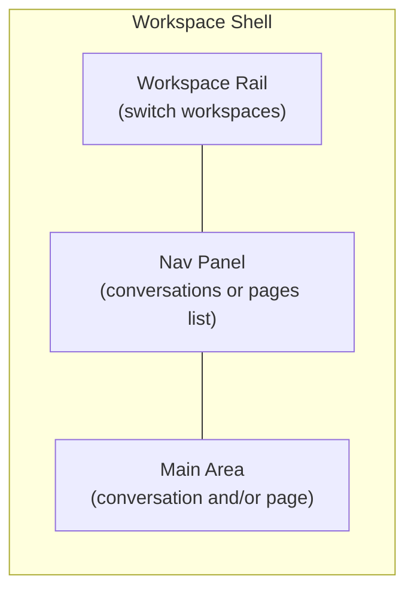

# User Interface

The main application UI is the workspace shell — a three-panel layout for navigating conversations and pages within a workspace.

**Primary file:** [`src/routes/_authenticated.w.$workspaceId.tsx`](../../src/routes/_authenticated.w.$workspaceId.tsx)

## Workspace Shell Layout



### Workspace Rail

Leftmost narrow panel for switching between workspaces the user belongs to. Also provides links to:

- Workspace settings (`/w/$workspaceId/settings`)
- Profile dialog
- Sign out

Collapsible on smaller viewports.

### Nav Panel

Resizable panel with two tabs:

| Tab | Content |
|-----|---------|
| Conversations | List of direct and group conversations; create new via dialog |
| Pages | List of accessible pages; create new via dialog |

Each item navigates by updating search params on the workspace route.

### Main Area

Displays one or both content windows based on URL search params:

| Search param | Component | Content |
|--------------|-----------|---------|
| `?c=$conversationId` | `ConversationWindow` | Chat interface |
| `?p=$pageId` | `PageWindow` | TipTap page editor |

Both can be open simultaneously in a split-pane layout using `ResizablePanelGroup`.

Example URL: `/w/abc123?c=conv-uuid&p=page-uuid`

## Navigation Model

The workspace route uses search params rather than nested routes for the main content:

```
/w/$workspaceId              → empty state (no conversation or page open)
/w/$workspaceId?c=uuid       → conversation open
/w/$workspaceId?p=uuid       → page open
/w/$workspaceId?c=uuid&p=uuid → split view
```

Legacy nested routes redirect to search params:

- `/w/$workspaceId/c/$conversationId` → `?c=$conversationId`
- `/w/$workspaceId/p/$pageId` → `?p=$pageId`

## Key UI Components

| Component | File | Role |
|-----------|------|------|
| `ConversationWindow` | [`conversation-window.tsx`](../../src/components/conversation/conversation-window.tsx) | Full chat UI |
| `PageWindow` | [`page-window.tsx`](../../src/components/page/page-window.tsx) | Page editor |
| `NewConversationDialog` | [`new-conversation-dialog.tsx`](../../src/components/new-conversation-dialog.tsx) | Create conversation |
| `NewPageDialog` | [`new-page-dialog.tsx`](../../src/components/page/new-page-dialog.tsx) | Create page |
| `ProfileDialog` | [`profile-dialog.tsx`](../../src/components/profile/profile-dialog.tsx) | User profile |

## Responsive Behavior

- Workspace rail collapses on mobile (`use-mobile` hook)
- Nav panel can be toggled open/closed
- Split-pane layout adapts to available width

## Empty State

When no conversation or page is selected, the main area shows a prompt to select or create content from the nav panel.

## Related Docs

- [Conversations](conversations.md) — Chat UI details
- [Pages](pages.md) — Page editor details
- [Workspaces & Permissions](workspaces_permissions.md) — Multi-workspace switching
