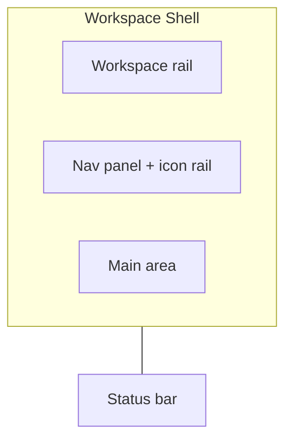

# User Interface

The main application UI is the workspace shell — workspace rail, navigation, main content, and a status bar — for conversations and pages within a workspace.

**Primary file:** [`src/routes/_authenticated.w.$workspaceId.tsx`](../../src/routes/_authenticated.w.$workspaceId.tsx)

## Workspace Shell Layout



| Band | Role |
|------|------|
| Workspace rail | Switch workspaces; settings at the bottom. Uses `--surface-workspace` so it reads darker than the nav. Width `--nav-rail` (3.75rem). Hidden until opened. |
| Nav panel | Conversations / pages / knowledge lists plus a matching icon rail. Folded and unfolded icon strips share the same `--nav-rail` width. |
| Main area | Empty state, conversation, page, or split view |
| Status bar | Workspace name, open asset(s) with icons, save status, version, theme, ⌘K |

### Workspace rail

Toggled with **⌘⇧\\** (Ctrl+Shift+\\ on Windows/Linux) or the Menu button in the nav header. Contains workspace initials and a link to workspace settings.

### Nav panel

Resizable, collapsible. Icon rail (always visible when the panel is open or folded):

| Icon | Action |
|------|--------|
| Conversations | Open conversations section |
| Pages | Open pages section |
| Search | Open search overlay (⌘F) |
| Knowledge base | Placeholder (“coming soon”) |
| Create | New conversation / new page |

Sections use uppercase labels (`Section` in [`navigation-panel.tsx`](../../src/components/navigation-panel.tsx)). Fold and open-section state persist in `localStorage`.

### Search

Search lives **on the icon rail in both folded and unfolded states**. It is not duplicated in the unfolded header.

See [User Search](../search/user_search.md) for the overlay.

### Main area

Displays one or both content windows based on URL search params:

| Search param | Component | Content |
|--------------|-----------|---------|
| `?c=$conversationId` | `ConversationWindow` | Chat interface |
| `?p=$pageId` | `PageWindow` | TipTap page editor |
| `?m=$messageId` | (with `c`) | Scrolls to and flashes that message after load |
| `?k=$chunkId` | (with `p`) | Scrolls to and flashes that page passage after load |

Both conversation and page can be open in a split-pane layout (`ResizablePanelGroup`). Example: `/w/abc123?c=conv-uuid&p=page-uuid`

**Close-on-drag:** if a pane is dragged below ~20% width, that asset is closed (`c`+`m` or `p`+`k` cleared). While dragging toward that threshold, [`CloseHintOverlay`](../../src/components/close-hint-overlay.tsx) shows a progressive blur/scrim and **Close conversation** / **Close page**.

## Navigation Model

```
/w/$workspaceId                    → empty state
/w/$workspaceId?c=uuid             → conversation
/w/$workspaceId?c=uuid&m=uuid      → conversation, focused message
/w/$workspaceId?p=uuid             → page
/w/$workspaceId?p=uuid&k=uuid      → page, focused passage
/w/$workspaceId?c=uuid&p=uuid      → split view
```

Legacy nested routes redirect to search params:

- `/w/$workspaceId/c/$conversationId` → `?c=$conversationId`
- `/w/$workspaceId/p/$pageId` → `?p=$pageId`

## Empty State

[`EmptyStateHome`](../../src/components/empty-state-home.tsx) when neither `c` nor `p` is set:

- Headline: **Welcome to Tamarind** (wordmark)
- If the user has authored messages or edited pages: quiet heading **Pick up where you left:** above a boxed list (up to 4 items from [`listRecentActivity`](../../src/lib/activity.functions.ts))
- If not: tagline, **Search anything** (⌘F), “or”
- **New conversation** and **New page** secondary buttons always shown

## Status Bar

[`status-bar.tsx`](../../src/components/status-bar.tsx) sits in document flow (24px-class height plus 2px). Left: workspace name, then conversation/page titles with the same icons as the nav. Right: save/sync (from [`SaveStatusProvider`](../../src/lib/save-status-context.tsx)), version + environment, theme toggle, Commands ⌘K.

## Command Palette

[`command-palette.tsx`](../../src/components/command-palette.tsx) (`cmdk`). Open with **⌘K**. Groups:

- **Actions** — new conversation, new page, search everything
- **Conversations / Pages** — last-modified first; 3 shown, **Show more** up to 30; typing the filter shows up to 30 immediately
- **Navigation** — toggle nav (⌘\\), toggle workspaces (⌘⇧\\), settings (⌘,), profile (⌘.), logout, switch workspace
- **Theme** — light / dark / system

## Keyboard Shortcuts

Canonical bindings: [`src/hooks/use-hotkeys.ts`](../../src/hooks/use-hotkeys.ts). `mod` is Cmd on macOS and Ctrl elsewhere. Bindings that browsers keep (⌘N, ⌘T, ⌘W) are not used.

| Binding | Action |
|---------|--------|
| ⌘K | Toggle command palette |
| ⌘F | Open search overlay (replaces Find-in-page while Tamarind is focused) |
| ⌘\\ | Toggle navigation panel |
| ⌘⇧\\ | Toggle workspaces rail |
| ⌘, | Workspace settings |
| ⌘. | User profile |
| ⌘⇧L | Clear search query and results (search overlay open) |
| ⌘↵ | Send message (composer) |
| Esc | Clear conversation message selection |

Hints use the [`Kbd`](../../src/components/ui/kbd.tsx) primitive.

## Key UI Components

| Component | File | Role |
|-----------|------|------|
| `NavigationPanel` | [`navigation-panel.tsx`](../../src/components/navigation-panel.tsx) | Icon rail + lists |
| `ConversationWindow` | [`conversation-window.tsx`](../../src/components/conversation/conversation-window.tsx) | Chat UI |
| `PageWindow` | [`page-window.tsx`](../../src/components/page/page-window.tsx) | Page editor |
| `EmptyStateHome` | [`empty-state-home.tsx`](../../src/components/empty-state-home.tsx) | Home empty state |
| `StatusBar` | [`status-bar.tsx`](../../src/components/status-bar.tsx) | Bottom ambient bar |
| `CommandPalette` | [`command-palette.tsx`](../../src/components/command-palette.tsx) | ⌘K palette |
| `SearchOverlay` | [`search-overlay.tsx`](../../src/components/search/search-overlay.tsx) | Workspace search (query is virtual first result; ⌘⇧L clears) |
| `CloseHintOverlay` | [`close-hint-overlay.tsx`](../../src/components/close-hint-overlay.tsx) | Split-view close preview |
| `NewConversationDialog` | [`new-conversation-dialog.tsx`](../../src/components/new-conversation-dialog.tsx) | Create conversation |
| `NewPageDialog` | [`new-page-dialog.tsx`](../../src/components/page/new-page-dialog.tsx) | Create page |
| `ProfileDialog` | [`profile-dialog.tsx`](../../src/components/profile/profile-dialog.tsx) | User profile (⌘.) |

## Responsive Behavior

- Workspace rail is off by default and toggled; same width as the nav icon rail
- Nav panel collapsible (`collapsedSize` matches `--nav-rail`)
- Split-pane layout adapts to available width; dragging a pane past the close threshold drops that asset

## Related Docs

- [User Search](../search/user_search.md) — Search overlay and result interaction
- [Conversations](conversations.md) — Chat UI details
- [Pages](pages.md) — Page editor details
- [Workspaces & Permissions](workspaces_permissions.md) — Multi-workspace switching
