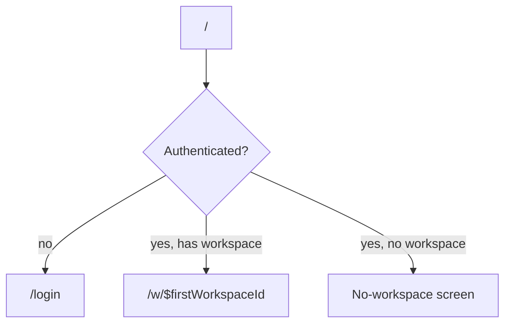
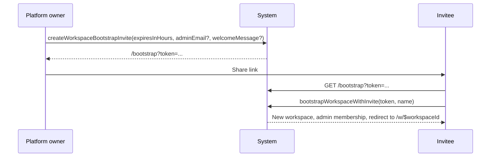
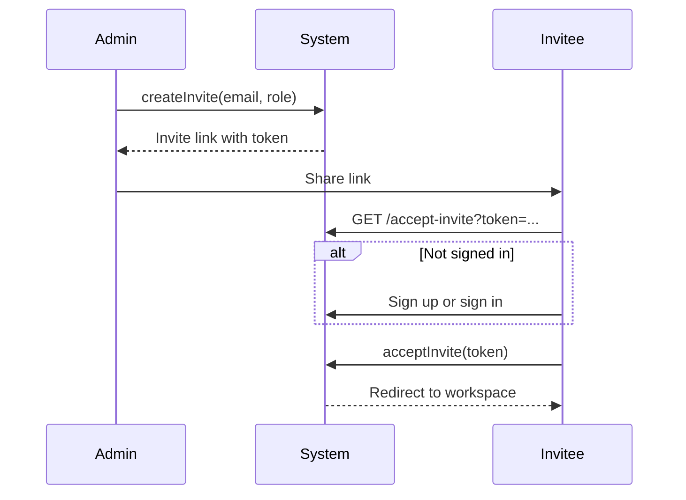

# User Onboarding

Tamarind supports multiple paths for users to join the platform: first-workspace bootstrap, email/password login, OAuth, and token-based invites.

## Entry Routing

[`src/routes/index.tsx`](../../src/routes/index.tsx) handles the root `/` redirect:

## Self-Serve Signup

**Route:** `/signup` ([`src/routes/signup.tsx`](../../src/routes/signup.tsx))

Public form: name (max 30 chars), email, and a required Terms & Conditions checkbox whose text opens in a dialog ([`src/components/terms-dialog.tsx`](../../src/components/terms-dialog.tsx)). Submitting always returns the same neutral "check your email" state, so the form cannot be used to enumerate registered addresses.

Server function `requestSignup` in [`src/lib/signup.functions.ts`](../../src/lib/signup.functions.ts):

1. Validates input with zod.
2. Flags the attempt as suspicious when the domain is on the disposable list ([`disposable-email-domains.ts`](../../src/lib/disposable-email-domains.ts)) or when recent attempts from the same email/IP exceed the hourly thresholds — attempts are recorded as salted hashes in `public.signup_attempts` (service-role only, RLS on with no policies).
3. Suspicious attempts must pass Cloudflare Turnstile (`TURNSTILE_SECRET_KEY` server-side, `VITE_TURNSTILE_SITE_KEY` for the widget). With no secret configured the check is skipped.
4. Sends the confirmation email via `signInWithOtp({ shouldCreateUser: true })` with `emailRedirectTo = <request origin>/bootstrap`.

The confirmation link lands on `/bootstrap`, where the signed-in user with no workspace sets a password and names their workspace. `createOwnWorkspace` ([`workspaces.functions.ts`](../../src/lib/workspaces.functions.ts)) enforces **one workspace per account**: if a membership already exists it returns that workspace instead of creating another.

## Bootstrap (First Workspace)

**Route:** `/bootstrap`

**File:** [`src/routes/bootstrap.tsx`](../../src/routes/bootstrap.tsx)

When the database has zero workspaces, new users are directed here to:

1. Create an admin account (email/password)
2. Create the first workspace
3. Redirect to the new workspace

Server function: `bootstrapFirstWorkspace` in [`src/lib/workspaces.functions.ts`](../../src/lib/workspaces.functions.ts)

Uses `supabaseAdmin` to bypass RLS for initial setup.

## Bootstrap via Invite (Additional Workspaces)

Once workspace #1 exists, `/bootstrap` (no token) is permanently unreachable — the zero-workspace gate above never opens again. Spinning up workspace #2, #3, etc. instead goes through a platform-owner-issued, single-use, time-limited link:

**Generate a link:** `/generate-workspace-invite` ([`src/routes/_authenticated.generate-workspace-invite.tsx`](../../src/routes/_authenticated.generate-workspace-invite.tsx)) — restricted to the `PLATFORM_OWNER_EMAILS` allowlist (see [Deployment](../architecture/deployment.md)), a concept distinct from any per-workspace `admin` role. Lets the owner set an expiry, optionally lock the invite to a specific admin email (shown disabled on `/bootstrap` if set), and attach a personalized welcome message (shown as the page headline).

**Redeem a link:** `/bootstrap?token=...` reuses the same page as the first-workspace flow, but on submit calls `bootstrapWorkspaceWithInvite` instead of `bootstrapFirstWorkspace`. One-time use is enforced atomically server-side (not just hidden in the UI), and an email lock, if set, is enforced server-side too.

Server functions in [`src/lib/workspace-bootstrap-invites.functions.ts`](../../src/lib/workspace-bootstrap-invites.functions.ts):
- `createWorkspaceBootstrapInvite` / `listWorkspaceBootstrapInvites` / `revokeWorkspaceBootstrapInvite` — owner-only management
- `getWorkspaceBootstrapInviteByToken` — public preview, used by `/bootstrap` before sign-in
- `bootstrapWorkspaceWithInvite` — redeems the invite, creating the workspace and admin membership

Sending the invite link and a post-creation confirmation email are not implemented here — no email-sending infrastructure exists in this codebase today; invites are copy-link only, same as [workspace invites](workspaces_permissions.md) below.

## Auth screens

Login, bootstrap, forgot/reset password, and accept-invite share [`AuthLayout`](../../src/components/auth-layout.tsx): form on the left, Tamarind wordmark, accent panel with the product tagline on large viewports. They follow the same light/dark theme as the rest of the app.

## Login

**Route:** `/login`

**File:** [`src/routes/login.tsx`](../../src/routes/login.tsx)

Supports:

| Method | Implementation |
|--------|---------------|
| Email/password | `supabase.auth.signInWithPassword` |
| Google OAuth | Lovable Cloud Auth → `supabase.auth.setSession` |
| Apple, Microsoft, Lovable OAuth | Same Lovable integration |

After login:
- If user has workspaces → redirect to first workspace
- If user has no workspaces → show "no workspace" dialog

## Invite Flow

**Route:** `/accept-invite?token=...`

**File:** [`src/routes/accept-invite.tsx`](../../src/routes/accept-invite.tsx)

Invites:
- Bound to a specific email address
- Expire after 24 hours
- Assign a role (admin, member, viewer) at creation time

Server functions in [`src/lib/invites.functions.ts`](../../src/lib/invites.functions.ts):
- `createInvite` — admin creates invite
- `getInviteByToken` — validate token
- `acceptInvite` — existing user accepts
- `acceptInviteWithSignup` — new user signs up and accepts

## Password Reset

| Route | File | Action |
|-------|------|--------|
| `/forgot-password` | [`forgot-password.tsx`](../../src/routes/forgot-password.tsx) | Send reset email via Supabase |
| `/reset-password` | [`reset-password.tsx`](../../src/routes/reset-password.tsx) | Set new password after reset link |

## Auth State Management

[`src/lib/auth-context.tsx`](../../src/lib/auth-context.tsx) provides `AuthProvider` and `useAuth()` hook for session state across the app.

On auth state change, [`AuthSync`](../../src/routes/__root.tsx) in the root route invalidates router and React Query caches to ensure fresh data.

The root HTML shell also injects the theme init script and wraps the tree in `ThemeProvider`. 404 and error boundaries use the `Button` primitive.

Signing out from the nav or the command palette calls `clearComposerDrafts()` before `supabase.auth.signOut()`.

## Related Docs

- [Auth](../architecture/auth.md) — Token flow and middleware
- [Workspaces & Permissions](workspaces_permissions.md) — Roles after onboarding
