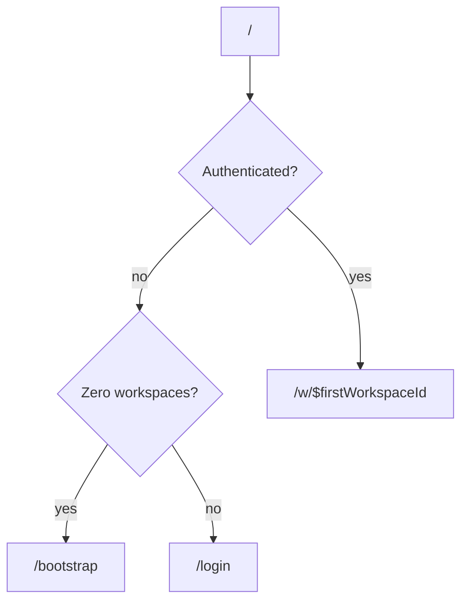
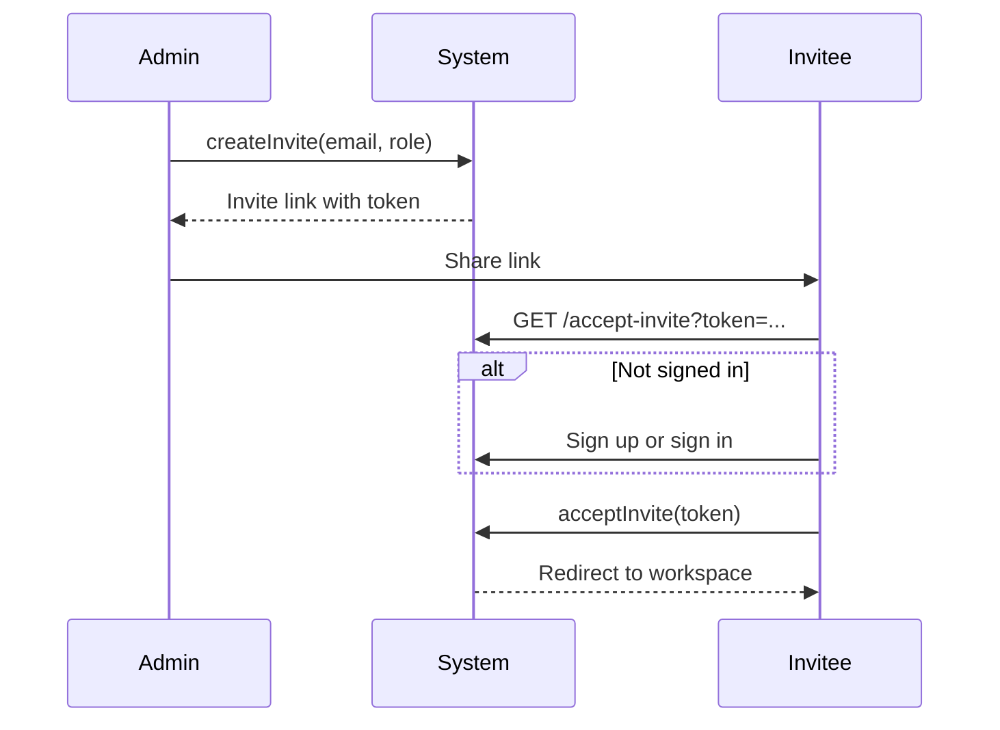

# User Onboarding

Tamarind supports multiple paths for users to join the platform: first-workspace bootstrap, email/password login, OAuth, and token-based invites.

## Entry Routing

[`src/routes/index.tsx`](../../src/routes/index.tsx) handles the root `/` redirect:

## Bootstrap (First Workspace)

**Route:** `/bootstrap`

**File:** [`src/routes/bootstrap.tsx`](../../src/routes/bootstrap.tsx)

When the database has zero workspaces, new users are directed here to:

1. Create an admin account (email/password)
2. Create the first workspace
3. Redirect to the new workspace

Server function: `bootstrapFirstWorkspace` in [`src/lib/workspaces.functions.ts`](../../src/lib/workspaces.functions.ts)

Uses `supabaseAdmin` to bypass RLS for initial setup.

## Auth screens

Login, bootstrap, forgot/reset password, and accept-invite share [`AuthLayout`](../../src/components/auth-layout.tsx): form on the left, Tamarind wordmark, accent panel with the product tagline on large viewports. They follow the same light/dark theme as the rest of the app.

## Login

**Route:** `/login`

**File:** [`src/routes/login.tsx`](../../src/routes/login.tsx)

Supports:

| Method | Implementation |
|--------|---------------|
| Email/password | `supabase.auth.signInWithPassword` |
| Google OAuth | Lovable Cloud Auth → `supabase.auth.setSession` |
| Apple, Microsoft, Lovable OAuth | Same Lovable integration |

After login:
- If user has workspaces → redirect to first workspace
- If user has no workspaces → show "no workspace" dialog

## Invite Flow

**Route:** `/accept-invite?token=...`

**File:** [`src/routes/accept-invite.tsx`](../../src/routes/accept-invite.tsx)

Invites:
- Bound to a specific email address
- Expire after 24 hours
- Assign a role (admin, member, viewer) at creation time

Server functions in [`src/lib/invites.functions.ts`](../../src/lib/invites.functions.ts):
- `createInvite` — admin creates invite
- `getInviteByToken` — validate token
- `acceptInvite` — existing user accepts
- `acceptInviteWithSignup` — new user signs up and accepts

## Password Reset

| Route | File | Action |
|-------|------|--------|
| `/forgot-password` | [`forgot-password.tsx`](../../src/routes/forgot-password.tsx) | Send reset email via Supabase |
| `/reset-password` | [`reset-password.tsx`](../../src/routes/reset-password.tsx) | Set new password after reset link |

## Auth State Management

[`src/lib/auth-context.tsx`](../../src/lib/auth-context.tsx) provides `AuthProvider` and `useAuth()` hook for session state across the app.

On auth state change, [`AuthSync`](../../src/routes/__root.tsx) in the root route invalidates router and React Query caches to ensure fresh data.

The root HTML shell also injects the theme init script and wraps the tree in `ThemeProvider`. 404 and error boundaries use the `Button` primitive.

Signing out from the nav or the command palette calls `clearComposerDrafts()` before `supabase.auth.signOut()`.

## Related Docs

- [Auth](../architecture/auth.md) — Token flow and middleware
- [Workspaces & Permissions](workspaces_permissions.md) — Roles after onboarding
