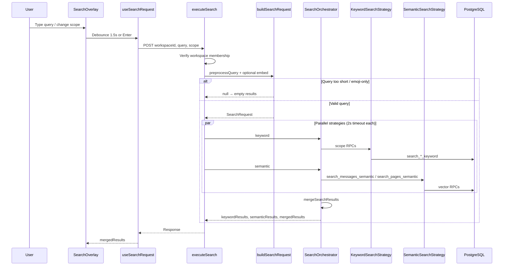

# Search Pipeline

The search pipeline transforms a user's query into ranked, merged results. It runs entirely server-side via TanStack Start server functions, with the client responsible for debouncing and display.

## End-to-End Flow



## Stage 1: Client Trigger

**Hook:** [`useSearchRequest`](../../src/hooks/use-search-request.ts)

| Behavior | Detail |
|----------|--------|
| Debounce | 1500ms after query or filter change |
| Immediate search | Enter in the query field calls `searchNow()` |
| Keyboard | Query is the virtual first list item; arrows wrap between query and results. Enter on a result opens it |
| Clear | `reset()` cancels in-flight work and clears results; overlay also blanks the query |
| Signature | Re-search only when `workspaceId`, `query`, `scope`, or dev strategy toggles change |
| Stale requests | Incrementing request ID drops out-of-order responses |
| Overlay closed | Cancels pending debounce; does not clear prior results |

The hook calls `executeSearch` and renders **`mergedResults` only**. Per-strategy lists are logged to the console in development.

## Stage 2: Authentication & Membership

**Server function:** [`executeSearch`](../../src/lib/search.functions.ts)

1. `requireSupabaseAuth` middleware validates the JWT and injects a user-scoped Supabase client
2. `getCurrentWorkspaceUser` verifies the caller is a member of the requested workspace via `workspace_users`
3. All search RPCs run as `SECURITY INVOKER` under RLS — users only see assets they can access

A companion function `prepareSearchRequest` builds the request without executing strategies. The UI does not call it today.

## Stage 3: Query Preprocessing

**File:** [`preprocessQuery`](../../src/search/preprocessQuery.ts)

| Rule | Outcome |
|------|---------|
| Emoji-only input | Rejected (`null`) |
| Empty after trim | Rejected |
| Emojis in text | Stripped |
| Whitespace | Collapsed to single spaces |
| Length &lt; 3 characters | Rejected |

If preprocessing returns `null`, `executeSearch` responds with empty result arrays.

## Stage 4: Request Building

**File:** [`buildSearchRequest`](../../src/search/buildSearchRequest.ts)

Builds a [`SearchRequest`](../../src/search/types.ts):

```typescript
{
  workspaceId: string
  query: string        // preprocessed
  embedding?: number[] // optional, 1536 dims
  scope: SearchScope   // "all" | "conversations" | "pages" | "users"
  limit: 20            // hard-coded
}
```

### Query Embedding

When scope supports semantic search (`all`, `conversations`, or `pages`), the pipeline embeds the query via [`embedSearchQuery`](../../src/semantic/embedding/embedSearchQuery.ts) using the same OpenAI provider as the indexing pipeline (`text-embedding-3-small`).

| Timeout | Behavior |
|---------|----------|
| 2s (`MAX_SEARCH_EMBEDDING_TIMEOUT_MS`) | Search continues without embedding; semantic strategy returns `[]` |
| Provider failure | Same — keyword-only fallback |

## Stage 5: Orchestration

**File:** [`SearchOrchestrator`](../../src/search/SearchOrchestrator.ts)

Runs keyword and semantic strategies in parallel via `Promise.all`. Each strategy is wrapped in a **2s timeout** (`MAX_SEARCH_STRATEGY_TIMEOUT_MS`); timeout or error yields an empty array for that strategy.

Development-only flags `enableKeywordSearch` and `enableSemanticSearch` can disable individual strategies. Production always enables both.

Each result is tagged with `strategy: "keyword" | "semantic"`.

## Stage 6: Merge

**Function:** `mergeSearchResults(keywordResults, semanticResults, limit)`

1. Key each result as `` `${assetType}:${assetId}` ``
2. On collision, keep the entry with the **higher score** (and its strategy tag)
3. Sort descending by score
4. Slice to `request.limit` (20)

Scores from keyword (trigram similarity ~0–1) and semantic (weighted blend) are **not calibrated** — merge is max-score, not reciprocal rank fusion.

## Response Shape

```typescript
type SearchOrchestratorResponse = {
  keywordResults: SearchResult[]
  semanticResults: SearchResult[]
  mergedResults: SearchResult[]
}

type SearchResult = {
  assetType: "page" | "conversation" | "message"
  assetId: string
  score: number
  title?: string
  snippet?: string
  matchedField: "title" | "content" | "name"
  conversationId?: string
  pageId?: string
  chunkId?: string
  strategy?: "keyword" | "semantic"
}
```

## Timeouts & Degradation

| Stage | Timeout | On failure |
|-------|---------|------------|
| Query embedding | 2s | Semantic strategy skipped |
| Keyword strategy | 2s | Empty keyword results |
| Semantic strategy | 2s | Empty semantic results |
| Individual keyword RPC | None (strategy-level only) | RPC error logged; other RPCs in scope still run |
| Individual semantic RPC | None (strategy-level only) | RPC error logged; the other corpus in `all` still runs |

The system is designed to degrade gracefully: a slow embedding provider or semantic query does not block keyword results.

## Related Docs

- [Keyword Search](keyword.md) — Keyword strategy and RPC details
- [Semantic Search](semantic.md) — Semantic strategy and scoring weights
- [User Search](user_search.md) — UI trigger and result interaction
- [Semantic Pipeline](../semantic/pipeline.md) — How message and page embeddings are produced
