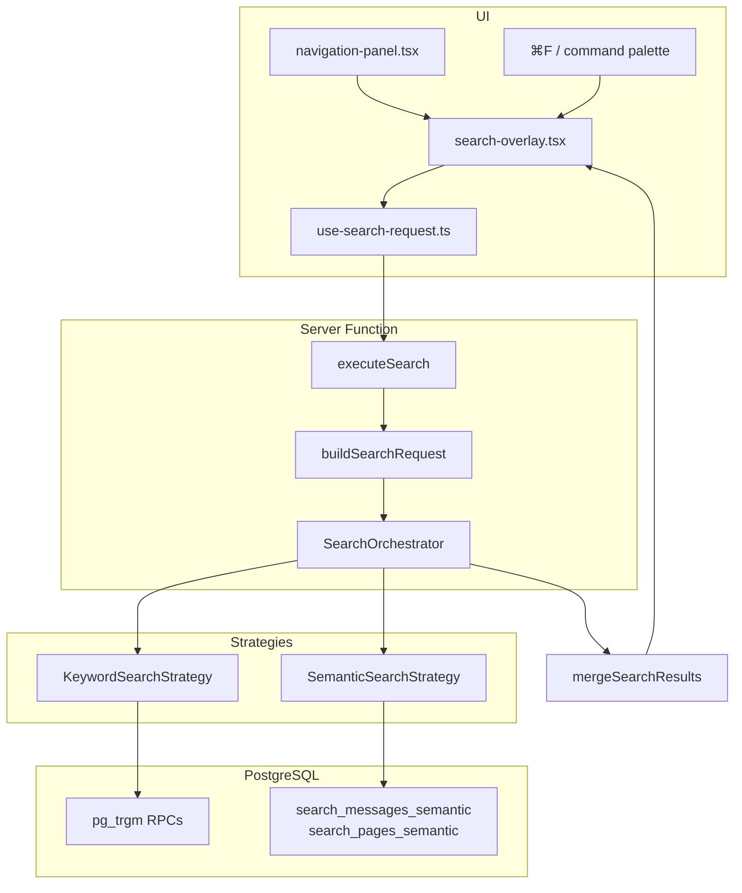

# Search & Retrieval Overview

Workspace search is a hybrid retrieval system that runs keyword and semantic strategies in parallel, merges the results, and presents them in a modal overlay. Users find pages, conversations, messages, and people within the current workspace.

Search is implemented as TanStack Start server functions and PostgreSQL RPCs — there is no dedicated REST `/api/search` route or external search engine.

## Subsystem Docs

| Document | Topic |
|----------|-------|
| [Pipeline](pipeline.md) | End-to-end query flow from UI to merged results |
| [Keyword Search](keyword.md) | Trigram-based keyword strategy and RPCs |
| [Semantic Search](semantic.md) | Vector similarity strategy over message and page-chunk embeddings |
| [User Search](user_search.md) | How users open search, filter, and act on results |

## Purpose

Teams capture knowledge in conversations and pages. Search lets members:

1. **Find content quickly** across pages, conversations, messages, and people
2. **Filter by scope** — all assets, conversations & messages, pages, or users & conversations
3. **Benefit from hybrid retrieval** — exact/substring matches via keyword search, meaning-based matches via semantic search over embedded messages and page chunks

## Architecture

## Key Modules

| Path | Role |
|------|------|
| [`src/components/search/search-overlay.tsx`](../../src/components/search/search-overlay.tsx) | Search modal UI |
| [`src/hooks/use-search-request.ts`](../../src/hooks/use-search-request.ts) | Debounced client search hook |
| [`src/lib/search.functions.ts`](../../src/lib/search.functions.ts) | `executeSearch` server function |
| [`src/search/`](../../src/search/) | Request building, orchestration, strategies, types |

## Strategies

| Strategy | Mechanism | Corpus |
|----------|-----------|--------|
| `keyword` | ILIKE containment + `pg_trgm` `similarity()` | Pages, conversations, messages, people → conversations |
| `semantic` | Query embedding + HNSW cosine similarity | Messages with active embeddings; pages with `EMBEDDED` chunk vectors |
| *(hybrid)* | Parallel run + max-score dedupe merge | Union of both strategies |

> **Not implemented today:** BM25, Elasticsearch/OpenSearch, external vector databases, reciprocal rank fusion (RRF), cross-encoder reranking, conversation-title semantic search, page topic/description search, message-level deep links, plan-gated search enforcement.

## Feature Gating

Plan feature keys `search.fulltext` and `search.semantic` are defined in [`src/lib/features.ts`](../../src/lib/features.ts) but **not enforced** on the `executeSearch` path. All workspace members can use both strategies regardless of plan tier.

## Indexing vs Retrieval

| Concern | Documentation |
|---------|---------------|
| Message normalization, scoring, embedding worker | [Semantic Pipeline](../semantic/readme.md) |
| Query-time search and UI | This folder |

Embeddings produced by the semantic pipeline feed the semantic search strategy. See [Semantic Search](semantic.md) for the query-time path.

## Related Docs

- [Semantic Pipeline](../semantic/readme.md) — Embedding index production
- [Database Schema](../architecture/database.md) — Indexes and search RPCs
- [User Interface](../interface/user_interface.md) — Workspace shell and navigation
- [Workspaces & Permissions](../interface/workspaces_permissions.md) — Plan feature keys
