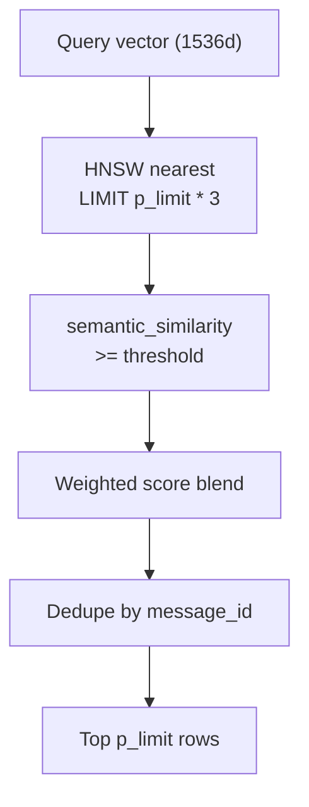

# Semantic Search

Semantic search finds messages and pages by meaning rather than exact text overlap. It embeds the user's query, compares it against stored message and page-chunk vectors via HNSW approximate nearest-neighbor search, and ranks candidates with a weighted blend of similarity and recency (messages also include a quality term).

**Strategy class:** [`SemanticSearchStrategy`](../../src/search/strategies/semantic/SemanticSearchStrategy.ts)

This document covers **query-time retrieval only**. How embeddings are produced, queued, and stored is documented in the [Semantic Pipeline](../semantic/readme.md).

## Scope Gate

Semantic search runs only when:

1. Scope is `all`, `conversations`, or `pages` ([`scopeSupportsSemanticSearch`](../../src/search/scope.ts))
2. A query embedding was successfully attached to the `SearchRequest`

Which corpora run:

| Scope | Message RPC | Page RPC |
|-------|-------------|----------|
| `all` | Yes | Yes (in parallel) |
| `conversations` | Yes | No |
| `pages` | No | Yes |
| `users` | No | No |

If scope is `users`, or embedding timed out/failed, the semantic strategy returns an empty array. Keyword search still runs. A single RPC error is logged and contributes `[]` without dropping the other corpus.

Conversation titles are not embedded; conversation-scope semantic hits are still **messages**.

## Query Embedding

Before the semantic strategy runs, [`buildSearchRequest`](../../src/search/buildSearchRequest.ts) calls [`embedSearchQuery`](../../src/semantic/embedding/embedSearchQuery.ts):

| Detail | Value |
|--------|-------|
| Provider | OpenAI via [`embeddingProvider`](../../src/semantic/embedding/embeddingProvider.ts) |
| Model | `text-embedding-3-small` |
| Dimensions | 1536 |
| Timeout | 2s — on timeout, semantic search is skipped |

The query embedding uses the same provider and model as the indexing pipelines, ensuring vector space compatibility.

## Ranking Config

Weights come from [`SEMANTIC_SEARCH_CONFIG`](../../src/search/strategies/semantic/config.ts) and override SQL defaults.

### Message knobs (`search_messages_semantic`)

| Parameter | App value | SQL default |
|-----------|-----------|-------------|
| `p_similarity_threshold` | **0.3** (`MESSAGE_EMBEDDING_THRESHOLD`) | 0.75 |
| `p_weight_similarity` | 0.7 (`MESSAGE_SCORE_WEIGHT_SIMILARITY`) | 0.8 |
| `p_weight_quality` | 0.15 (`MESSAGE_SCORE_WEIGHT_QUALITY`) | 0.1 |
| `p_weight_recency` | 0.15 (`MESSAGE_SCORE_WEIGHT_RECENCY`) | 0.1 |
| `p_recency_half_life_days` | 180 (`MESSAGE_RECENCY_HALF_LIFE_DAYS`) | 180 |

### Page knobs (`search_pages_semantic`)

There is no page quality signal. Recency uses `pages.last_modified_at`. SQL defaults already match the app values.

| Parameter | App value | SQL default |
|-----------|-----------|-------------|
| `p_similarity_threshold` | 0.3 (`PAGE_EMBEDDING_THRESHOLD`) | 0.3 |
| `p_weight_similarity` | 0.85 (`PAGE_SCORE_WEIGHT_SIMILARITY`) | 0.85 |
| `p_weight_recency` | 0.15 (`PAGE_SCORE_WEIGHT_RECENCY`) | 0.15 |
| `p_recency_half_life_days` | 180 (`PAGE_RECENCY_HALF_LIFE_DAYS`) | 180 |
| `p_embedding_model` | `text-embedding-3-small` ([`PAGE_CHUNK_CONFIG.PAGE_EMBEDDING_MODEL`](../../src/semantic/pages/page-chunks/engine/config.ts)) | `text-embedding-3-small` |

## RPC: `search_messages_semantic`

**Migration:** [`20260806181750_9e0a6166-0a5c-4d7f-b627-b3b0d73d0d3c.sql`](../../supabase/migrations/20260806181750_9e0a6166-0a5c-4d7f-b627-b3b0d73d0d3c.sql)

### Algorithm



1. **Nearest candidates** — Order `message_embeddings` by cosine distance (`<=>`) to the query vector; fetch `p_limit * 3` rows where `is_active = true` and message belongs to the workspace
2. **Threshold filter** — Keep rows where `1 - distance >= p_similarity_threshold`
3. **Score blend** — For each candidate:

   ```
   score = weight_similarity * semantic_similarity
         + weight_quality   * quality_score
         + weight_recency   * exp(-age_days / half_life_days)
   ```

4. **Dedupe** — One row per message (best score wins via `ROW_NUMBER()`)
5. **Return** — Top `p_limit` by final score

### Return columns

| Column | Maps to |
|--------|---------|
| `asset_id` | Message UUID |
| `conversation_id` | Parent conversation |
| `title` | Conversation title (nullable) |
| `match_text` | `message_semantics.normalized_text` |
| `matched_field` | Always `content` |
| `score` | Weighted final score |

## RPC: `search_pages_semantic`

**Migration:** [`20260819065842_e1ea0660-bb40-4638-bc7d-ef877f9a47d5.sql`](../../supabase/migrations/20260819065842_e1ea0660-bb40-4638-bc7d-ef877f9a47d5.sql)

Runs as `SECURITY INVOKER`; existing `page_chunk_embeddings` / `page_chunks` RLS (via `can_read_page`) applies.

1. **Nearest candidates** — Join `page_chunk_embeddings → page_chunks → pages`; keep `embedding_status = 'EMBEDDED'` and matching `embedding_model`; HNSW order by `pe.embedding <=> p_embedding`; fetch `p_limit * 3`
2. **Threshold filter** — Keep rows where `1 - distance >= p_similarity_threshold`
3. **Score blend** — No quality term:

   ```
   score = weight_similarity * semantic_similarity
         + weight_recency   * exp(-age_days / half_life_days)
   ```

   Recency age is `now() - pages.last_modified_at`.
4. **Dedupe** — One row per page (`PARTITION BY page_id`); winning chunk's `content` is `match_text`
5. **Return** — Top `p_limit` by final score

### Return columns

| Column | Maps to |
|--------|---------|
| `asset_id` | Page UUID |
| `title` | `pages.title` |
| `match_text` | Winning `page_chunks.content` |
| `matched_field` | Always `content` |
| `score` | Weighted final score |

Page topic name/description (`page_topics`) is **not** part of this corpus.

## App-Side Post-Processing

After the RPC(s) return:

1. Map message rows to `SearchResult` with `assetType: "message"`
2. Map page rows to `SearchResult` with `assetType: "page"` and `pageId`
3. Generate snippet via [`extractSnippet`](../../src/search/utils/snippet.ts)
4. Dedupe by `` `${assetType}:${assetId}` `` (keep higher score)
5. Sort by score descending, slice to limit

On RPC error, the strategy logs that RPC and continues with any remaining corpus. It does not fail the overall search.

## Indexing Dependency

Semantic hits require completed embeddings:

| Prerequisite | Table |
|--------------|-------|
| Normalized text | `message_semantics` |
| Quality score above embed threshold (0.5) | `message_semantics` |
| Active vector | `message_embeddings` (`is_active = true`) |
| Page chunks | `page_chunks` |
| Embedded chunk vectors | `page_chunk_embeddings` (`embedding_status = 'EMBEDDED'`) |

Messages or pages still queued, failed, or skipped during indexing will not appear in semantic results. They may still appear via keyword search.

Indexing is operational via existing workers — there is no search-time backfill. See [Embedding](../semantic/msg_embedding.md) and [Page Embedding](../semantic/page_embedding.md).

## Vector Index

| Index | Table | Type |
|-------|-------|------|
| `idx_message_embeddings_vector` | `message_embeddings` | HNSW cosine (`vector_cosine_ops`) |
| `idx_page_chunk_embeddings_vector` | `page_chunk_embeddings` | Partial HNSW cosine on `embedding` WHERE `embedding_status = 'EMBEDDED'` |

RLS policy `"Participants view message embeddings"` restricts message vector reads to conversation participants. Page embedding reads follow page visibility via `can_read_page`.

## Related Docs

- [Search Pipeline](pipeline.md) — Orchestration and merge with keyword results
- [Keyword Search](keyword.md) — Complementary substring/trigram strategy
- [Semantic Pipeline](../semantic/readme.md) — Index production
- [Embedding](../semantic/msg_embedding.md) — Message batch worker and OpenAI provider
- [Page Embedding](../semantic/page_embedding.md) — Page-chunk embedding worker
- [Database Schema](../architecture/database.md) — Embedding tables, HNSW indexes, search RPCs
