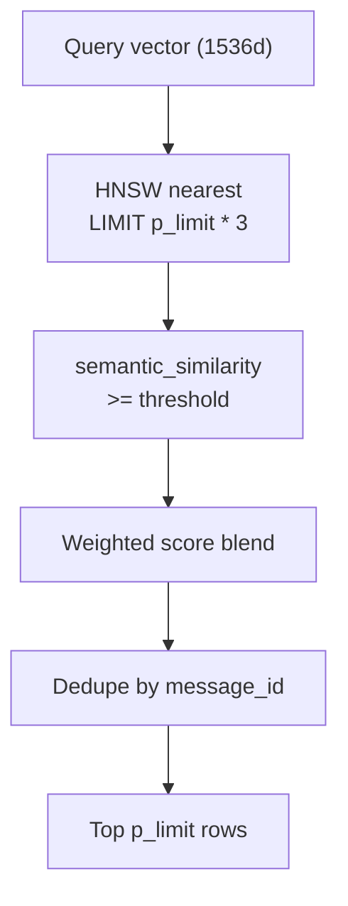

# Semantic Search

Semantic search finds messages by meaning rather than exact text overlap. It embeds the user's query, compares it against stored message vectors via HNSW approximate nearest-neighbor search, and ranks candidates with a weighted blend of similarity, quality, and recency.

**Strategy class:** [`SemanticSearchStrategy`](../../src/search/strategies/semantic/SemanticSearchStrategy.ts)

This document covers **query-time retrieval only**. How embeddings are produced, queued, and stored is documented in the [Semantic Pipeline](../semantic/readme.md).

## Scope Gate

Semantic search runs only when:

1. Scope is `all` or `conversations` ([`scopeSupportsSemanticSearch`](../../src/search/scope.ts))
2. A query embedding was successfully attached to the `SearchRequest`

If scope is `pages` or `users`, or embedding timed out/failed, the semantic strategy returns an empty array. Keyword search still runs.

> **Corpus limitation:** Semantic search covers **messages only**. Pages and conversations are not embedded for search today.

## Query Embedding

Before the semantic strategy runs, [`buildSearchRequest`](../../src/search/buildSearchRequest.ts) calls [`embedSearchQuery`](../../src/semantic/embedding/embedSearchQuery.ts):

| Detail | Value |
|--------|-------|
| Provider | OpenAI via [`embeddingProvider`](../../src/semantic/embedding/embeddingProvider.ts) |
| Model | `text-embedding-3-small` |
| Dimensions | 1536 |
| Timeout | 2s — on timeout, semantic search is skipped |

The query embedding uses the same provider and model as the indexing pipeline, ensuring vector space compatibility.

## RPC: `search_messages_semantic`

**Migration:** [`20260806181750_9e0a6166-0a5c-4d7f-b627-b3b0d73d0d3c.sql`](../../supabase/migrations/20260806181750_9e0a6166-0a5c-4d7f-b627-b3b0d73d0d3c.sql)

### Parameters (from app)

The strategy passes weights from [`SEMANTIC_SEARCH_CONFIG`](../../src/search/strategies/semantic/config.ts), overriding SQL defaults:

| Parameter | App value | SQL default |
|-----------|-----------|-------------|
| `p_similarity_threshold` | **0.3** | 0.75 |
| `p_weight_similarity` | 0.7 | 0.8 |
| `p_weight_quality` | 0.15 | 0.1 |
| `p_weight_recency` | 0.15 | 0.1 |
| `p_recency_half_life_days` | 180 | 180 |

### Algorithm



1. **Nearest candidates** — Order `message_embeddings` by cosine distance (`<=>`) to the query vector; fetch `p_limit * 3` rows where `is_active = true` and message belongs to the workspace
2. **Threshold filter** — Keep rows where `1 - distance >= p_similarity_threshold`
3. **Score blend** — For each candidate:

   ```
   score = weight_similarity * semantic_similarity
         + weight_quality   * quality_score
         + weight_recency   * exp(-age_days / half_life_days)
   ```

4. **Dedupe** — One row per message (best score wins via `ROW_NUMBER()`)
5. **Return** — Top `p_limit` by final score

### Return columns

| Column | Maps to |
|--------|---------|
| `asset_id` | Message UUID |
| `conversation_id` | Parent conversation |
| `title` | Conversation title (nullable) |
| `match_text` | `message_semantics.normalized_text` |
| `matched_field` | Always `content` |
| `score` | Weighted final score |

## App-Side Post-Processing

After the RPC returns:

1. Map rows to `SearchResult` with `assetType: "message"`
2. Generate snippet via [`extractSnippet`](../../src/search/utils/snippet.ts)
3. Dedupe by `assetId` (keep higher score)
4. Sort by score descending, slice to limit

On RPC error, the strategy logs and returns `[]` without failing the overall search.

## Indexing Dependency

Semantic hits require messages to have completed the embedding pipeline:

| Prerequisite | Table |
|--------------|-------|
| Normalized text | `message_semantics` |
| Quality score above embed threshold (0.5) | `message_semantics` |
| Active vector | `message_embeddings` (`is_active = true`) |

Messages that were skipped during normalization/scoring, or are still queued for embedding, will not appear in semantic results. They may still appear via keyword search if their normalized text contains the query.

See [Embedding](../semantic/msg_embedding.md) for worker details.

## Vector Index

| Index | Table | Type |
|-------|-------|------|
| `idx_message_embeddings_vector` | `message_embeddings` | HNSW cosine (`vector_cosine_ops`) |

RLS policy `"Participants view message embeddings"` restricts vector reads to conversation participants.

## Related Docs

- [Search Pipeline](pipeline.md) — Orchestration and merge with keyword results
- [Keyword Search](keyword.md) — Complementary substring/trigram strategy
- [Semantic Pipeline](../semantic/readme.md) — Index production
- [Embedding](../semantic/msg_embedding.md) — Batch worker and OpenAI provider
- [Database Schema](../architecture/database.md) — `message_embeddings` table and HNSW index
