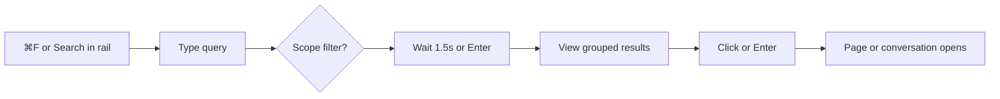

# User Search

How workspace members find content in the app. Search is a modal overlay — not a dedicated route — opened from the workspace shell.

## Entry Points

| Location | File | Action |
|----------|------|--------|
| Nav icon rail (folded and unfolded) | [`navigation-panel.tsx`](../../src/components/navigation-panel.tsx) | Search button (after Pages, before Knowledge) |
| Keyboard | [`use-hotkeys.ts`](../../src/hooks/use-hotkeys.ts) | **⌘F** / Ctrl+F (`HOTKEYS.search`) |
| Command palette | [`command-palette.tsx`](../../src/components/command-palette.tsx) | **Search everything** |
| Empty state | [`empty-state-home.tsx`](../../src/components/empty-state-home.tsx) | **Search anything** row |

⌘F is claimed from the page (`preventDefault`), so Find-in-page is unavailable while Tamarind is focused (browser menu still works).

The overlay mounts on `/w/$workspaceId` and does not change the URL until a result is selected.

## Search Overlay

**Component:** [`search-overlay.tsx`](../../src/components/search/search-overlay.tsx)

Rendered as a shadcn `Dialog` (~55vw, max 720px), visually aligned with the command palette. Filter chips are **always visible** (no show/hide toggle).

### Input

| Element | Value |
|---------|-------|
| Placeholder | `Search anything…` |
| Dialog title (sr-only) | `Search` |
| Trigger search | 1500ms debounce on typing; **Enter** in the query field searches immediately |
| Keyboard | The query field is the virtual first item of a circular list. Arrow Down from the query highlights the first result; Arrow Up from the query highlights the last. Arrow Up on the first result (and Arrow Down on the last) return focus to the query. Enter on a highlighted result opens it; Enter in the query always searches. |
| Clear | Circle-X in the query field (**Clear query**) or **⌘⇧L** clears the query and results (scope chips stay). |

### Scope Filters

Clicking an active chip deselects it (returns to **All**).

| Scope value | Label | Icon |
|-------------|-------|------|
| `all` | All | — |
| `conversations` | Conversations & messages | MessageSquareMore |
| `pages` | Pages | FileText |
| `users` | Users & conversations | User |

Semantic search runs for **All**, **Conversations & messages**, and **Pages**. **Users & conversations** uses keyword search only.

### Dev-Only Strategy Toggles

In development (`import.meta.env.DEV`), additional chips appear:

| Toggle | Label |
|--------|-------|
| Keyword | Keyword search |
| Semantic | Semantic search |

These isolate individual strategies. In production both are always enabled and the toggles are hidden.

## Results Display

Results are **grouped by asset type** (Pages, Conversations, Messages) after a global merge/rank. Query terms are highlighted in titles and snippets.

| UI element | Behavior |
|------------|----------|
| Count | `{n} result` / `{n} results` |
| Groups | Sticky group headings |
| Row layout | Icon + title; italic snippet for content matches |
| Dev metadata | `Keyword match` / `Semantic match` · score (development only) |

### Row Content

| Asset type | Icon | Title fallback |
|------------|------|----------------|
| Page | FileText | Page title or **Untitled** |
| Conversation | User | Conversation title or **Untitled** |
| Message | MessageSquareMore | **Message** |

Snippets appear when `matchedField === "content"`. Maximum **20 results** per search. No pagination.

## Selecting a Result

Clicking a result (or **Enter** on a highlighted result — not while the query field is focused) closes the overlay and navigates within the workspace:

| Asset type | Navigation |
|------------|------------|
| Page | `/w/$workspaceId?p=<pageId>` |
| Conversation | `/w/$workspaceId?c=<conversationId>` |
| Message | `/w/$workspaceId?c=<conversationId>` (opens parent conversation) |

Message hits do **not** scroll to or highlight the specific message. People search hits open the matched conversation.

## Status States

| State | Copy |
|-------|------|
| Loading | Spinner in the search field |
| Error | `Something went wrong. Try again.` |
| Empty (searched, no hits) | `No results. Try a different search or remove a filter.` |
| Has results | Grouped list |
| Pre-search / blank query | No status line; results panel collapsed |

## Session Persistence

Query text, scope, and previous results persist while the overlay is closed and reopened during the same session. A new search runs only when the query signature changes (query, scope, or dev strategy toggles).

Closing the overlay cancels any pending debounced search but does not reset the input or results. **Clear query** / **⌘⇧L** resets the input and results without closing the overlay.

## What Search Does Not Provide

| Missing capability | Notes |
|--------------------|-------|
| Dedicated search page/route | Overlay only |
| Result preview pane | Click navigates directly |
| Save / share / feedback on results | Not implemented |
| Pagination | Hard cap of 20 results |
| Message deep link | Opens conversation, not specific message |
| Date / source / type filters beyond scope chips | Not implemented |
| Plan-based strategy gating | Both strategies available to all members |

## User Journey

1. User is in a workspace (`/w/$workspaceId`)
2. Opens search (rail, ⌘F, palette, or empty state)
3. Types a query; optionally narrows scope with always-visible chips
4. After debounce or Enter, sees grouped results
5. Selects a row → overlay closes → page or conversation opens
6. If no results, adjusts query or scope and retries

## Related Docs

- [Search Pipeline](pipeline.md) — Server-side retrieval flow
- [User Interface](../interface/user_interface.md) — Workspace shell, command palette, hotkeys
- [Workspaces & Permissions](../interface/workspaces_permissions.md) — Plan feature keys (not yet enforced)
