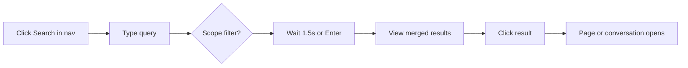

# User Search

How workspace members find content in the app. Search is a modal overlay — not a dedicated route — opened from the navigation panel within any workspace.

## Entry Points

| Location | File | Action |
|----------|------|--------|
| Nav header (expanded panel) | [`navigation-panel.tsx`](../../src/components/navigation-panel.tsx) | Search icon button |
| Nav rail (folded panel) | same file | **Search** button (does not expand the panel) |

Both open [`SearchOverlay`](../../src/components/search/search-overlay.tsx). There is no global keyboard shortcut (e.g. ⌘K) to open search.

The overlay mounts on the workspace route `/w/$workspaceId` and does not change the URL until a result is selected.

## Search Overlay

**Component:** [`search-overlay.tsx`](../../src/components/search/search-overlay.tsx)

Rendered as a shadcn `Dialog` modal (~55vw wide, max 900px). On open, the query input is focused and selected after a short delay.

### Input

| Element | Value |
|---------|-------|
| Placeholder | `Search anything…` |
| Dialog title (sr-only) | `Search` |
| Trigger search | 1500ms debounce on typing; **Enter** searches immediately |

### Scope Filters

Scope chips filter which asset types are searched. Clicking an active chip deselects it (returns to **All**).

| Scope value | Label | Icon |
|-------------|-------|------|
| `all` | All | — |
| `conversations` | Conversations & messages | MessageSquareMore |
| `pages` | Pages | FileText |
| `users` | Users & conversations | User |

The sliders button toggles filter visibility. Tooltip: **Filter your search**.

Semantic search runs only for **All** and **Conversations & messages** scopes. **Pages** and **Users & conversations** use keyword search only.

### Dev-Only Strategy Toggles

In development (`import.meta.env.DEV`), additional chips appear:

| Toggle | Label |
|--------|-------|
| Keyword | Keyword search |
| Semantic | Semantic search |

These allow isolating individual strategies. In production both are always enabled and the toggles are hidden.

## Results Display

Results from keyword and semantic strategies are **merged into a single ranked list** — not separate tabs or sections.

| UI element | Behavior |
|------------|----------|
| Count | `{n} result` / `{n} results` |
| List | Scrollable `<ul>` (max-height 45vh) |
| Row layout | Icon + title; italic snippet for content matches |
| Dev metadata | `Keyword match` / `Semantic match` · score (development only) |

### Row Content

| Asset type | Icon | Title fallback |
|------------|------|----------------|
| Page | FileText | Page title or **Untitled** |
| Conversation | MessageSquareMore | Conversation title or **Untitled** |
| Message | MessageSquareMore | **Message** |

Snippets (italic, muted) appear only when `matchedField === "content"`.

Maximum **20 results** per search. No pagination or infinite scroll.

## Selecting a Result

Clicking a result closes the overlay and navigates within the workspace:

| Asset type | Navigation |
|------------|------------|
| Page | `/w/$workspaceId?p=<pageId>` |
| Conversation | `/w/$workspaceId?c=<conversationId>` |
| Message | `/w/$workspaceId?c=<conversationId>` (opens parent conversation) |

Message hits do **not** scroll to or highlight the specific message. People search hits open the matched conversation.

Navigation uses TanStack Router search params on the existing workspace route, consistent with the [workspace shell](../interface/user_interface.md) model.

## Status States

| State | Copy |
|-------|------|
| Loading | `Searching…` (with spinner) |
| Error | `Something went wrong. Try again.` |
| Empty (searched, no hits) | `No results. Try a different search or remove a filter.` |
| Has results | Result count |
| Pre-search / blank query | No status line; results panel collapsed |

## Session Persistence

Query text, scope, and previous results persist while the overlay is closed and reopened during the same session. A new search runs only when the query signature changes (query, scope, or dev strategy toggles).

Closing the overlay cancels any pending debounced search but does not reset the input or results.

## What Search Does Not Provide

| Missing capability | Notes |
|--------------------|-------|
| Dedicated search page/route | Overlay only |
| Global keyboard shortcut | No ⌘K binding |
| Result preview pane | Click navigates directly |
| Save / share / feedback on results | Not implemented |
| Pagination | Hard cap of 20 results |
| Message deep link | Opens conversation, not specific message |
| Date / source / type filters beyond scope chips | Not implemented |
| Plan-based strategy gating | Both strategies available to all members |

## User Journey

1. User is in a workspace (`/w/$workspaceId`)
2. Clicks **Search** in the navigation panel
3. Types a query; optionally narrows scope with filter chips
4. After debounce or Enter, sees a merged result list with count
5. Clicks a row → overlay closes → page or conversation opens in the main workspace view
6. If no results, adjusts query or scope and retries

## Related Docs

- [Search Pipeline](pipeline.md) — Server-side retrieval flow
- [User Interface](../interface/user_interface.md) — Workspace shell and URL search params
- [Workspaces & Permissions](../interface/workspaces_permissions.md) — Plan feature keys (not yet enforced)
