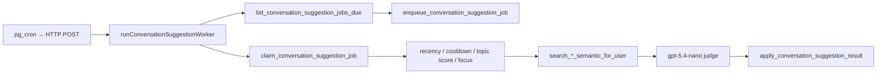

# Conversation Suggestions

Surfaces a private, per-participant nudge when the current conversation topic strongly matches another message or page chunk the user can read.

**Code:** [`src/semantic/conversation-suggestions/`](../../src/semantic/conversation-suggestions/)

## Flow

1. `list_conversation_suggestion_jobs_due(p_idle, p_cooldown, p_limit)` returns participant × conversation pairs. Intervals come from TypeScript config.
2. `enqueue_conversation_suggestion_job` upserts the durable job (`enqueued` / `requeued` / `processing` no-op).
3. `claim_conversation_suggestion_job` claims one `QUEUED` / due `RETRY_WAIT` row (`FOR UPDATE SKIP LOCKED`), recovering stale `PROCESSING` after 10 minutes.
4. App gates (then `committed_none` if they fail): last embedded message within 72h and older than the 5-minute debounce, no negative-feedback cooldown, winner topic score ≥ 0.8, established-topic focus (winner uniquely closest for a majority of the last 10 embedded messages), no unexpired `PENDING`.
5. Semantic retrieve uses **only** the winner topic embedding against `search_messages_semantic_for_user` and `search_pages_semantic_for_user` (threshold 0.75, top 10). Page hits keep chunk `match_text` and persist the **page_chunk** entity id. Same-conversation messages are eligible except the last-N context window.
6. LLM judge returns `{ decision, entity_id, confidence, reason, notification_text }`. Persist only `suggest` with confidence ≥ 0.85, entity type `message` | `page_chunk`, and no 14-day same-entity backoff.
7. `apply_conversation_suggestion_result` inserts the row (or completes with none) and marks the job `COMPLETED`.

The frontend fetches pending suggestions on conversation open (path B, artificial delay) and polls while the window is mounted (path A). Click uses existing `?c=&m=` and `?p=&k=` deeplinks.

## Configuration

[`engine/config.ts`](../../src/semantic/conversation-suggestions/engine/config.ts) and [`worker/config.ts`](../../src/semantic/conversation-suggestions/worker/config.ts)

| Key | Default | Purpose |
|-----|---------|---------|
| `CONVERSATION_SUGGESTION_LAST_MSG_CONTEXT_WINDOW_MS` | 72 h | Last embedded message must be this recent |
| `CONVERSATION_SUGGESTION_LAST_MSGS_CONTEXT_THRESHOLD` | 10 | Recent embedded messages for focus + LLM |
| `CONVERSATION_SUGGESTION_CURRENT_TOPIC_SCORE_THRESHOLD` | 0.8 | Winner `topicScore` floor |
| `CONVERSATION_SUGGESTION_COOLDOWN_MS` | 120 h | Passed as `p_cooldown`; re-checked after claim |
| `CONVERSATION_SUGGESTION_SEARCH_SIMILARITY_THRESHOLD` | 0.75 | ANN floor |
| `CONVERSATION_SUGGESTION_LLM_CONFIDENCE_THRESHOLD` | 0.85 | Judge floor |
| `CONVERSATION_SUGGESTION_EXPIRATION_TIME_MS` | 48 h | `expires_at` on insert |
| `CONVERSATION_SUGGESTION_DELAY_AFTER_CONVERSATION_REOPEN_MS` | 5 min | Path B delay |
| `CONVERSATION_SUGGESTION_BACKOFF_REPEATED_SUGGESTIONS_MS` | 14 d | Same entity + user + conversation |
| `CONVERSATION_SUGGESTION_DEBOUNCE_MS` | 5 min | Passed as `p_idle`; re-checked after claim |
| `MAX_JOBS_PER_TICK` | 8 | LLM jobs per cron tick |

## Operations

| Item | Value |
|------|-------|
| Cron endpoint | `POST /api/public/internal/run-conversation-suggestion-worker` |
| Header | `x-conversation-suggestions-worker-secret` |
| Secret | `CONVERSATION_SUGGESTIONS_WORKER_SECRET` |
| Response | `{ enqueued, processed, suggested, failed }` |

## Related Docs

- [Cron & Background Jobs](../cron/readme.md)
- [Semantic Search](../search/semantic.md)
- [Deployment](../deployment.md)
