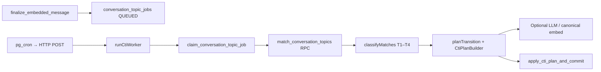

# Conversation Topics (CTI)

Conversation Topic Identification (CTI) clusters embedded messages into per-conversation topics (`conversation_topics`), tracks evidence links (`conversation_topic_evidences`), and maintains a decaying “current topic” pointer on `conversations.current_topic_id`.

**Code:** [`src/semantic/conversation-topics/`](../../src/semantic/conversation-topics/)

## Flow

1. After a message is embedded, `finalize_embedded_message` enqueues a `conversation_topic_jobs` row (one job per message, processed in conversation order).
2. `runCtiWorker` claims the next processable job (`QUEUED` or due `RETRY_WAIT`).
3. `match_conversation_topics` returns **every** topic in the conversation with cosine similarity to the message vector (no SQL similarity floor).
4. `classifyMatches` routes the message into tier **1**, **2**, **3**, or **4** using configurable thresholds.
5. `planTransition` builds a mutation plan (topic inserts/updates, evidence rows, optional `current_topic_id`).
6. `apply_cti_plan_and_commit` applies the plan under a per-conversation advisory lock and marks the job `COMPLETED`.

Downstream consumers include the semantic map ([`listConversationTopics`](../../src/lib/conversation-topics.functions.ts)), conversation suggestions (winner topic embedding), and message-delete reconciliation.

## Similarity tiers

Configured in [`engine/config.ts`](../../src/semantic/conversation-topics/engine/config.ts):

| Band | Cosine similarity | Route |
|------|-------------------|-------|
| **Strong** | `≥ 0.60` (`UPPER`) | Tier **1** |
| **Medium** | `≥ 0.40` and `< 0.60` (`LOWER`–`UPPER`) | Tier **2** |
| **Weak** | `< 0.40` | Tier **3** (or tier **4** if no topics exist) |

Tier **4** also applies when the conversation has no topics with embeddings yet.

## Per-tier behavior

Routing logic: [`engine/classifyMatches.ts`](../../src/semantic/conversation-topics/engine/classifyMatches.ts). Plan execution: [`engine/planTransition.ts`](../../src/semantic/conversation-topics/engine/planTransition.ts).

### Tier 1 — strong match (`similarity ≥ 0.60`)

| Topic kind | Action |
|------------|--------|
| **Established** | `reinforceEstablished`: +1 evidence, add message **similarity** to `historical_weight` |
| **Candidate** | `addCandidateEvidence`: +1 evidence, add **similarity** to `historical_weight`, update unnamed candidate embedding (mean of evidence vectors) |
| **Candidate promotion** | After evidence is attached, any candidate with `evidence_count ≥ 3` runs the promotion LLM (`evaluatePromotion`) |

All strong established and strong candidate matches are processed (not only the best match).

### Tier 2 — medium match (`0.40 ≤ similarity < 0.60`)

Entered when **any** established or candidate topic falls in the medium band (including medium-only candidate matches).

| Topic kind | Action |
|------------|--------|
| **Established** (best medium match present) | `applyTier2Decision`: classification LLM chooses an existing established topic (**reinforce** with LLM confidence) or creates a **named candidate** (`evidence_count = 1`, weight = confidence) |
| **Candidate** (all medium matches) | `addCandidateEvidence` (same as tier 1 candidate path) |
| **Candidate promotion** | Same as tier 1: `evaluatePromotion` when `evidence_count ≥ 3` after new evidence |

When only candidates match in the medium band, tier 2 runs **candidate evidence + promotion** without calling the tier-2 LLM.

### Tier 3 — weak match (`similarity < 0.40`)

Creates a new **unnamed candidate** (`is_candidate = true`, `name = null`, `evidence_count = 1`, embedding = message vector, `historical_weight = 0`).

### Tier 4 — no topics

Same as tier 3: new unnamed candidate (first topic seed for the conversation).

## Promotion (`evaluatePromotion`)

When a candidate reaches `CONVERSATION_TOPIC_MINIMUM_EVIDENCE_THRESHOLD` (**3** evidences), the promotion LLM receives evidence texts and established topic labels.

| LLM decision | Result |
|--------------|--------|
| **existing** | Merge candidate into chosen established topic: evidences move, weights combine (+ LLM confidence), candidate row deleted |
| **new** (no name collision) | Candidate becomes established: canonical topic embedding, name/description from LLM, `is_candidate = false`, + LLM confidence to weight |
| **new** (name matches established) | Merge into that established topic (same as **existing**) |

## `historical_weight` accumulation

Monotonic in the database (no decay on write). Recency decay applies only to `topicScore` for `current_topic_id`.

| Event | Weight change |
|-------|----------------|
| Tier 1 candidate evidence | + cosine similarity |
| Tier 2 candidate evidence | + cosine similarity |
| Tier 1 established reinforce | + cosine similarity |
| Tier 2 established reinforce (LLM) | + LLM confidence |
| Tier 2 new named candidate | starts at LLM confidence |
| Tier 3/4 unnamed candidate | starts at `0`; later tier-1/2 evidence adds similarity |
| First-time promotion | + promotion LLM confidence |
| Merge on promotion | target += candidate weight + promotion confidence |

## Current topic selection

After each plan, `selectCurrentTopic` scores **established** topics with `topicScore(historical_weight, last_seen_at, now, 72h half-life)` and applies **15% hysteresis** so `conversations.current_topic_id` does not flicker on small score changes.

## Configuration

[`engine/config.ts`](../../src/semantic/conversation-topics/engine/config.ts)

| Key | Default | Purpose |
|-----|---------|---------|
| `CONVERSATION_TOPIC_MEDIUM_SIMILARITY_UPPER_THRESHOLD` | **0.60** | Strong band floor (tier 1) |
| `CONVERSATION_TOPIC_MEDIUM_SIMILARITY_LOWER_THRESHOLD` | **0.40** | Medium band floor (tier 2) |
| `CONVERSATION_TOPIC_MINIMUM_EVIDENCE_THRESHOLD` | 3 | Promotion evidence floor |
| `CONVERSATION_TOPIC_SCORE_HALF_LIFE_HOURS` | 72 | `topicScore` recency decay |
| `CONVERSATION_TOPIC_SCORE_HYSTERESIS_PERCENTAGE` | 0.15 | Current-topic stickiness |
| `CTI_LLM_MODEL` | `gpt-5.4-nano` | Classification + promotion |
| `CTI_LLM_MAX_TOPICS` | 5 | Established topics in LLM prompt |
| `CTI_LLM_TIMEOUT_MS` | 20_000 | LLM call timeout |

## Operations

| Item | Value |
|------|-------|
| Cron endpoint | `POST /api/public/internal/run-cti-worker` |
| Header | `x-cti-worker-secret` |
| Secret | `CTI_WORKER_SECRET` |
| Match RPC | `match_conversation_topics(conversation_id, message_id)` — service role only |

## Related docs

- [Pipeline](pipeline.md) — phases A–C overview
- [Conversation Suggestions](conversation_suggestions.md) — uses winner topic embedding
- [Semantic Search](../search/semantic.md) — separate similarity threshold (0.3) for retrieval
