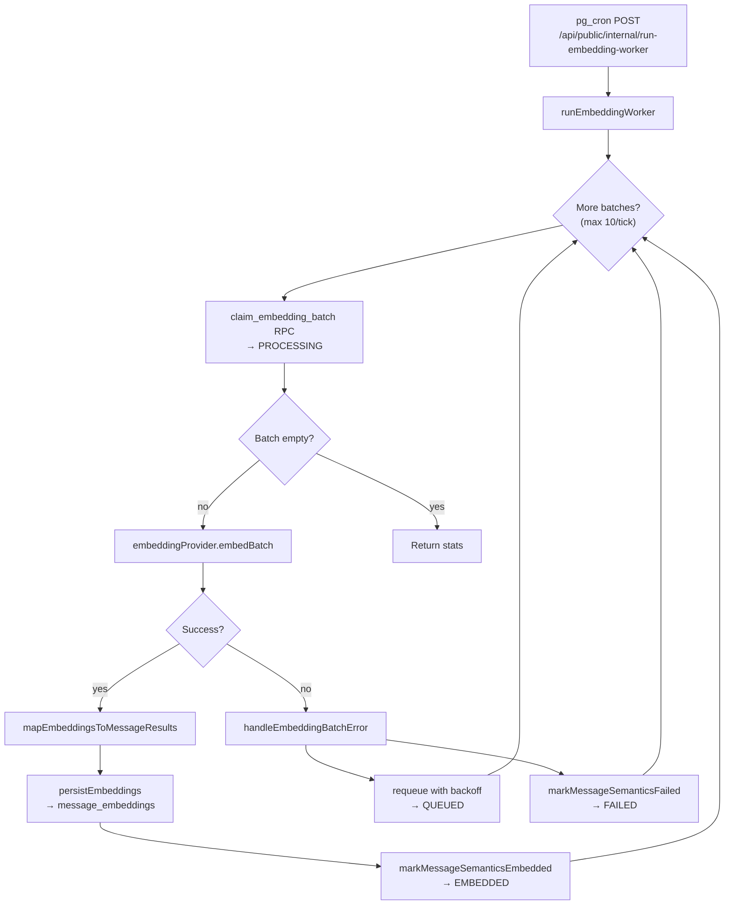

# Message Embedding

The embedding worker batch-processes queued messages, generates vector embeddings via OpenAI, and persists them for semantic search.

**Entry point:** [`runEmbeddingWorker`](../../src/semantic/messages/message-embedding/runEmbeddingWorker.ts)

## Worker Flow



## Configuration

[`EMBEDDING_CONFIG`](../../src/semantic/messages/message-embedding/config.ts):

| Parameter | Value |
|-----------|-------|
| `EMBEDDING_BATCH_SIZE` | 64 messages per batch |
| `OPENAI_EMBEDDING_MODEL` | `text-embedding-3-small` |
| `MAX_BATCHES_PER_TICK` | 10 |
| `MAX_RETRY_COUNT` | 10 |
| `BASE_DELAY_RETRY_MS` | 5,000 ms |
| `MAX_DELAY_RETRY_MS` | 600,000 ms (10 min) |

## Batch Claiming

[`claimEmbeddingBatch`](../../src/semantic/messages/message-embedding/claimBatch.ts) calls the Postgres RPC `claim_embedding_batch`:

- Selects rows where `embedding_status = 'QUEUED'` and `next_retry_at <= now()`
- Atomically sets status to `PROCESSING`
- Returns claimed rows to the worker
- Stale PROCESSING rows (worker crash) are reclaimed after timeout

Only `service_role` can execute this RPC.

## Embedding Provider

The generic embedding client lives in [`src/semantic/embedding/`](../../src/semantic/embedding/). It knows only about text inputs and embedding vectors.

[`embeddingProvider`](../../src/semantic/embedding/embeddingProvider.ts) is a pluggable interface. The active provider is OpenAI:

[`openAiEmbeddingProvider`](../../src/semantic/embedding/providers/openai/embeddings.server.ts) sends batch requests to the OpenAI embeddings API using `OPENAI_API_KEY`.

Generic provider interface:

```typescript
type EmbeddingProvider = {
  embedBatch(options: {
    model?: string;
    texts: string[];
  }): Promise<EmbedOutcome>;
};
```

The message indexing layer ([`mapEmbeddingsToMessageResults`](../../src/semantic/messages/message-embedding/mapMessageEmbeddings.ts)) maps generic vectors back to `message_semantics` IDs before persistence. Other pipelines (e.g. search-query embedding) can reuse the same generic provider directly.

## Persistence

On success, [`persistEmbeddings`](../../src/semantic/messages/message-embedding/persistEmbeddings.ts):

1. Inserts rows into `message_embeddings` with `embedding_vector vector(1536)`
2. Calls `markMessageSemanticsEmbedded` to set status to `EMBEDDED`

Vectors are stored with an HNSW cosine index (`idx_message_embeddings_vector`) for similarity search.

## Error Handling

[`handleEmbeddingBatchError`](../../src/semantic/messages/message-embedding/handleEmbeddingError.ts) classifies errors:

| Error type | HTTP status | Action |
|------------|-------------|--------|
| Transient | 429, 5xx | Requeue with exponential backoff |
| Permanent | 400, 401, 403 | Mark FAILED immediately |
| Max retries exceeded | — | Mark FAILED after 10 attempts |

Retry delay: `min(BASE_DELAY * 2^retryCount, MAX_DELAY_RETRY_MS)`

## HTTP Endpoints

| Route | Auth | Purpose |
|-------|------|---------|
| `POST /api/public/internal/run-embedding-worker` | `x-embedding-worker-secret` header | Production cron target |
| `POST /api/run-embedding-worker` | Dev-only (404 in prod) | Manual local testing |
| `POST /api/generate-embeddings` | None (JSON schema only) | Message-shaped embedding proxy |

See [API Routes](../api/readme.md) and [Cron & Background Jobs](../cron/readme.md).

## Environment Variables

| Variable | Purpose |
|----------|---------|
| `OPENAI_API_KEY` | OpenAI API authentication |
| `EMBEDDING_WORKER_SECRET` | Cron endpoint secret (timing-safe comparison) |
| `SUPABASE_SERVICE_ROLE_KEY` | Admin client for claim and persist |

## Related Docs

- [Pipeline](pipeline.md) — Full two-phase flow
- [Scoring](msg_scoring.md) — What determines QUEUED vs SKIPPED
- [Database Schema](../architecture/database.md) — message_embeddings table
