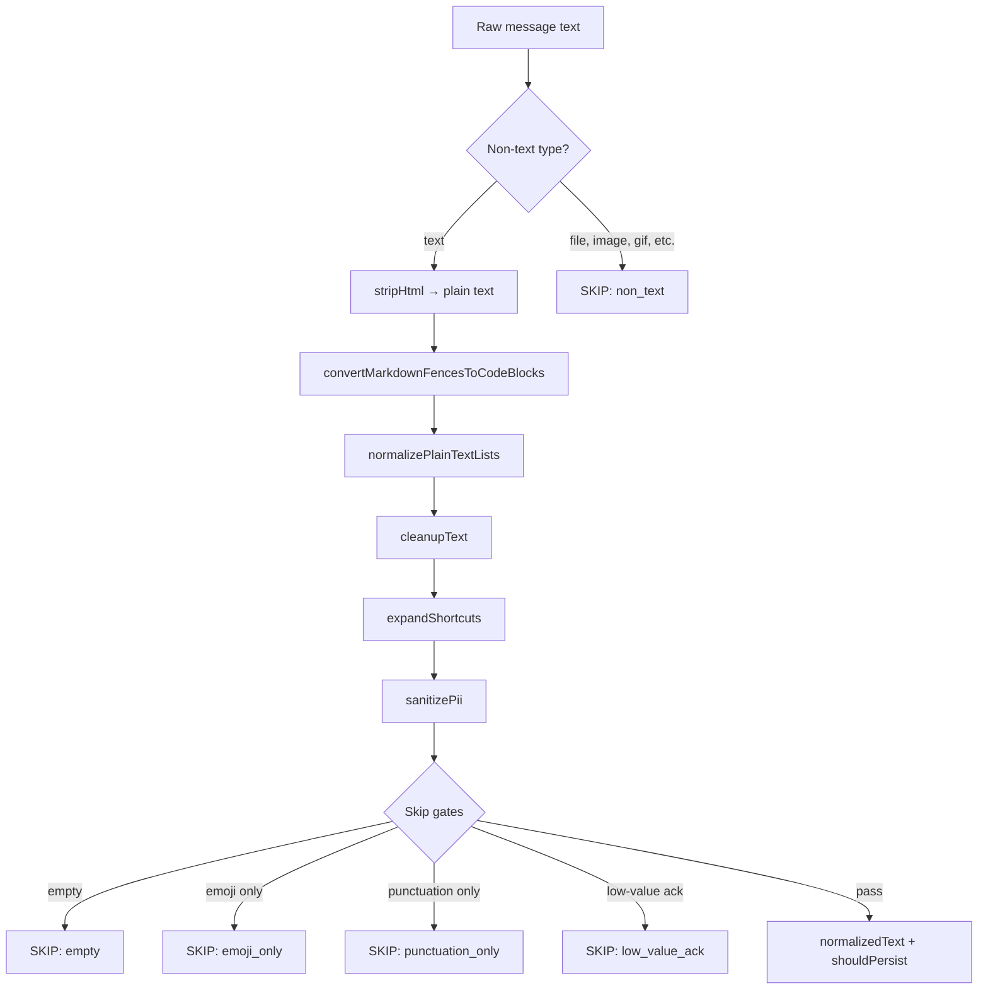

# Message Normalization

Normalization transforms raw chat message text into clean, searchable plain text. Messages that fail quality gates are skipped and never persisted to `message_semantics`.

**Entry point:** [`normalizeMessage`](../../src/semantic/messages/message-normalization/normalizeMessage.ts)

## Pipeline Steps



## Step Details

### 1. Non-text type check

Messages with types in `NON_TEXT_MESSAGE_TYPES` are skipped immediately:

`file`, `image`, `gif`, `audio`, `video`, `attachment`, `sticker`, `document`

### 2. HTML stripping

[`stripHtml.ts`](../../src/semantic/messages/message-normalization/stripHtml.ts) converts TipTap/HTML content to plain text, preserving structure where possible.

### 3. Markdown fence conversion

[`convertMarkdownFences.ts`](../../src/semantic/messages/message-normalization/convertMarkdownFences.ts) converts fenced code blocks (`` ``` ``) into protected `[[CODE_BLOCK]]...[[/CODE_BLOCK]]` markers so subsequent steps don't corrupt code content.

### 4. Plain-text list normalization

[`normalizePlainTextLists.ts`](../../src/semantic/messages/message-normalization/normalizePlainTextLists.ts) standardizes bullet and numbered lists to a consistent `- item` format.

### 5. Text cleanup

[`cleanupText`](../../src/semantic/messages/message-normalization/normalizeMessage.ts) (internal):
- Collapse whitespace and excessive newlines
- Remove emojis (Unicode Extended_Pictographic)
- Strip markdown formatting (bold, italic, links, headers)
- Preserve code block regions via marker protection

### 6. Shortcut expansion

[`shortcuts.ts`](../../src/semantic/messages/message-normalization/shortcuts.ts) expands common chat abbreviations (e.g. `tbh` → `to be honest`, `imo` → `in my opinion`) to improve searchability.

### 7. PII sanitization

Email addresses, phone numbers, and credit card patterns are redacted before persistence.

## Skip Gates

After normalization, messages are evaluated against skip gates. If any gate triggers, `shouldPersist` is set to `false`:

| Skip reason | Condition |
|-------------|-----------|
| `non_text` | Message type is attachment/media |
| `empty` | Normalized text is empty or whitespace-only |
| `emoji_only` | Text contains only emoji characters |
| `punctuation_only` | Text contains only punctuation (no letters/digits) |
| `low_value_ack` | Text matches acknowledgement tokens in [`acknowledgements.ts`](../../src/semantic/messages/message-normalization/acknowledgements.ts) |

### Acknowledgement tokens

Low-value acknowledgements like `ok`, `thanks`, `got it`, `👍`, `lgtm` are filtered out. The full list is in [`acknowledgements.ts`](../../src/semantic/messages/message-normalization/acknowledgements.ts).

## Output

```typescript
type NormalizationResult = {
  shouldPersist: boolean;
  rawMessage: string;
  normalizedText?: string;
  skipReason?: string;
};
```

When `shouldPersist` is true, `normalizedText` contains the cleaned text ready for scoring and persistence.

## Orchestration

[`processMessageNormalization`](../../src/semantic/messages/message-normalization/normalizer.ts) wraps `normalizeMessage` with debug logging. [`processAndPersistMessageSemantics`](../../src/semantic/messages/message-normalization/normalizer.ts) continues to scoring and persistence when `shouldPersist` is true.

## Related Docs

- [Pipeline](pipeline.md) — Where normalization fits in the full flow
- [Scoring](msg_scoring.md) — What happens after normalization
