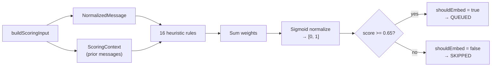

# Message Scoring

Scoring estimates the institutional knowledge value of a normalized message. High-scoring messages are queued for embedding; low-scoring messages are persisted as SKIPPED.

**Model:** MVP v1 heuristic scorer in [`src/semantic/message-scoring/models/mvp-v1/`](../../src/semantic/message-scoring/models/mvp-v1/)

## Scoring Flow



## Scoring Input

[`buildScoringInput`](../../src/semantic/message-scoring/buildScoringInput.ts) loads:

1. The anchor message from `messages` table
2. Up to 4 prior messages in the same conversation (via [`findMessageWithPriorContext`](../../src/semantic/persistence/messageRepository.ts))
3. Prior messages are re-normalized for context evaluation

```typescript
type ScoringContext = {
  priorMessages: NormalizedMessage[];  // up to 4, oldest first
};
```

## Scoring Rules

16 heuristic rules in [`rules.ts`](../../src/semantic/message-scoring/models/mvp-v1/rules.ts). Each rule has an `ENABLED` flag, a `WEIGHT`, and an `evaluate()` function.

### Message content rules

| Rule ID | Weight | Trigger |
|---------|--------|---------|
| `HEUR_MSG_LENGTH` | 10 | ≥ 10 words |
| `HEUR_MSG_TECH_TERMS` | 15 | Contains technical keyword (architecture, api, postgres, etc.) |
| `HEUR_MSG_EXPLANATION_WORDS` | 8 | Contains causal phrase (because, therefore, in order to, etc.) |
| `HEUR_MSG_LISTS` | 15 | ≥ 3 comma-separated items in a line |
| `HEUR_MSG_BULLET_LIST` | 15 | ≥ 3 bullet/numbered list items |
| `HEUR_MSG_URLS` | 5 | Contains URL |
| `HEUR_MSG_CODE` | 10 | Contains inline code |
| `HEUR_MSG_CODE_BLOCK` | 35 | Contains fenced code block |
| `HEUR_MSG_COMMANDS` | 20 | Contains action verb (create, implement, refactor, etc.) |
| `HEUR_MSG_DECISIONS` | 35 | Contains decision language (we decided, going forward, etc.) |
| `HEUR_MSG_NUMBERS` | 5 | Contains numeric values |
| `HEUR_MSG_PROPOSAL` | 30 | Contains proposal language (what if we, how about, etc.) |

### Context rules (prior messages)

| Rule ID | Weight | Trigger |
|---------|--------|---------|
| `HEUR_CONTEXT_QUESTION` | 25 | Preceding message (within 2) is a question |
| `HEUR_CONTEXT_SAME_AUTHOR_2` | 12 | Same author sent 2+ consecutive messages |
| `HEUR_CONTEXT_SAME_AUTHOR_4` | 30 | Same author sent 4+ consecutive messages |

## Score Normalization

Raw heuristic scores are summed, then normalized via sigmoid:

```
normalizedScore = 1 / (1 + exp(-K * (score - MIDPOINT)))
```

Configuration in [`config.ts`](../../src/semantic/message-scoring/models/mvp-v1/config.ts):

| Parameter | Value |
|-----------|-------|
| `K` | 0.05 |
| `MIDPOINT` | 50 |
| `SHOULD_EMBED_THRESHOLD` | 0.65 |

## Output

```typescript
type ScoringResult = {
  heuristicScore: number;      // raw sum of matched rule weights
  normalizedScore: number;       // sigmoid output [0, 1]
  shouldEmbed: boolean;          // normalizedScore >= 0.65
  appliedRules: AppliedRule[];   // which rules matched
};
```

## Persistence Decision

[`persistMessageSemantics`](../../src/semantic/persistence/persistMessageSemantics.ts) uses the scoring result:

| `shouldEmbed` | `embedding_status` | `processable` |
|---------------|-------------------|---------------|
| `true` | `QUEUED` | `true` |
| `false` | `SKIPPED` | `false` |

Both outcomes persist the row (with checksum dedup). SKIPPED messages are never claimed by the embedding worker.

## Configuration

All rule weights, keywords, and thresholds are in [`SCORING_CONFIG`](../../src/semantic/message-scoring/models/mvp-v1/config.ts). To tune scoring behavior, adjust weights or the `SHOULD_EMBED_THRESHOLD` without changing rule logic.

## Related Docs

- [Pipeline](pipeline.md) — Where scoring fits
- [Normalization](msg_normalization.md) — Input to scoring
- [Embedding](msg_embedding.md) — What happens to QUEUED messages
