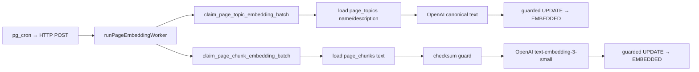

# Page Embedding Worker

Turns `page_chunks` rows queued by the [page chunking sweeper](../cron/readme.md) into 1536-dimensional vectors on `page_chunk_embeddings`, and canonical page-topic strings (`{topic_name}: {topic_description}`) into vectors on `page_topic_embeddings`.

**Code:** [`src/semantic/pages/page-embeddings/`](../../src/semantic/pages/page-embeddings/)

## Flow

Each tick processes **one topic batch first**, then up to `MAX_BATCHES_PER_TICK` chunk batches. A transient 429/5xx on the topic batch skips remaining chunk batches.

### Topic embeddings

1. `claim_page_topic_embedding_batch` uses the same claim/stale-recovery pattern as chunks. Rows are enqueued only by `trg_page_topics_enqueue_embedding` when `page_topics.topic_name` or `topic_description` change, and each row is keyed by `page_topic_id` → `page_topics.id`.
2. Live `page_topics` text is formatted with `canonicalTopicText` (`name: description`) and SHA-256 compared to the claimed checksum before spending an API call.
3. Heartbeat `updated_at`, then `embedBatch` of the canonical strings.
4. Guarded persist: `WHERE id = ? AND embedding_status = 'PROCESSING' AND checksum = ?`.

### Chunk embeddings

1. `claim_page_chunk_embedding_batch(p_batch_size, p_stale_after)` flips `QUEUED` / `RETRY_WAIT` rows to `PROCESSING` with `FOR UPDATE SKIP LOCKED`, and recovers `PROCESSING` rows whose `updated_at` is older than `p_stale_after` (10 minutes).
2. Chunk text is loaded in one follow-up query keyed by `chunk_id`. The claim RPC intentionally does not join chunk text.
3. The live chunk checksum is compared with the claimed row's checksum before spending an API call.
4. `touchPageEmbeddings` bumps `updated_at` (heartbeat) immediately before the embed call.
5. Persist is guarded: `WHERE id = ? AND embedding_status = 'PROCESSING' AND checksum = ?`. Success writes the vector, sets `EMBEDDED`, clears `last_error` / `next_retry_at`, and resets `attempts`. It does **not** change `embedding_model` (the queued value stays the unique key). Zero rows updated means the row drifted; the worker logs a skip and moves on.
6. The embed call uses each claimed row’s `embedding_model`. A transient 429/5xx requeues the batch then **circuit-breaks the tick** so the rest of `MAX_BATCHES_PER_TICK` is not spent on a rate-limited provider.

## Configuration

[`worker/config.ts`](../../src/semantic/pages/page-embeddings/worker/config.ts)

| Key | Default | Purpose |
|-----|---------|---------|
| `PAGE_EMBEDDING_BATCH_SIZE` | 20 | Rows claimed per chunk or topic RPC call |
| `PAGE_EMBEDDING_MODEL` | `text-embedding-3-small` | Must match `vector(1536)` |
| `BASE_DELAY_RETRY_MS` | 10 000 | Exponential backoff base |
| `MAX_TRANSIENT_BACKOFFS` | 5 | Backoffs before the long cooldown |
| `COOLDOWN_MS` | 24 h | `next_retry_at` after the budget is spent |
| `STALE_AFTER_MS` | 10 min | Stale `PROCESSING` recovery window |
| `MAX_BATCHES_PER_TICK` | 5 | Worker CPU guard |

## Status model

| Status | Meaning | Claimable |
|--------|---------|-----------|
| `QUEUED` | Chunking or the topic trigger queued it, or a drifted row was requeued | Yes |
| `PROCESSING` | Claimed; `updated_at` is the heartbeat | Only after `STALE_AFTER_MS` |
| `RETRY_WAIT` | Transient failure, waiting on `next_retry_at` | Yes, when due |
| `EMBEDDED` | Vector + `embedded_at` written | No |
| `FAILED` | Permanent error (bad input, unsupported model) | No |

Unlike message embeddings, exhausting retries never sets `FAILED` — the row lands on `RETRY_WAIT` with a 24h cooldown and `attempts` reset, following the CTI pattern.

## Drift handling

- **Chunk missing** — reconciliation deleted it; CASCADE removed (or will drop) the embedding row. Persist no-ops.
- **Topic row missing** — `page_topics` was deleted; CASCADE should already have dropped `page_topic_embeddings`. Persist no-ops.
- **Checksum differs** — the row is requeued as `QUEUED` with the live checksum, so the next tick embeds the current text (chunk content or canonical topic string).

## Operations

| Item | Value |
|------|-------|
| Cron endpoint | `POST /api/public/internal/run-page-embedding-worker` |
| Header | `x-page-embedding-worker-secret` |
| Secret | `PAGE_EMBEDDING_WORKER_SECRET` (dedicated; not shared with message embeddings) |
| Response | `{ claimed, embedded, skipped, failed, topicClaimed, topicEmbedded, topicSkipped, topicFailed, batchesProcessed }` |

## Related Docs

- [Cron & Background Jobs](../cron/readme.md)
- [Message Embedding](msg_embedding.md)
- [Semantic Search](../search/semantic.md) — query-time use of `EMBEDDED` page vectors
- [Deployment](../deployment.md)
