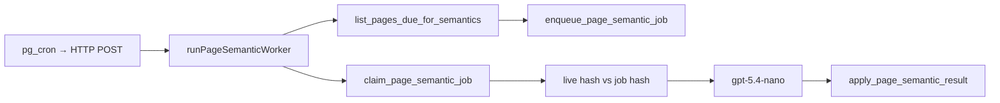

# Page Semantic Worker

Turns idle pages into LLM-derived topic name + description on `page_semantics`, gated by a SHA-256 snapshot of `pages.plain_text`.

**Code:** [`src/semantic/pages/page-semantics/`](../../src/semantic/pages/page-semantics/)

## Flow

1. `list_pages_due_for_semantics` returns pages idle ≥ 5 minutes whose live `plain_text` SHA-256 differs from `page_semantics.page_snapshot_hash` (or never analyzed / emptied).
2. The sweeper applies a 300-token count threshold (`gpt-tokenizer`). No snapshot → enqueue immediately. Empty pages with a semantics row → delete the row and complete inflight `QUEUED`/`RETRY_WAIT` jobs.
3. `enqueue_page_semantic_job` upserts the in-flight job (`enqueued` / `requeued` / `processing` no-op).
4. `claim_page_semantic_job` claims one `QUEUED` / due `RETRY_WAIT` row (`FOR UPDATE SKIP LOCKED`), recovering stale `PROCESSING` via `started_at` (10 minutes).
5. Live `plain_text` is hashed with `computeMessageChecksum`. Hash drift, missing page, or empty text calls `apply_page_semantic_result` with the **job** hash so the RPC returns `drifted` without writing `page_semantics`.
6. Otherwise the LLM (`gpt-5.4-nano`, JSON `{ name, description }`) runs with page title + contents. Title is input only — it is not part of the snapshot.
7. `apply_page_semantic_result` re-hashes live `plain_text`, upserts `page_semantics`, and marks the job `COMPLETED` in one transaction (`committed` / `drifted` / `not_processing` / `not_found`).

## Configuration

[`engine/config.ts`](../../src/semantic/pages/page-semantics/engine/config.ts) and [`worker/config.ts`](../../src/semantic/pages/page-semantics/worker/config.ts)

| Key | Default | Purpose |
|-----|---------|---------|
| `PAGE_SEMANTIC_SNAPSHOT_DIFF_THRESHOLD_TOKENS` | 300 | Token-count delta required to re-analyze |
| `PAGE_SEMANTIC_LLM_MODEL` | `gpt-5.4-nano` | OpenAI Responses model |
| `PAGE_SEMANTIC_LLM_TIMEOUT_MS` | 20 000 | LLM abort timeout |
| `PAGE_SEMANTIC_SWEEP_BATCH_SIZE` | 20 | Due pages per tick |
| `PAGE_SEMANTIC_DEBOUNCE_MS` | 5 min | Idle window (`p_idle`) |
| `BASE_DELAY_RETRY_MS` | 10 000 | Exponential backoff base |
| `MAX_TRANSIENT_BACKOFFS` | 5 | Backoffs before the 24h cooldown |
| `COOLDOWN_MS` | 24 h | `next_retry_at` after the budget is spent |
| `STALE_AFTER_MS` | 10 min | Stale `PROCESSING` recovery |
| `MAX_JOBS_PER_TICK` | 8 | LLM jobs per cron tick |

## Status model (`page_semantic_jobs`)

| Status | Meaning | Claimable |
|--------|---------|-----------|
| `QUEUED` | Sweeper enqueued it | Yes |
| `PROCESSING` | Claimed; `started_at` is the stale clock | Only after `STALE_AFTER_MS` |
| `RETRY_WAIT` | Transient failure, waiting on `next_retry_at` | Yes, when due |
| `COMPLETED` | Applied, drifted, or empty-page cleanup | No |
| `FAILED` | Permanent error | No |

`page_semantics` has no status. A missing row means never analyzed. Exhausting retries never sets `FAILED` — the job lands on `RETRY_WAIT` with a 24h cooldown and `attempts` reset. `FAILED` is only for permanent errors (validation, 4xx besides timeouts).

Jobs are independent per page. Transient waits on one page do not block others. A 429/5xx circuit-breaks the rest of the tick.

## Drift handling

- **Live hash ≠ job hash** (or empty / missing page) — `apply` returns `drifted`; no LLM call; no semantics write. The sweeper enqueues a new hash on a later tick.
- **Hash changed under 300 tokens** — sweeper skips enqueue.
- **Same-length rewrite** — token-count delta may be 0; known MVP gap.

## Operations

| Item | Value |
|------|-------|
| Cron endpoint | `POST /api/public/internal/run-page-semantic-worker` |
| Header | `x-page-semantic-worker-secret` |
| Secret | `PAGE_SEMANTIC_WORKER_SECRET` |
| Dev trigger | `POST /api/run-page-semantic-worker` |
| Response | `{ analyzed, skipped, failed }` |

## Related Docs

- [Cron & Background Jobs](../cron/readme.md)
- [Page Embedding](page_embedding.md)
- [Deployment](../deployment.md)
