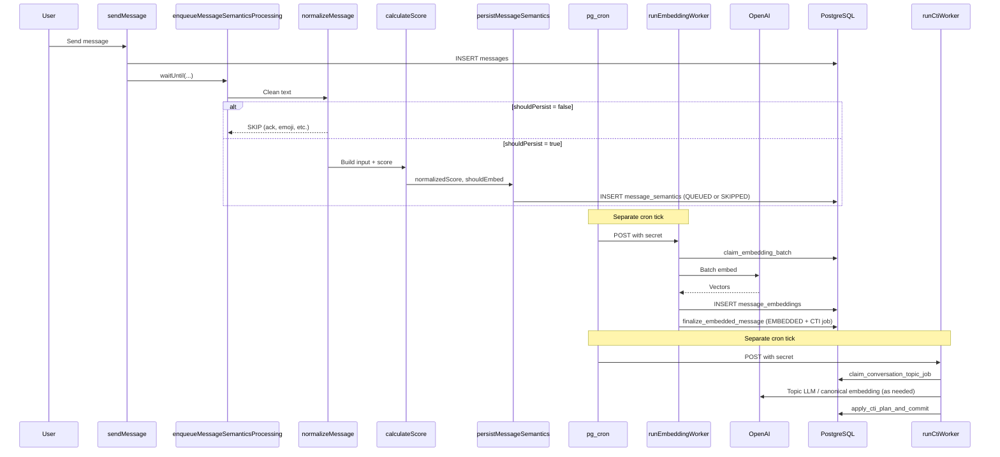

# Semantic Pipeline

The semantic pipeline processes messages in three decoupled phases: inline normalization and scoring on insert, asynchronous batch embedding via cron, and conversation topic identification (CTI) via a separate cron worker.

## End-to-End Flow



## Phase A: Inline Processing

**Entry:** [`enqueueMessageSemanticsProcessing`](../../src/semantic/enqueueMessageSemanticsProcessing.ts)

Called immediately after a message is inserted. Uses Cloudflare Workers `waitUntil()` to run asynchronously without blocking the HTTP response.

**Orchestrator:** [`processAndPersistMessageSemantics`](../../src/semantic/messages/message-normalization/normalizer.ts)

Steps:
1. `normalizeMessage(rawMessage)` — clean text, apply skip gates
2. If `shouldPersist` is false, stop
3. `buildScoringInput(messageId, normalizedText)` — load message + up to 4 prior messages
4. `calculateScore(message, context)` — heuristic scoring
5. `persistMessageSemantics(messageId, normalizedText, { normalizedScore, shouldEmbed })` — insert with checksum dedup

## Phase B: Embedding Worker

**Entry:** [`runEmbeddingWorker`](../../src/semantic/messages/message-embedding/runEmbeddingWorker.ts)

Triggered by external cron. Processes up to 10 batches per tick, 64 messages per batch.

Steps:
1. `claimEmbeddingBatch()` — RPC locks QUEUED rows as PROCESSING
2. `embeddingProvider.embedBatch()` — generic OpenAI API call with normalized text
3. `mapEmbeddingsToMessageResults()` — zip vectors with message_semantics IDs
4. On success: `persistEmbeddings()` → insert vectors, `finalize_embedded_message` (EMBEDDED + CTI job)
5. On failure: `handleEmbeddingBatchError()` → retry or mark FAILED

## Phase C: CTI Worker

**Entry:** [`runCtiWorker`](../../src/semantic/conversation-topics/worker/runCtiWorker.ts)

Triggered by external cron. Processes up to 8 jobs per tick, **one job at a time** (no batching).

Steps:
1. `claimConversationTopicJob()` — RPC claims one next-in-order `QUEUED` or due `RETRY_WAIT` job
2. `conversationTopicEngine.planTransition()` — match topics, route T1–T4, optional LLM/embedding, build mutation plan
3. `applyCtiPlanAndCommit()` — advisory lock + apply topic/evidence/`current_topic_id` writes + COMPLETED in one transaction
4. On failure: `handleCtiJobError()` — permanent → `QUARANTINED`; transient → `RETRY_WAIT` (5× backoff, then 24h halt)

`QUARANTINED` jobs do not block later messages. `RETRY_WAIT` keeps the cursor on the failed job until backoff or the 24h halt expires.

`conversation_topics.historical_weight` is a monotonic accumulator in the database (no decay on write). Recency decay is scoring-only (`topicScore`, 72h half-life) when choosing `conversations.current_topic_id`.

How weight is accumulated:

- **Candidate evidence (tier 1):** each attached message adds its cosine similarity.
- **Unnamed candidate (tier 3/4):** starts at `0`; later evidence adds similarity as above.
- **Named candidate (tier 2 `new`):** starts at the classification LLM confidence (clamped `[0, 1]`).
- **First-time promotion** (candidate becomes its own established topic): add the promotion LLM confidence.
- **Merge into an existing established topic:** the target receives the candidate's accumulated weight plus the promotion LLM confidence.
- **Established reinforce:** tier 1 adds message similarity; tier 2 adds classification LLM confidence.

## Page Chunking Worker

**Entry:** [`runPageChunkingWorker`](../../src/semantic/pages/page-chunks/worker/runPageChunkingWorker.ts)

Triggered by external cron after page content has been idle for `PAGE_CHUNKING_DEBOUNCE_MS` (5 minutes). `pages.last_modified_at` is the pending signal; there is no `waitUntil` on save.

Steps:
1. `listPagesDueForChunking()` — RPC `list_pages_due_for_chunking`
2. `chunkPageContent(content)` — TipTap structural pack (header glue, 300/350 tokens)
3. `reconcilePageChunks()` — checksum identity, preserve ids, queue new embeddings as `QUEUED`

Per-page failures are logged and do not abort the rest of the tick.

## Page Embedding Worker

**Entry:** [`runPageEmbeddingWorker`](../../src/semantic/pages/page-embeddings/worker/runPageEmbeddingWorker.ts)

Triggered by a separate external cron (`PAGE_EMBEDDING_WORKER_SECRET`). Each tick processes **one topic batch first** (up to 20 `page_topic_embeddings` rows), then up to 5 chunk batches of 20 `page_chunk_embeddings` rows.

Steps:
1. `claimPageTopicEmbeddingBatch()` — RPC `claim_page_topic_embedding_batch`; load `page_topics` name/description; embed `canonicalTopicText` (`name: description`); guarded persist → `EMBEDDED`
2. `claimPageEmbeddingBatch()` — RPC `claim_page_chunk_embedding_batch` locks `QUEUED` / due `RETRY_WAIT` (and stale `PROCESSING`) as `PROCESSING`
3. Load `page_chunks` text; skip missing chunks; requeue checksum drift as `QUEUED`
4. Heartbeat `updated_at`, then `embeddingProvider.embedBatch()` using each row’s `embedding_model`
5. On success: guarded persist → `EMBEDDED` (vector + `embedded_at`, `attempts` reset; `embedding_model` unchanged)
6. On failure: transient → `RETRY_WAIT` (5× backoff, then 24h cooldown); permanent → `FAILED`; 429/5xx on either stream circuit-breaks the rest of the tick

Topic vectors are **not** written to `page_chunk_embeddings`. See [Page Embedding](page_embedding.md).

## Page Semantic Worker

**Entry:** [`runPageSemanticWorker`](../../src/semantic/pages/page-semantics/worker/runPageSemanticWorker.ts)

Triggered by a separate external cron (`PAGE_SEMANTIC_WORKER_SECRET`). Each tick sweeps due pages then processes up to 8 LLM jobs.

Steps:
1. `list_pages_due_for_topics` — idle ≥ 5 minutes, hash drift / never analyzed / empty cleanup
2. Token-count threshold 300 (or no snapshot → enqueue). `enqueue_page_topic_job`
3. `claim_page_topic_job` — one `QUEUED` / due `RETRY_WAIT`, stale `PROCESSING` recovery via `started_at`
4. Live SHA-256 vs job hash; mismatch → `apply_page_topic_result` `drifted` (no LLM)
5. `llmProvider.complete` (`gpt-5.4-nano`) with title + `plain_text`
6. On success: `apply_page_topic_result` upserts `page_topics` + `COMPLETED` (trigger enqueues `page_topic_embeddings` when the topic fields change)
7. On failure: transient → `RETRY_WAIT` (5× backoff, then 24h cooldown); permanent → `FAILED`; 429/5xx circuit-breaks the tick

See [Page Semantics](page_semantic.md).

## Embedding Status Lifecycle

```
              persistMessageSemantics (no intermediate state)
              ┌─────────────────────┐
              │                     │
        shouldEmbed=true      shouldEmbed=false
              │                     │
              ▼                     ▼
        ┌──────────┐          ┌──────────┐
        │  QUEUED  │          │ SKIPPED  │ (terminal)
        └────┬─────┘          └──────────┘
             │ claim_embedding_batch
             ▼
        ┌────────────┐
        │ PROCESSING │
        └─────┬──────┘
              │
     ┌────────┴────────┐
     │                 │
     ▼                 ▼
┌──────────┐     ┌──────────┐
│ EMBEDDED │     │  FAILED  │ (terminal)
└──────────┘     └──────────┘
```

| Status | Set by | Meaning |
|--------|--------|---------|
| `QUEUED` | `persistMessageSemantics` | Eligible for embedding, waiting for worker |
| `SKIPPED` | `persistMessageSemantics` | Score below threshold; never embedded |
| `PROCESSING` | `claim_embedding_batch` RPC | Locked by worker |
| `EMBEDDED` | `finalize_embedded_message` | Vector stored; CTI job enqueued |
| `FAILED` | `markMessageSemanticsFailed` | Permanent or max-retry failure |

## Deduplication

Before insert, `computeMessageChecksum(normalizedText)` generates a SHA-256 hash. If a row with the same checksum already exists, the message is not persisted again.

## Trigger Points

| Event | File | Function |
|-------|------|----------|
| User sends chat message | `conversations.functions.ts` | `sendMessage` → `enqueueMessageSemanticsProcessing` |
| Page share announcement | `pages.server.ts` | Page announcement → `enqueueMessageSemanticsProcessing` |
| Page-from-messages announcement | `conversations.functions.ts` | `createPageFromMessages` side-effect |

## Related Docs

- [Normalization](msg_normalization.md)
- [Scoring](msg_scoring.md)
- [Embedding](msg_embedding.md)
- [Page Embedding](page_embedding.md)
- [Page Semantics](page_semantic.md)
- [Cron & Background Jobs](../cron/readme.md)
