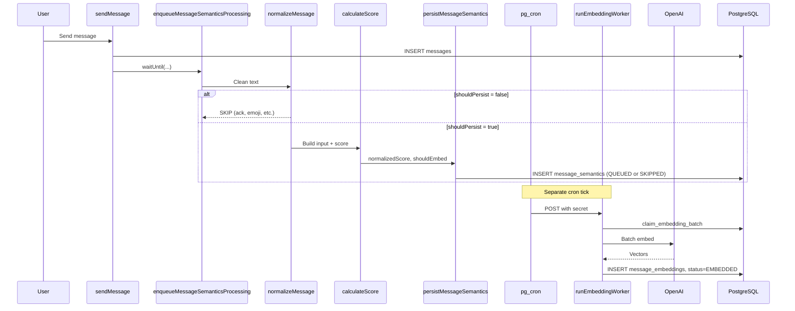

# Semantic Pipeline

The semantic pipeline processes messages in two independent phases: inline normalization and scoring on insert, and asynchronous batch embedding via cron.

## End-to-End Flow



## Phase A: Inline Processing

**Entry:** [`enqueueMessageSemanticsProcessing`](../../src/semantic/enqueueMessageSemanticsProcessing.ts)

Called immediately after a message is inserted. Uses Cloudflare Workers `waitUntil()` to run asynchronously without blocking the HTTP response.

**Orchestrator:** [`processAndPersistMessageSemantics`](../../src/semantic/messages/message-normalization/normalizer.ts)

Steps:
1. `normalizeMessage(rawMessage)` — clean text, apply skip gates
2. If `shouldPersist` is false, stop
3. `buildScoringInput(messageId, normalizedText)` — load message + up to 4 prior messages
4. `calculateScore(message, context)` — heuristic scoring
5. `persistMessageSemantics(messageId, normalizedText, { normalizedScore, shouldEmbed })` — insert with checksum dedup

## Phase B: Embedding Worker

**Entry:** [`runEmbeddingWorker`](../../src/semantic/messages/message-embedding/runEmbeddingWorker.ts)

Triggered by external cron. Processes up to 10 batches per tick, 64 messages per batch.

Steps:
1. `claimEmbeddingBatch()` — RPC locks QUEUED rows as PROCESSING
2. `embeddingProvider.embedBatch()` — generic OpenAI API call with normalized text
3. `mapEmbeddingsToMessageResults()` — zip vectors with message_semantics IDs
4. On success: `persistEmbeddings()` → insert vectors, mark EMBEDDED
5. On failure: `handleEmbeddingBatchError()` → retry or mark FAILED

## Embedding Status Lifecycle

```
                    ┌──────────┐
                    │   NEW    │ (initial, rarely seen)
                    └────┬─────┘
                         │
              ┌──────────┴──────────┐
              │                     │
        shouldEmbed=true      shouldEmbed=false
              │                     │
              ▼                     ▼
        ┌──────────┐          ┌──────────┐
        │  QUEUED  │          │ SKIPPED  │ (terminal)
        └────┬─────┘          └──────────┘
             │ claim_embedding_batch
             ▼
        ┌────────────┐
        │ PROCESSING │
        └─────┬──────┘
              │
     ┌────────┴────────┐
     │                 │
     ▼                 ▼
┌──────────┐     ┌──────────┐
│ EMBEDDED │     │  FAILED  │ (terminal)
└──────────┘     └──────────┘
```

| Status | Set by | Meaning |
|--------|--------|---------|
| `QUEUED` | `persistMessageSemantics` | Eligible for embedding, waiting for worker |
| `SKIPPED` | `persistMessageSemantics` | Score below threshold; never embedded |
| `PROCESSING` | `claim_embedding_batch` RPC | Locked by worker |
| `EMBEDDED` | `markMessageSemanticsEmbedded` | Vector stored in message_embeddings |
| `FAILED` | `markMessageSemanticsFailed` | Permanent or max-retry failure |

## Deduplication

Before insert, `computeMessageChecksum(normalizedText)` generates a SHA-256 hash. If a row with the same checksum already exists, the message is not persisted again.

## Trigger Points

| Event | File | Function |
|-------|------|----------|
| User sends chat message | `conversations.functions.ts` | `sendMessage` → `enqueueMessageSemanticsProcessing` |
| Page share announcement | `pages.server.ts` | Page announcement → `enqueueMessageSemanticsProcessing` |
| Page-from-messages announcement | `conversations.functions.ts` | `createPageFromMessages` side-effect |

## Related Docs

- [Normalization](msg_normalization.md)
- [Scoring](msg_scoring.md)
- [Embedding](msg_embedding.md)
- [Cron & Background Jobs](../cron/readme.md)
