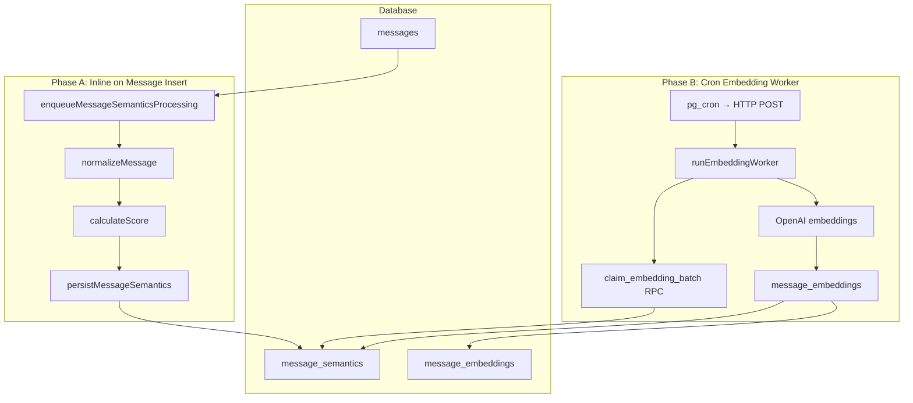

# Semantic Pipeline Overview

The semantic pipeline transforms raw chat messages into searchable vector embeddings. It runs in two decoupled phases: inline processing on message insert, and a cron-driven embedding worker.

Developer reference: [`src/semantic/README.md`](../../src/semantic/README.md)

## Subsystem Docs

| Document | Topic |
|----------|-------|
| [Pipeline](pipeline.md) | End-to-end flow and status lifecycle |
| [Normalization](msg_normalization.md) | Text cleanup and skip gates |
| [Scoring](msg_scoring.md) | MVP v1 heuristic quality model |
| [Embedding](msg_embedding.md) | Batch worker and OpenAI provider |

## Purpose

Not every chat message contains institutional knowledge. The pipeline:

1. **Filters** low-value messages (acknowledgements, emoji-only, attachments)
2. **Normalizes** remaining text into clean, searchable plain text
3. **Scores** normalized messages against heuristics to estimate knowledge value
4. **Persists** eligible messages with a quality score
5. **Embeds** high-scoring messages as 1536-dimensional vectors consumed by [semantic search](../search/semantic.md)

## Architecture

## Trigger Points

Phase A is triggered when a message is inserted:

| Location | Trigger |
|----------|---------|
| [`src/lib/conversations.functions.ts`](../../src/lib/conversations.functions.ts) | `sendMessage`, page announcement messages |
| [`src/lib/pages.server.ts`](../../src/lib/pages.server.ts) | Page share announcement messages |

Phase B is triggered externally:

| Location | Trigger |
|----------|---------|
| [`src/routes/api/public/internal/run-embedding-worker.ts`](../../src/routes/api/public/internal/run-embedding-worker.ts) | pg_cron via pg_net (production) |
| [`src/routes/api/run-embedding-worker.ts`](../../src/routes/api/run-embedding-worker.ts) | Manual trigger (dev-only) |

## Database Tables

| Table | Role |
|-------|------|
| `message_semantics` | Normalized text, quality score, embedding queue state (1:1 with messages) |
| `message_embeddings` | Vector embeddings linked to message_semantics rows |

See [Database Schema](../architecture/database.md) for full table definitions.

## Related Docs

- [Search & Retrieval](../search/readme.md) — Query-time hybrid search over embeddings
- [Cron & Background Jobs](../cron/readme.md) — Scheduling details
- [API Routes](../api/readme.md) — HTTP endpoints
