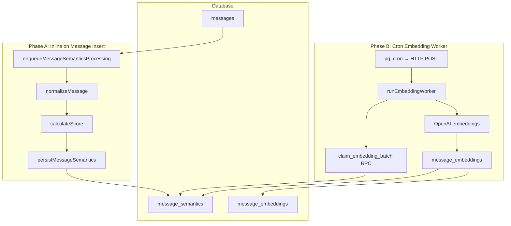

# Semantic Pipeline Overview

The semantic pipeline transforms raw chat messages into searchable vector embeddings. It runs in two decoupled phases: inline processing on message insert, and a cron-driven embedding worker. After a message is embedded, a CTI worker matches or promotes conversation topics (`conversation_topics`). A separate page-chunking sweeper decomposes idle pages into `page_chunks` and queues `page_chunk_embeddings` as `QUEUED`, which the page embedding worker turns into vectors. The same worker also embeds canonical page-topic strings onto `page_topic_embeddings`. A page-semantic worker produces an LLM topic name and description per page on `page_topics`. A canonical-topics worker then lifts established page and conversation topics into workspace-wide `canonical_topics` nodes linked by `canonical_topic_evidences`.

Developer reference: [`src/semantic/README.md`](../../src/semantic/README.md)

## Subsystem Docs

| Document | Topic |
|----------|-------|
| [Pipeline](pipeline.md) | End-to-end flow, CTI `historical_weight`, and status lifecycle |
| [Normalization](msg_normalization.md) | Text cleanup and skip gates |
| [Scoring](msg_scoring.md) | MVP v1 heuristic quality model |
| [Embedding](msg_embedding.md) | Batch worker and OpenAI provider |
| [Page Embedding](page_embedding.md) | Page chunk and canonical topic vector worker, retries, and drift guards |
| [Page Semantics](page_semantic.md) | Page-level LLM topic name/description worker |
| [Conversation Topics](conversation_topics.md) | CTI worker: similarity tiers, candidates, promotion |
| [Conversation Suggestions](conversation_suggestions.md) | Per-participant related-entity nudge worker |
| [Canonical Topics](canonical_topics.md) | Workspace-wide topic nodes, evidence links, and canonicalization worker |

## Purpose

Not every chat message contains institutional knowledge. The pipeline:

1. **Filters** low-value messages (acknowledgements, emoji-only, attachments)
2. **Normalizes** remaining text into clean, searchable plain text
3. **Scores** normalized messages against heuristics to estimate knowledge value
4. **Persists** eligible messages with a quality score
5. **Embeds** high-scoring messages as 1536-dimensional vectors consumed by [semantic search](../search/semantic.md)

## Architecture

## Trigger Points

Phase A is triggered when a message is inserted:

| Location | Trigger |
|----------|---------|
| [`src/lib/conversations.functions.ts`](../../src/lib/conversations.functions.ts) | `sendMessage`, page announcement messages |
| [`src/lib/pages.server.ts`](../../src/lib/pages.server.ts) | Page share announcement messages |

Phase B is triggered externally:

| Location | Trigger |
|----------|---------|
| [`src/routes/api/public/internal/run-embedding-worker.ts`](../../src/routes/api/public/internal/run-embedding-worker.ts) | pg_cron via pg_net (production) |
| [`src/routes/api/run-embedding-worker.ts`](../../src/routes/api/run-embedding-worker.ts) | Manual trigger (dev-only) |
| [`src/routes/api/public/internal/run-page-chunking-worker.ts`](../../src/routes/api/public/internal/run-page-chunking-worker.ts) | pg_cron via pg_net (production page chunking) |
| [`src/routes/api/run-page-chunking-worker.ts`](../../src/routes/api/run-page-chunking-worker.ts) | Manual page chunking trigger (dev-only) |
| [`src/routes/api/public/internal/run-page-embedding-worker.ts`](../../src/routes/api/public/internal/run-page-embedding-worker.ts) | pg_cron via pg_net (production page embedding) |
| [`src/routes/api/run-page-embedding-worker.ts`](../../src/routes/api/run-page-embedding-worker.ts) | Manual page embedding trigger (dev-only) |
| [`src/routes/api/public/internal/run-page-semantic-worker.ts`](../../src/routes/api/public/internal/run-page-semantic-worker.ts) | pg_cron via pg_net (production page semantics) |
| [`src/routes/api/run-page-semantic-worker.ts`](../../src/routes/api/run-page-semantic-worker.ts) | Manual page semantic trigger (dev-only) |

## Database Tables

| Table | Role |
|-------|------|
| `message_semantics` | Normalized text, quality score, embedding queue state (1:1 with messages) |
| `message_embeddings` | Vector embeddings linked to message_semantics rows |
| `page_chunks` | Structural page segments (`content`, `checksum`, `token_count`, `position`) |
| `page_chunk_embeddings` | Queue + vectors per chunk; chunking inserts `QUEUED`, the page embedding worker writes `EMBEDDED` |
| `page_topics` | Last successful page topic name/description + content snapshot |
| `page_topic_jobs` | Page analysis queue (`QUEUED` → `PROCESSING` → `COMPLETED` / `RETRY_WAIT` / `FAILED`) |
| `page_topic_embeddings` | Queue + vectors per page topic; trigger enqueues `QUEUED`, the page embedding worker writes `EMBEDDED` |
| `conversation_topics` | Per-conversation topic candidates and established topics (`historical_weight`, `is_candidate`) |
| `conversation_topic_evidences` | Message-to-topic links with cosine similarity |
| `conversation_topic_jobs` | CTI queue (`QUEUED` → `PROCESSING` → `COMPLETED` / `RETRY_WAIT` / `QUARANTINED`) |

See [Database Schema](../architecture/database.md) for full table definitions.

## Related Docs

- [Search & Retrieval](../search/readme.md) — Query-time hybrid search over embeddings
- [Cron & Background Jobs](../cron/readme.md) — Scheduling details
- [API Routes](../api/readme.md) — HTTP endpoints
